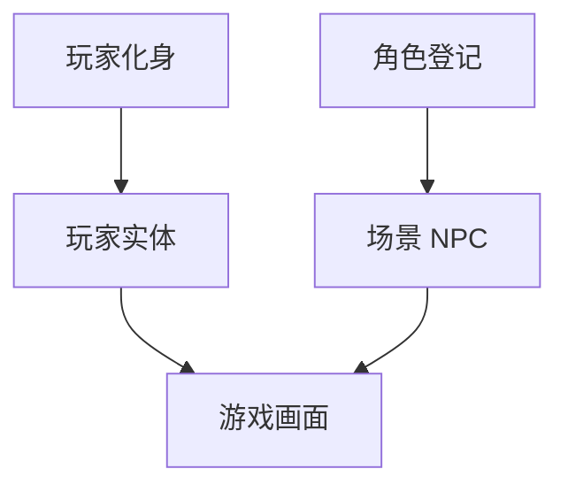

# 玩家化身面板

玩家控制的是 **主角**，不是场景 NPC 表里那一项。**玩家化身**（player avatar）专管主角：行走图集、朝向变体、可能的多套外观（换装、术式附体等）。 [角色登记](./character) 管关二狗、庙祝；**本面板管「你」**。

全局配置里 **playerAvatar** 常在 **独立编辑器** 维护，主配置页可能是盲区——改主角优先开本面板。

---

## 这块面板管什么

- **化身 id** 与资源路径。
- **行走/站立** 等多向贴图或图集引用。
- **变体**（若有 Tab）：不同剧情阶段主角外观。
- 动作 **切换玩家化身** 在运行时切换（见 [动作](../concepts/actions)）。

---

## 怎么打开

1. `./dev.sh editor` → **资源 → 玩家化身**。
2. 选默认化身或变体编辑。
3. Apply；[全局配置](./config) 指 initial 化身（若配置页可见）。

:::info[配图：玩家化身表单]
截默认行走四向图或图集选择器。
:::

---

## 与 NPC 分工

---

## 怎么新建变体

1. 添加变体 id `avatar_robe`「道袍形态」。
2. 绑新行走图；预览跑图看脚滑不滑。
3. [过场](./cutscene) 或叙事 进入时 用 切换玩家化身 切换。
4. 变体结束记得切回默认，避免后续场景仍穿道袍。

---

## 怎么改 / 删

- 改默认化身影响全局新开档与未指定变体时。
- 删变体前查动作/过场是否还 set 到此 id。

---

## 当心什么

| 当心 | 说明 |
|---|---|
| 与 config 盲区重复 | playerAvatar 在 [全局配置](./config) 可能改不到——以本面板为准 |
| 像素密度与场景 | entityPixelDensity 类项若在 config 盲区，缩放不对找程序 |
| 只改外观不改碰撞 | 场景出生点仍按点落位 |
| 图集方向缺一格 | 斜走复用错向 |

---

## 雾津例子

1. 默认化身：短打布衣四向走。
2. 获得庙祝赠袍后 切换玩家化身 `avatar_robe`。
3. [位面](./plane) 鬼打墙可选半透明变体（若项目有）。
4. [富文本](../concepts/rich-text) `[player]` 引玩家名，与化身外观无关。

:::info[配图：换装前后]
预览同一.scene 默认 vs 道袍变体。
:::

---

## 和相关面板怎么配合

| 面板 | 关系 |
|---|---|
| [全局配置](./config) | 初始引用 |
| [场景](./scene) | 出生点与速度 |
| [过场](./cutscene) | showCharacter 与化身区分 |
| [动作总表](./actions) | 切换玩家化身 |

---

---

## 实操检查清单

- [ ] 默认化身四向行走图齐全，无缺向或复用错向
- [ ] 新变体（道袍、附体等）脚点与默认化身一致，防滑步
- [ ] 全局配置若改不到 playerAvatar，以本面板为准
- [ ] 变体切换动作在过场或叙事里成对出现：有切必有切回
- [ ] 删变体前查过场、动作总表是否仍 set 到此 id
- [ ] 像素密度与场景 entity 缩放一起在预览跑图测
- [ ] 半透明或鬼打墙专用变体在险境位面单独预览
- [ ] 改默认化身前通知全组：影响新档与未指定变体时
- [ ] 与 NPC 角色登记分清：本面板只管「你」，不管关二狗
- [ ] Apply 后新开一局或读档各测一次外观

---

## 常见问题

| 现象 | 原因 | 怎么办 |
|---|---|---|
| 新档仍是旧行走图 | 改的是变体不是默认化身 | 改默认或查开局是否指定变体 |
| 换装后脚滑 | 变体图集锚点与默认不一致 | 对齐脚点或换图集 |
| 配置页改不动主角 | playerAvatar 在盲区 | 回本面板改 |
| 剧情结束仍穿道袍 | 未写切回默认的动作 | 补 set 回默认变体 |
| 斜走方向怪 | 图集缺斜向复用错格 | 补全四向或修正映射 |

---

## 预览验证

1. 在本面板确认默认化身与目标变体已保存。
2. 运行预览，四向各走一段，看动画与位移是否同步。
3. 触发换装剧情（如庙祝赠袍），确认变体切换即时生效。
4. 切位面或进鬼打墙，看半透明变体（若有）是否正常。
5. 剧情收束后确认已回到默认外观。
6. 新开一局，确认 initial 外观与策划一致。

---

庙祝赠袍后你应在过场或叙事 进入时 里切道袍变体，并在离开城隍庙前切回——否则后续渡口场景仍穿道袍会削弱「还俗日常」感。鬼打墙若做半透明化身，预览时对照位面掉血与长按 UI，别让人物「飘」得像 bug。默认短打四向走应比 NPC 略亮一档，方便玩家在雾夜里仍认得出自己。

---

## 相关概念

- [怎么编排动作](../concepts/actions)
- [怎么设条件](../concepts/conditions)
- [怎么写带引用的文本](../concepts/rich-text)
- [危险区](../concepts/danger-zone)
