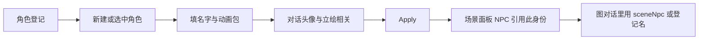
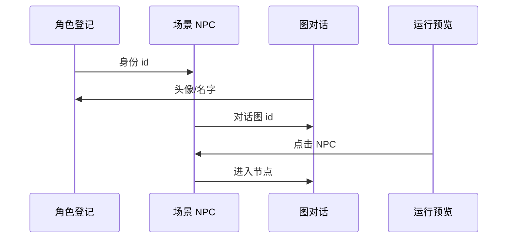

# 角色登记面板

场景里放一个会动的「关二狗」，画布上那个实例管的是**站哪、 patrol、挂哪段对话**；关二狗**是谁、长什么样、用哪套走路动画**，要在**角色登记**里先立好档。你可以把这里想成雾津的**人物名册**：一次登记，多处场景引用，改脸改动画只改一处。

---

## 这块面板管什么

- **角色身份**：内部代号、显示名、简介类信息（给策划和下游面板下拉用）。
- **动画资源**：走路、站立、特殊动作用哪份动画表（动画来自生产流程，本面板只选不编）。
- **对话呈现**：聊天气泡旁的头像、立绘相关挂接。
- **与场景 NPC 的关系**：场景里 NPC 选「用哪个登记身份」，不在这里摆坐标。

登记**不等于**把角色放进地图——放人请去 [场景面板](./scene)。

---

## 怎么打开

1. `./dev.sh editor` 打开主编辑器。
2. 左侧 **物理世界 → 角色登记**（或导航里「角色」项）。
3. 列表里选人改，或新建一条登记。
4. 改完 Apply，再到场景里把 NPC 实例指向新身份。

:::info[配图：角色登记列表与详情]
截列表中有「关二狗」「庙祝」等条目，右侧详情露出名字、动画选择、对话头像区域。
:::

---

## 界面怎么走

---

## 怎么新建一条登记

1. 点 **新建**（或列表上方添加），给**内部代号**：建议稳定、英文或拼音 slug，例如 `guan_ergou`——下游下拉都认这个。
2. **显示名**给玩家看的：关二狗、城隍庙庙祝、渡口货郎。
3. **动画**：从已有动画表里选；若列表空，先去动画生产流程（视频转图集等）产出再回来选。
4. **对话头像**：图对话节点里 speaker 选 NPC 时，头像从这里取。
5. Apply。

:::tip[命名习惯]
内部代号一旦场景、对话、任务里引用多了，**不要随便改名**；要改得全局搜一遍谁还指着旧 id。
:::

---

## 怎么改已有角色

- **换动画包**：选中角色，动画下拉换成新版本；所有引用该身份的 NPC 实例会一起变样，无需逐场景改。
- **改显示名**：玩家可见名字更新；富文本里若手写死了旧名，要单独去 [文本库](./strings) 或对话里改。
- **补头像**：新立绘导入后，在这里换对话头像路径或选项。

没有「画布」，纯表单 + 列表。

---

## 怎么删

1. 确认 **场景里没有任何 NPC** 还引用该身份。
2. 确认 **图对话** 没有 speaker 还指着这个人。
3. 再删登记条目。

删了登记不会自动删场景里的 NPC 实例——实例会变成悬空引用，预览里可能变默认人或报错，务必先解绑。

---

## 当心什么

| 情况 | 后果 |
|---|---|
| 只改了场景 NPC 没改登记 | 脸和动画还是旧登记；坐标、对话挂接是场景的事 |
| 登记了但从没在场景放实例 | 游戏里见不到这个人 |
| 动画表未产出就选 | 游戏里 T-pose 或空白 |
| 内部代号与显示名混用 | 条件下拉、任务文本容易选错人 |

角色登记本身**没有**场景那种大面积「重建丢字段」问题，但它是**全项目引用枢纽**——改代号比改显示名危险得多。

---

## 雾津例子：关二狗从名册到码头

1. **角色登记**新建 `guan_ergou`，显示名「关二狗」，动画选码头闲逛那套，头像选黢黑脸短打那张。
2. **场景**打开雾津码头，添加 NPC，身份选关二狗，坐标定在缆桩旁，朝向河。
3. **图对话**写关二狗第一句「哟，寻狗啊？」，speaker 选 NPC 并关联登记身份。
4. 场景里给 NPC 绑对话图 id 与入口节点。
5. 运行预览：点关二狗，头像与立绘一致，走路动画对得上。

---

## 和相关面板怎么配合

| 需求 | 面板 |
|---|---|
| 人在哪、巡逻、碰撞 | [场景](./scene) |
| 说什么、分支 | [图对话](./dialogue-graph) |
| 过场里显隐角色 | [过场](./cutscene) |
| 查动画片段 | [动画浏览](./anim-browser) |
| 玩家捏脸（主角） | [玩家化身](./avatar)（不是本面板） |

---

---

## 实操检查清单

- [ ] 内部代号稳定，改代号比改显示名危险得多
- [ ] 显示名给玩家看，与富文本手写名对表
- [ ] 动画包在动画浏览确认后再选
- [ ] 对话头像与图对话 speaker 呈现一致
- [ ] 登记后必须在场景放 NPC 实例才可见
- [ ] 删登记前场景无 NPC、对话无 speaker 引用
- [ ] 换动画包一次改全项目引用该身份的实例
- [ ] 与玩家化身面板分清：本面板不管「你」
- [ ] 动画未产出勿选，防 T-pose
- [ ] Apply 后场景绑身份并 preview 点 NPC

---

## 常见问题

| 现象 | 原因 | 怎么办 |
|---|---|---|
| 游戏里见不到人 | 只登记未放场景 NPC | 去场景添加实例 |
| 脸/动画不对 | 改场景未改登记或反之 | 以登记为准统一 |
| T-pose | 动画包空或错 | 先产出动画再选 |
| 删登记后 NPC 怪 | 实例仍引用旧身份 | 先解绑再删 |
| 对话头像错 | speaker 未关联登记 | 图对话改 speaker |

---

## 预览验证

1. 新建或改登记：代号、显示名、动画、头像，Apply。
2. 场景添加 NPC 选此身份，摆位绑对话。
3. 图对话 speaker 关联同一身份。
4. 运行 preview 点 NPC，看头像、动画、名字。
5. 换动画包后再 preview，所有实例应变。
6. 巡逻与 initial 动画状态与动画浏览一致。

---

关二狗登记选码头闲逛动画包，场景缆桩旁实例绑同一身份——你在 preview 里点他应见黢黑脸短打与闲逛 idle。改内部代号前全局搜引用，比改显示名麻烦一个数量级。庙祝与货郎各一条登记，勿共用一个身份再在场景硬改脸。

---

## 相关概念

- [怎么编排动作](../concepts/actions)
- [怎么设条件](../concepts/conditions)
- [怎么写带引用的文本](../concepts/rich-text)
- [危险区](../concepts/danger-zone)
