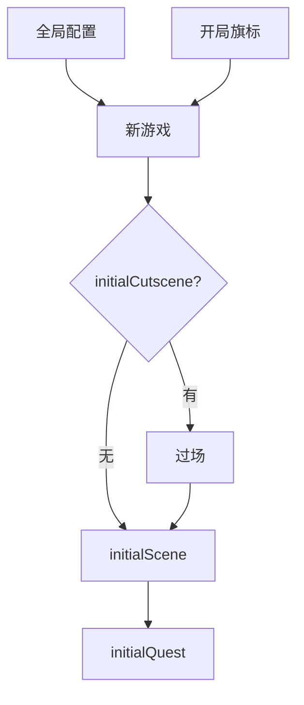

# 全局配置面板

新档从哪张场景开始、默认接哪个任务、窗口多大、要不要先播开场过场、开局自带哪些旗标——**全局配置**（game config）在一处改。改错这里，全项目起不来或开局掉进错场景。

**playerAvatar**（主角化身）与部分像素密度匹配项常在 **盲区**：主配置页改不到，去 [玩家化身](./avatar) 专页。

---

## 这块面板管什么

（以检视器实际字段为准，常见包括：）

- **initialScene**：新游戏第一张场景。
- **initialQuest**：开局关联任务（若有）。
- **fallbackScene**：异常回落场景，防卡死。
- **initialCutscene**：开局过场 id（若有）。
- **initialCutsceneDoneFlag**：播完开场要设的旗标。
- **viewport / windowSize**：视口与窗口尺寸。
- **开局旗标**：新档批量写入的旗标初值。

---

## 怎么打开

1. `./dev.sh editor` → **资源 → 全局配置**。
2. 改字段；**慎点 Apply**——影响所有新档与默认启动。
3. 改完必 **运行预览** 新开一局测。

:::info[配图：全局配置表单]
截初始场景、初始任务、窗口尺寸、开局旗标区域。
:::

---

## 启动链

---

## 怎么改（逐项当心）

### 初始场景

- 选已存在的场景 id（[场景面板](./scene) 列表里有，不能在此新建场景）。
- 雾津默认常是院子或老街——与叙事设计对齐。

### 初始任务

- 选 [任务](./quest) 里主线第一步；空则日志空开局。

### 回落场景

- fallback 选安全场景（如老街），避免 crash 后黑屏。

### 开场过场

- initialCutscene 指向 [过场](./cutscene)；播完设 initialCutsceneDoneFlag，避免下回重复播。

### 窗口与视口

- 改 windowSize 影响桌面窗口；与美术分辨率文档一致。

### 启动旗标

- 开局旗标写初值；键应在 [旗标](./flags) 注册过。

---

## 怎么「删」

配置是单对象，没有删条目——只能清空字段或恢复默认；清 initialQuest 等于无开局任务。

---

## 当心什么：盲区

| 字段 | 用户说法 |
|---|---|
| **playerAvatar** | 在全局配置 **够不着** → 去 [玩家化身](./avatar) |
| **entityPixelDensityMatch** 等 | 可能在盲区；缩放不对别死磕本页 |
| 改 initialScene 忘出生点 | 玩家落墙里——回场景查 default spawn |
| 开局旗标写未注册键 | 校验或协作工具报警 |

详见 [危险区](../concepts/danger-zone)。

---

## 雾津例子

1. initialScene `yard_morning` 院子晨。
2. initialQuest `xungou_find_dog_01`。
3. initialCutscene 空或短黑场；flag 标记 intro_done。
4. 开局旗标按设计填初值（若教程已结束则关掉教程类旗标）。
5. fallbackScene `old_street_safe`。
6. 窗口 1280×720 与 UI 稿一致。

改 initialScene 后跑 [教程：5 分钟跑起来](../../tutorials/intro) 同款启动命令验证。

:::info[配图：新游戏第一屏]
预览新档落在院子晨场景、任务日志有湿了的鞋。
:::

---

## 和相关面板怎么配合

| 面板 | 关系 |
|---|---|
| [场景](./scene) | initial / fallback |
| [任务](./quest) | initialQuest |
| [过场](./cutscene) | 开场 |
| [旗标](./flags) | 开局旗标 |
| [玩家化身](./avatar) | 主角（配置盲区） |

---

---

## 实操检查清单

- [ ] initialScene 与场景出生点存在且可落位
- [ ] initialQuest 指向已存在任务第一步
- [ ] fallbackScene 选安全场景防 crash 黑屏
- [ ] 开局旗标 键均在旗标表注册
- [ ] initialCutscene 播完 flag 防重复播
- [ ] windowSize 与 UI 稿分辨率一致
- [ ] playerAvatar 改去玩家化身面板，本页可能够不着
- [ ] entityPixelDensity 类若在盲区，缩放问题别死磕本页
- [ ] 改 initial 相关项后必新开一局 preview
- [ ] Apply 前组内知会：影响所有新档

---

## 常见问题

| 现象 | 原因 | 怎么办 |
|---|---|---|
| 新档落墙里 | 场景出生点错 | 回场景查 spawn |
| 开局无任务 | initialQuest 空或 id 错 | 选对主线首步 |
| 重复播开场 | cutsceneDoneFlag 未设 | 补 flag |
| 主角外观改不动 | playerAvatar 盲区 | 去玩家化身 |
| startup 报警 | 旗标未注册 | 先旗标表登记 |

---

## 预览验证

1. 改 initialScene、Quest、Cutscene、Flags、窗口等，Apply。
2. 新开一局（勿用旧档）。
3. 确认第一屏场景、任务日志、窗口大小。
4. 若有开场过场，播完应进 initialScene 且不重复。
5. 故意 trigger fallback 路径（若可测）落安全 scene。
6. 对照教程同款启动命令再验一遍。

---

新档 initialScene 院子晨、initialQuest 湿了的鞋、fallback 老街安全——你在 preview 新局第一分钟应能走动且日志有任务。intro_done 类 flag 防二次播黑场。窗口 1280×720 与 UI 稿不一致时，地图与对话 safe area 会偏，改 window 后全 UI 扫一遍。

---

## 相关概念

- [怎么编排动作](../concepts/actions)
- [怎么设条件](../concepts/conditions)
- [怎么写带引用的文本](../concepts/rich-text)
- [危险区](../concepts/danger-zone)
