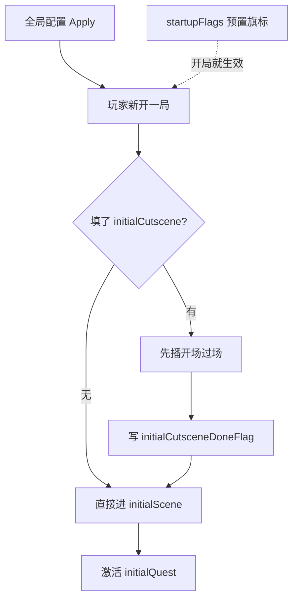

# 全局配置面板

新档从哪张场景开始、默认接哪个任务、开局要不要先播一段过场、窗口画面多大、开局自带哪些世界状态——**全局配置**（game config）在一处集中管。读完这页你能安全地改好这几项、并搞清楚哪两个和"主角长相/像素缩放"相关的字段这里**压根改不到**，得去别的地方。

---

## 这是什么（30 秒看懂）

把全局配置想成新一局戏开幕前的"总纲"：戏从哪个场子开锣（初始场景）、台下先递给谁一个什么活儿（初始任务）、开场要不要先演一段引子（开场过场）、戏台本身搭多大（窗口/分辨率）、开幕时世界已经是什么状态（开局旗标）。这一页改的是"新存档诞生那一刻"的默认样子，**改一次会影响这个工程之后所有新开的档**，不是改某一局存档，所以动手前最好和同组人知会一声。

有两类东西**看起来该在这儿、但实际改不到**：**主角的外观/动画**（要去[玩家化身](./avatar)专页）、以及和**像素缩放匹配**相关的一两个开关（这里完全没有入口，属于纯盲区）。这是本页最容易踩坑的地方，危险区一节会专门讲。

---

## 入门：手把手做第一次

1. 打开主编辑器 → **资源 → 全局配置**。
2. **启动引用**这组里：初始场景选一个已存在的场景 id（比如院子晨 `yard_morning`）；初始任务选主线第一步任务；兜底场景选一个安全场景（比如老街）保底；开场过场按需选一个，不需要就留空。
3. 若填了开场过场，记得填开场播放完成旗标（比如 `intro_done`），防止玩家下次重进又被强制重播一遍开场。
4. 展开"Display（分辨率/窗口）"折叠栏：先勾选 Viewport 的启用框，填 1280×720；再勾选 Window Size 的启用框，同样填 1280×720（两者含义不同，进阶部分详细讲）。
5. 在初始旗标表格里点"+ Flag"，逐行填新档要预置的旗标 key/value（比如把教程类旗标设成已完成）。
6. **慎点 Apply**——这会影响所有新档与默认启动。
7. 改完必须**运行预览、新开一局**（不要用旧档）验证：第一屏是不是落在你设的场景、任务日志有没有对的第一条、窗口尺寸对不对。

**雾津小例子**：初始场景设成院子晨 `yard_morning`，初始任务设成"湿了的鞋"这条主线第一步，开场过场留空（或放一段极短的引子），兜底场景设老街 `old_street_safe` 保底；Viewport 与 Window Size 都填 1280×720 与美术 UI 稿对齐。新开一局应该能在院子里走动，任务日志已经有第一条。

---

## 进阶：每一项都讲透

### 启动引用组

- **初始场景**：新存档进入的第一个场景，从下拉选一个已存在的场景 id，**这里没有"新建场景"的入口**，得先去[场景](./scene)面板建好场景再回来选。改这个字段别忘了同步确认目标场景的出生点是否合适——出生点不对，玩家开局就会卡进墙里。
- **初始任务**：新存档自动激活的初始任务，从[任务](./quest)列表里选主线第一步；留空的话新档的任务日志会是空的。
- **兜底场景**：目标场景缺失、或运行时出现异常跳转时的兜底场景，选一个绝对安全、不会再出问题的场景（比如老街），避免玩家卡进黑屏或崩溃循环。
- **开场过场**：新游戏开场播放的[过场](./cutscene)，从下拉选，留空则新档直接进场景、不播任何开场演出。
- **开场播放完成旗标**：记录"开场过场已经播过"的旗标，配合开场过场使用——填了开场过场却忘填这个，玩家每次重开新档都会被迫重播一遍开场；这个 flag 键需要先在[旗标](./flags)登记表注册过。

### Display 分辨率/窗口（两个字段含义不同，别混）

- **Viewport（逻辑渲染分辨率）**：游戏画面本身实际按多大尺寸去画，画完之后再等比缩放去填满窗口。改这个影响的是"游戏内容渲染精细度/取景范围"，跟窗口实际显示多大是两回事。
- **Window Size（窗口/容器尺寸）**：游戏窗口（容器）本身占多大，和上面的渲染分辨率是各自独立的两件事——你可以让画面按一个尺寸渲染，再用另一个尺寸的窗口去显示它。
- 两组都各带一个"启用"勾选框：**不勾选就不会写进配置**，运行时会用引擎自己的默认值；只有勾选之后填的 W/H 数值才会真正生效写入。默认值都是 1280×720，改之前先和美术的 UI 设计稿对齐，避免场景边缘、对话框安全区跟着跑偏。

### 新存档初始旗标

- 这是一张 key/value 表，逐行登记新游戏开始时要预置的旗标键值，相当于给这一局世界预设一个"起始状态"（比如"教程已完成""某个旗标默认为真"）。
- 用"+ Flag"/"− Flag"增删行；填的 key 必须是已经在[旗标](./flags)登记表注册过的键，否则校验或协作工具会报警。
- 这些旗标只在**新存档创建那一刻**写入一次，不是"每次进游戏都重置"，玩家存档之后自己的进度改动不会被这里的值覆盖。

### 怎么"删"

全局配置是单一对象，没有"新增一条/删一条"的概念——你能做的只是清空某个字段或恢复默认值。比如清空初始任务就等于"新档开局没有任务"，不是删掉一条配置记录。

### 和相关面板怎么配合

| 面板 | 关系 |
|---|---|
| [场景](./scene) | 初始场景 / 兜底场景的候选来源，出生点也在这里检查 |
| [任务](./quest) | 初始任务的候选来源 |
| [过场](./cutscene) | 开场过场的候选来源 |
| [旗标](./flags) | 开场播放完成旗标、初始旗标的键都需要先在这里注册 |
| [玩家化身](./avatar) | 主角外观/动画在这个独立面板改，本页够不着 |

### 批量做法与效率窍门

- 改完初始场景、初始任务、开场过场、初始旗标任何一项后，**必须新开一局**验证，不要沿用旧档去看效果（旧档已经走过这些逻辑，不会重新触发）。
- 团队协作时，Apply 前在群里知会一声——这不是"我的那一份"配置，是全项目共用的开局设定，改错会让所有人新建的存档都出问题。
- 可以对照[教程：5 分钟跑起来](../../tutorials/intro)里同款的启动命令，每次改完全局配置都用同一套流程验证一遍，减少遗漏。

---

## 危险区与边界

以下两类字段是这一页**真正的盲区**——本页检视器完全没有入口，不管你在这个面板里怎么翻都改不到，需要去别的地方：

| 字段 | 在哪儿改 |
|---|---|
| **主角外观/动画** | 全局配置页够不着，去[玩家化身](./avatar)专用面板 |
| **像素密度匹配相关的一两个开关** | 决定角色贴图是否按背景的像素密度做匹配处理（避免像素画风的人物和背景缩放观感不一致），主编辑器完全没有可视化入口；运行预览里的调试菜单可以临时切换看效果，但那只是**临时调试**，不会写回配置文件，重启就恢复原状——真要长期改，需要按危险区流程升级或手改文件，别在这个面板里死磕找入口 |

其它常见坑：

- **改初始场景忘了核对出生点**：玩家新开局直接卡进墙里或掉出地图，回[场景](./scene)面板检查该场景的默认出生点。
- **初始旗标写了未注册的键**：校验工具或协作检查会报警，先去[旗标](./flags)登记表补上再回来填。
- **忘填开场播放完成旗标**：填了开场过场却没配这个旗标，玩家每次新建存档都会被迫重播一遍开场演出。
- 更多编辑器整体可编辑边界见 [危险区](../concepts/danger-zone)。

---

## 常见问题

| 现象 | 原因 | 怎么办 |
|---|---|---|
| 新档落墙里 | 初始场景对应场景的出生点不对 | 回场景面板核对默认出生点位置 |
| 开局无任务 | 初始任务留空或选错 id | 选对主线第一步任务 |
| 每次新档都重播开场过场 | 没配开场播放完成旗标 | 补上这个旗标 |
| 主角外观/动画改不动 | 这项在本页是盲区 | 去[玩家化身](./avatar)面板改 |
| 像素缩放观感不对，怎么都改不了 | 相关开关不在本页 GUI 范围内 | 用运行预览调试菜单临时验证效果，长期改动按危险区流程处理 |
| 初始旗标保存后报警告 | 填的 key 没有在旗标登记表注册 | 先去[旗标](./flags)注册这个键 |
| 窗口大小和场景 UI 对不上 | Viewport 与 Window Size 两个概念混淆 | 分别核对：一个是渲染分辨率，一个是窗口容器尺寸 |

---

## 相关

- [场景](./scene)——初始场景 / 兜底场景的候选与出生点
- [任务](./quest)——初始任务的候选
- [过场](./cutscene)——开场过场的候选
- [旗标](./flags)——开场播放完成旗标、初始旗标键的注册处
- [玩家化身](./avatar)——主角外观/动画，本页的盲区去这里改
- [怎么编排动作](../concepts/actions)
- [怎么设条件](../concepts/conditions)
- [危险区](../concepts/danger-zone)
