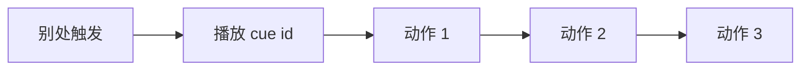

# 信号 Cue 面板

叙事状态机发的是**逻辑信号**；玩家看到的是灯闪、音效、叠图、震屏。**信号 Cue** 把「表现向」的 [动作](../concepts/actions) 打成具名包：别处一句「播放 cue xxx」就行，不用每次重复排十步。雾津里城隍庙钟鸣、档案翻开时的纸页声、鬼打墙进场的低鸣，都适合先在这里封装。

---

## 这块面板管什么

- **Cue id**：稳定代号。
- **描述**：给策划自己记这笔 cue 干什么。
- **动作列表**：顺序执行的表现动作（播音效、叠图、闪白、小字幕等——以动作面板支持的为准）。

与 [临场长按](./pressure-hold) 同在叙事工具族；长按偏交互，cue 偏**一键播片式表现**。

---

## 怎么打开

1. `./dev.sh editor` → **叙事编排 → 信号 Cue**（或「信号」导航项）。
2. 列表选或新建 cue。
3. 动作区用通用动作编辑器堆步骤。
4. Apply；在叙事迁移 进入时、热区、图对话 执行动作 里引用。

:::info[配图：信号 Cue 动作链]
截 cue `temple_bell`：两三个播音效/震屏/字幕动作。
:::

---

## 怎么用

---

## 怎么新建

1. id `temple_bell_ring`。
2. description「城隍庙晨钟，远播三响」。
3. actions：播音效 → wait → 再播一声 → 可选 flash 或 subtitle「钟鸣三下」。
4. Apply。
5. [剧本](./scenarios) phase 进入「晨」时 进入时 或叙事信号里 `播放信号 Cue`（动作名以游戏内为准）。

---

## 怎么改 / 删

- 改动作顺序即改表现；预览时从固定场景触发听一遍。
- 删 cue 前查全局引用；删了 id 还在用会静默失败或报错。

---

## 当心什么

| 当心 | 说明 |
|---|---|
| cue 里塞逻辑动作 | 可以但不清晰——大改旗标建议仍放 执行动作 节点 |
| 与过场重复 | 长演出用 [过场](./cutscene)，短反馈用 cue |
| 音频 id 错 | 没声；去 [音频](./audio) 核对 |
| 描述不写 | 半年后忘了 `cue_17` 是啥 |

cue 条目简单，少见重建丢字段；仍遵守 [危险区](../concepts/danger-zone) 里动作嵌套规则。

---

## 雾津例子：进鬼打墙 cue

1. `enter_ghost_wall_cue`：低鸣 ambient + blend 叠图雾气 + 短 subtitle「风向不对了……」。
2. [叙事状态机](./narrative) 进「鬼打墙」状态 进入时 第一条播此 cue。
3. [位面](./plane) 同时切换，玩家体感「规则+表现」一起变。
4. 破除时另 cue `exit_ghost_wall_cue` 做反向收束。

:::info[配图：cue 触发瞬间]
预览进鬼打墙时叠图与字幕同屏截图。
:::

---

## 和相关面板怎么配合

| 面板 | 关系 |
|---|---|
| [过场](./cutscene) | 长演出 |
| [音频](./audio) | 音效源 |
| [叠图](./overlay) | showOverlay 类动作 |
| [动作总表](./actions) | 查可编排项 |

---

---

## 实操检查清单

- [ ] 每个 Cue id 有可读 description，半年后仍知用途
- [ ] 动作链只放表现向步骤，大改旗标仍放业务面板
- [ ] 音效、叠图 id 在音频、叠图表已登记
- [ ] 短反馈用 Cue，长演出用过场，勿 Cue 塞半分钟
- [ ] 进出场成对设计（如鬼打墙 enter/exit）
- [ ] 删 Cue 前全局搜 播放信号 Cue 类引用
- [ ] 动作顺序：先音后画或先震后字，按体感微调
- [ ] 与叙事 进入时 对齐，避免位面已切 Cue 未播
- [ ] 嵌套子动作遵守危险区规则
- [ ] Apply 后从固定场景触发点连测三遍

---

## 常见问题

| 现象 | 原因 | 怎么办 |
|---|---|---|
| 触发后完全无表现 | id 错或 Cue 已删 | 核对引用与登记表 |
| 有震屏无声音 | 音效 id 未登记 | 回音频表补 sfx |
| 叠图闪一下消失 | 动作缺 wait 或 duration | 加等待或延长 blend |
| 逻辑变了世界没变 | 只改 Cue 未改业务动作 | 分清表现与逻辑编排 |
| 两处重复播同一 Cue | 进入时 与热区双绑 | 合并触发或加条件 |

---

## 预览验证

1. 在 Cue 面板堆好动作链，Apply。
2. 从叙事状态 进入时 或测试热区触发一次。
3. 耳听音效顺序、眼观叠图与字幕是否同步。
4. 快速连触发两次，看是否叠播错乱。
5. 测反向 Cue（若有），确认收束干净。
6. 对照位面、滤镜切换时点，整体节奏是否对。

---

城隍庙晨钟 Cue 宜三响递进，最后一响稍长，给玩家「天亮了」的体感。进鬼打墙时低鸣、雾气叠图、短 subtitle 应同帧起——你在预览里慢放看是否有一步晚半拍。档案翻页纸声若单独做 Cue，首次阅读 与重复打开不要共用同一套，免重复阅读时吵。

---

## 相关概念

- [怎么编排动作](../concepts/actions)
- [怎么设条件](../concepts/conditions)
- [怎么写带引用的文本](../concepts/rich-text)
- [危险区](../concepts/danger-zone)
