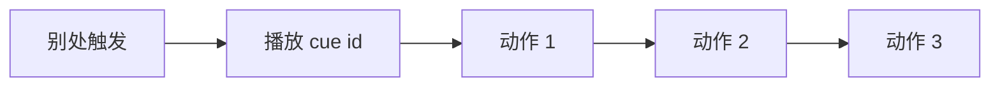

# 信号 Cue 面板

叙事状态机发的是**逻辑信号**；玩家看到的是灯闪、音效、叠图、震屏。**信号 Cue** 把「表现向」的 [动作](../concepts/actions) 打成具名包：别处一句「播放 cue xxx」就行，不用每次重复排十步。雾津里城隍庙钟鸣、档案翻开时的纸页声、鬼打墙进场的低鸣，都适合先在这里封装。

读完这页你能：独立封装一条可复用的表现 Cue、看懂它和过场、动作总表的分工、知道删改时要避开哪些坑。

---

## 这是什么（30 秒看懂）

信号 Cue 就是一个"表现快捷键"：你把"播音效 → 停一下 → 再播一声 → 弹个字幕"这一串步骤存成一个具名包，取个好记的 id。以后任何地方——叙事状态进入时、热区触发时、图对话执行动作里——只要说一句"播放这个 Cue"，这一整串表现就会照着原样跑一遍，不用每次都重新排列步骤。

---

## 入门：手把手做第一次

1. `./dev.sh editor` → **叙事编排 → 信号 Cue**（导航里也可能显示为"信号"）。
2. 新建一条 Cue，id 如 `temple_bell_ring`。
3. **description** 填一句备注，比如「城隍庙晨钟，远播三响」——这纯粹是给你自己看的，不影响游戏运行，但半年后回来看会感激当初写了它。
4. 用动作编辑器堆叠动作序列：播音效 → 等待 → 再播一声 → 可选加一段闪屏或字幕「钟鸣三下」。
5. 保存；在[叙事状态机](./narrative)某个状态的"进入时"、或热区、或图对话的执行动作里，用"播放信号 Cue"引用这个 id。

:::info[配图：信号 Cue 动作链]
截 Cue `temple_bell`：两三个播音效/震屏/字幕动作。
:::

**雾津小例子（进鬼打墙 Cue）**：`enter_ghost_wall_cue`——低鸣环境音 + 叠一层雾气叠图 + 一句短字幕「风向不对了……」。[叙事状态机](./narrative)进入"鬼打墙"状态时，进入时动作第一条就播这个 Cue；同一时刻[位面](./plane)也切到鬼打墙规则，玩家体感"规则和表现"一起变。破除仪式完成时再播一条 `exit_ghost_wall_cue` 做反向收束。

:::info[配图：Cue 触发瞬间]
预览进鬼打墙时叠图与字幕同屏截图。
:::

---

## 进阶：每一项都讲透

### 面板里能填什么

| 字段 | 说明 |
|---|---|
| id | 稳定代号，全表唯一，别处靠这个 id 播放这条 Cue |
| description | 策划自己的备注，纯记录用途，不影响运行时表现，可留空但不建议留空 |
| 动作序列（actions） | 顺序执行的一串动作，走通用[动作](../concepts/actions)编辑器编排——播音效、叠图、闪白、弹字幕等，具体能用哪些动作以你项目动作总表支持的为准 |

信号 Cue 本身**没有隐藏字段**，结构就这三样——比起遭遇、位面这类面板，它算是编辑器里最"薄"的一块，重建丢字段的风险也最低。

### 怎么定位"这该不该做成 Cue"

- **短反馈用 Cue**：几秒钟内完成的一组表现（钟声、闪屏、震动、一句字幕），做成 Cue 复用。
- **长演出用[过场](./cutscene)**：需要镜头运镜、多句对白、较长时间线的演出，应该走过场面板，不要硬塞进 Cue——Cue 塞半分钟的内容会让维护变得很痛苦。
- Cue 里**技术上**可以塞逻辑向动作（比如顺手改一个旗标），但不建议——表现和逻辑混在一起，半年后很难看出这条 Cue 到底"是播特效的"还是"其实还改了游戏状态"。大改旗标这类业务逻辑，建议仍然放在动作总表或对应的业务面板里编排，Cue 只负责纯表现。

### 批量与效率技巧

- 进/出场景常常需要**成对设计**：进鬼打墙有一条 enter cue，破除时配一条对称的 exit cue 做收尾，体验上更完整。
- 动作顺序按体感微调：一般"先响后画"或"先震后字"更贴近真实反馈节奏，具体顺序在预览里多听多看几遍再定。
- 多处会共用同一段表现时，先封装成 Cue 再到处引用，比每个地方各自散着排列动作省事得多，以后要统一调整只用改一处。

### 和相关面板怎么配合

| 面板 | 关系 |
|---|---|
| [过场](./cutscene) | 长演出用过场，短反馈用 Cue |
| [音频](./audio) | Cue 里播的音效来源 |
| [叠图](./overlay) | Cue 里做画面叠加效果时引用 |
| [动作总表](./actions) | 查看 Cue 里可以编排哪些动作 |

---

## 危险区与边界

| 当心 | 说明 |
|---|---|
| Cue 里塞逻辑动作 | 技术上可行，但会让"表现"和"逻辑"混在一起，不清晰，大改旗标建议仍走业务面板 |
| 与过场功能重复 | 长演出该用[过场](./cutscene)，别把 Cue 拉得太长 |
| 音频/叠图 id 写错 | 没有声音或没有画面，需去[音频](./audio)、[叠图](./overlay)面板核对登记表 |
| description 不写 | 半年后忘了这条 Cue 到底是干嘛的，排查问题时无从下手 |
| 删除 Cue 前未查引用 | 别处仍在"播放信号 Cue"这个 id 会静默失败或报错，删前先全局搜索引用 |

Cue 条目结构简单，很少出现"重建丢字段"的问题；仍要遵守[危险区](../concepts/danger-zone)里关于动作嵌套的通用规则。

---

## 常见问题

| 现象 | 原因 | 怎么办 |
|---|---|---|
| 触发后完全没有表现 | id 写错，或这条 Cue 已被删除 | 核对引用处的 id 与登记表 |
| 有震屏没有声音 | 音效 id 未在[音频面板](./audio)登记 | 回音频表补登记 |
| 叠图闪一下就消失 | 动作序列缺等待步骤，或叠图持续时间太短 | 加一个等待动作或延长叠图时长 |
| 逻辑改了，世界却没变 | 只改了 Cue 的表现动作，没改真正推动游戏状态的动作 | 分清表现（Cue）和逻辑（业务面板）各自的职责 |
| 两处同时触发同一条 Cue | 比如叙事进入时和热区同时都绑了它 | 合并触发点，或加条件避免重复播放 |

---

## 相关

- [过场面板](./cutscene)
- [音频面板](./audio)
- [叠图面板](./overlay)
- [动作总表](./actions)
- [叙事状态机](./narrative)
- [怎么编排动作](../concepts/actions)
- [怎么设条件](../concepts/conditions)
- [怎么写带引用的文本](../concepts/rich-text)
- [危险区](../concepts/danger-zone)
