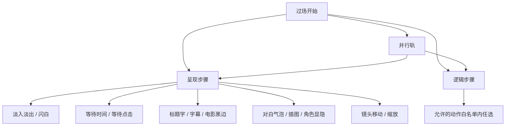
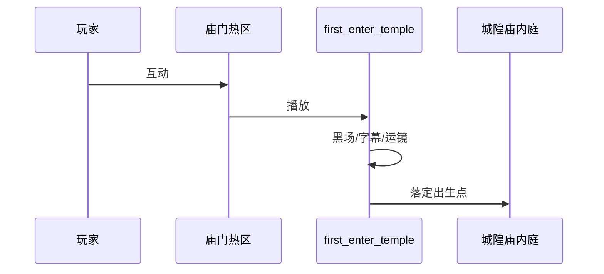

# 过场面板

有时你不想让玩家乱走，要让画面黑下去、字幕一行行出来、镜头推到城隍庙匾额上——这叫**过场**。过场面板是一条**时间轴**：从上往下（或大纲里）排步骤，每步做一件事；可以并排多轨，也可以嵌套「同时发生」的段落。排好后，场景热区、任务、图对话里用动作调用它即可。

---

## 这块面板管什么

- **过场身份**：内部 id、播完落在哪张场景、哪个出生点、落点坐标。
- **是否恢复状态**：播完是否还原玩家进过场前的某些状态（老数据里过时字段会被面板丢掉，以检视器为准）。
- **步骤序列**：画面呈现类步骤、游戏逻辑类步骤、并行轨。
- **大纲**：增删步骤、折叠、拖拽重排顺序。

过场**不是**图对话：图对话要玩家点选项；过场默认**自动往下走**（除非某步等点击）。

---

## 怎么打开

1. `./dev.sh editor` → **叙事编排 → 过场**。
2. 列表选已有过场，或 **新建** 一条。
3. 中间时间轴 / 大纲编辑步骤，右侧检视器改当前步参数。
4. Apply，在场景或任务里挂「播放此过场」类 [动作](../concepts/actions)，运行预览。

:::info[配图：过场时间轴]
截一条雾津过场：大纲里可见 fadeToBlack、showSubtitle、cameraMove 等步骤，右侧参数区。
:::

---

## 步骤类型概览

### 呈现类（玩家看得见）

常见包括：淡入黑、淡出、闪白、等待几秒、等玩家点一下、大字标题、带说话人的对白、插图显示/隐藏、电影感上下黑边、经典或电影感字幕、镜头平移与缩放、某个场景角色显示或隐藏。

镜头移动往往能在小地图上**点选目标点**，比手填坐标省心。

### 逻辑类

在允许列表里的**动作**（与全局动作系统同源，见 [动作概念](../concepts/actions)）：给物品、改旗标、切场景等。不在允许列表里的类型，编辑器会拒绝保存——别硬塞未支持项。

### 并行轨

一个「并行」块里多轨同时跑，再汇合——适合「BGM 渐强 + 字幕 + 插图」一起上。

---

## 怎么新建过场

1. **新建**，给稳定 id，如 `chenghuang_miao_enter`。
2. 设 **目标场景**（播完落在哪）、**出生点**（若有）、**落点 x/y**（若要精确站位）。
3. 在大纲 **添加步骤**，从呈现类里选第一步（常见：fadeFromBlack 或 fadeToBlack）。
4. 逐步往下接：waitTime → showSubtitle（雾津旁白）→ cameraMove（推向庙门）。
5. 需要中途发物品或改旗标，插入 **逻辑动作步**。
6. 多件事同时，包一层 **并行** 再加子轨。
7. Apply。

---

## 怎么改顺序

- 大纲里 **拖拽** 步骤行重排。
- 改单步参数在右侧检视器；改完注意前后 wait 是否还衔接得上。
- **折叠** 并行块便于看清结构。

---

## 怎么删

- 删单步：选中步骤，删除（确认并行块结构还合法）。
- 删整条过场：确认没有场景热区、任务、对话还引用该 id。

---

## 当心什么：危险区

| 风险 | 用户说法 |
|---|---|
| 呈现步多写了编辑器不认识的字段 | 保存后那些附加项**没了**，只留表单里有的 |
| 未知呈现类型反而可能整步保留 | 与「已知类型乱加字段」相反——别赌，按面板能填的来 |
| 过场顶层过时字段 | 旧式 commands 一类会被丢掉 |
| 逻辑步不在白名单 | **保存被拒**，预览也播不了 |
| 目标场景/出生点写错 | 播完掉进黑屏或落墙里 |

先读 [危险区总览](../concepts/danger-zone)。过场与 [场景](./scene) 转场是两套入口：转场是玩家走；过场常是剧情掐断控制。

---

## 雾津例子：第一次进城隍庙

1. 过场 id `first_enter_temple`：目标场景城隍庙内庭，出生点 `after_cutscene`。
2. 步骤：fadeToBlack → waitTime 0.5 → showTitle「城隍庙」→ fadeIn → cameraMove 对准香炉 → showSubtitle（庙祝画外音一句）→ waitClick → showCharacter 显示庙祝 → playScriptedDialogue 或切图对话（按你管线）。
3. 并行轨：一侧渐显 BGM，一侧字幕。
4. 末尾逻辑步：设旗标「已进过庙」。
5. 老街热区「庙门」的 [动作](../concepts/actions) 里调用此过场（而非直接转场）。

:::info[配图：进庙过场预览前后]
编辑器大纲截图 + 运行预览里字幕与镜头效果各一帧。
:::

---

## 和相关面板怎么配合

| 面板 | 关系 |
|---|---|
| [场景](./scene) | 热区可绑过场 id；目标场景与出生点要存在 |
| [图对话](./dialogue-graph) | 过场可播脚本化对白或再接对话图 |
| [音频](./audio) | 字幕配音、BGM 条目 |
| [叠图](./overlay) | 插图类步骤用的图在叠图或资源里 |
| [任务](./quest) | 任务接取/完成时播过场 |

---

## 相关概念

- [怎么编排动作](../concepts/actions)
- [怎么设条件](../concepts/conditions)
- [怎么写带引用的文本](../concepts/rich-text)
- [危险区](../concepts/danger-zone)
