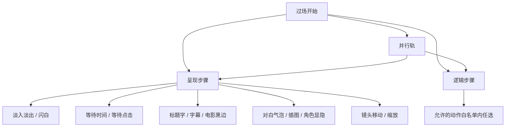
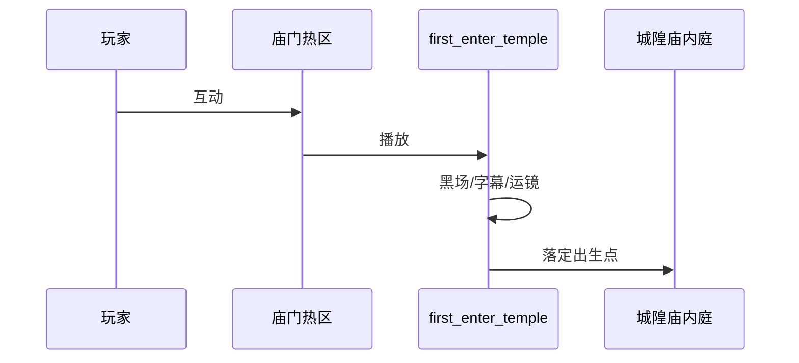

# 过场面板

有时你不想让玩家乱走，要让画面黑下去、字幕一行行出来、镜头推到城隍庙匾额上——这叫**过场**。过场面板是一条**时间轴**：从上往下（或大纲里）排步骤，每步做一件事；可以并排多轨，也可以嵌套「同时发生」的段落。排好后，场景热区、任务、图对话里用动作调用它即可。

---

## 这块面板管什么

- **过场身份**：内部 id、播完落在哪张场景、哪个出生点、落点坐标——**目标出生点**和**落点 x/y** 是两种精确度不同的选择：填出生点就沿用那张场景已经登记好的位置，填精确 x/y 是「不管出生点，直接把玩家钉在这个坐标」，两者按需二选一或搭配兜底。
- **是否恢复状态**：播完是否还原玩家进过场前的某些状态（比如过场里临时把玩家挪了个姿势，播完要不要恢复原样）；老数据里过时字段会被面板丢掉，以检视器为准。
- **步骤序列**：画面呈现类步骤、游戏逻辑类步骤、并行轨。
- **大纲**：增删步骤、折叠、拖拽重排顺序。

过场**不是**图对话：图对话要玩家点选项；过场默认**自动往下走**（除非某步等点击）。

---

## 怎么打开

1. `./dev.sh editor` → **叙事编排 → 过场**。
2. 列表选已有过场，或 **新建** 一条。
3. 中间时间轴 / 大纲编辑步骤，右侧检视器改当前步参数。
4. Apply，在场景或任务里挂「播放此过场」类 [动作](../concepts/actions)，运行预览。

:::info[配图：过场时间轴]
截一条雾津过场：大纲里可见淡入黑、字幕、镜头平移等步骤，右侧参数区。
:::

---

## 步骤类型概览

### 呈现类逐个讲（15 种，玩家看得见）

| 步骤 | 用途 | 能填什么 | 填了会怎样 |
|---|---|---|---|
| 淡入黑 | 画面缓缓黑下去 | 无额外参数或简单时长 | 常放段落开头/结尾，掩盖切换 |
| 淡入 | 从黑（或某状态）淡回正常 | 同上 | 和淡入黑配对用 |
| 闪白 | 一瞬间闪白 | 无额外参数 | 常用来表现「一惊」「灵光一现」 |
| 等待时间 | 停顿几秒 | 秒数 | 让前后节奏喘口气，别接得太急 |
| 等待点击 | 暂停，等玩家点一下才继续 | 无参数 | 把主动权交回玩家，常放在一段字幕后 |
| 标题字 | 打出一行大字 | 标题文本 | 常用于「城隍庙」这种地点/章节报幕 |
| 对白 | 弹出带说话人的一句对白 | 说话人文案 + 台词文本 + **绑定哪个具体角色身份**（决定用谁的名字和头像） | 就算过场里没有真正的 NPC 实例站着，也能借这个字段让台词配上对的脸和名字 |
| 插图显示 | 贴一张图在画面上 | 图片 id + 具体图片 | 常配合字幕/黑场做「静态立绘讲述」 |
| 插图隐藏 | 撤掉某张插图 | 图片 id | 和插图显示成对 |
| 电影黑边 | 上下加/撤电影感黑边 | 无额外参数 | 渲染「进入演出模式」的仪式感 |
| 字幕 | 打字幕 | 经典位置模式，或电影感模式（对齐方式 + 可选配音/表情标记） | 两种排版风格二选一，别混填 |
| 镜头平移 | 镜头挪到某个点 | 目标坐标 + 时长 | 常在小地图上**直接点选目标点**，比手填坐标省心 |
| 镜头缩放 | 镜头拉近/拉远 | 缩放倍数 + 时长 | 配合镜头平移做「推向匾额」这类运镜 |
| 角色显隐 | 让**场景里已有的某个 NPC 实例**当场显示或隐藏 | 显示/隐藏开关 | 不是新建角色，只是控制已经摆在这张场景里的那个实例，见前后场地隐身/现身效果 |

### 逻辑类

在允许列表里的**动作**（与全局动作系统同源，见 [动作概念](../concepts/actions)）：给物品、改旗标、切场景等——但过场这里能用的动作只是全部动作里的一个子集（大约三十来种，覆盖最常见的发东西/改状态），具体每个动作是什么用途去 [动作总表](./actions) 查。不在允许列表里的类型，编辑器会拒绝保存——别硬塞未支持项。

### 并行轨

一个「并行」块里多轨同时跑，再汇合——适合「BGM 渐强 + 字幕 + 插图」一起上。

---

## 怎么新建过场

1. **新建**，给稳定 id，如 `chenghuang_miao_enter`。
2. 设 **目标场景**（播完落在哪）、**出生点**（若有）、**落点 x/y**（若要精确站位）。
3. 在大纲 **添加步骤**，从呈现类里选第一步（常见：淡入或淡入黑）。
4. 逐步往下接：等待时间 → 字幕（雾津旁白）→ 镜头平移（推向庙门）。
5. 需要中途发物品或改旗标，插入 **逻辑动作步**。
6. 多件事同时，包一层 **并行** 再加子轨。
7. Apply。

---

## 怎么改顺序

- 大纲里 **拖拽** 步骤行重排。
- 改单步参数在右侧检视器；改完注意前后 wait 是否还衔接得上。
- **折叠** 并行块便于看清结构。

---

## 怎么删

- 删单步：选中步骤，删除（确认并行块结构还合法）。
- 删整条过场：确认没有场景热区、任务、对话还引用该 id。

---

## 当心什么：危险区

| 风险 | 用户说法 |
|---|---|
| 呈现步多写了编辑器不认识的字段 | 保存后那些附加项**没了**，只留表单里有的 |
| 未知呈现类型反而可能整步保留 | 与「已知类型乱加字段」相反——别赌，按面板能填的来 |
| 过场顶层过时字段 | 旧式 commands 一类会被丢掉 |
| 逻辑步不在白名单 | **保存被拒**，预览也播不了 |
| 目标场景/出生点写错 | 播完掉进黑屏或落墙里 |

先读 [危险区总览](../concepts/danger-zone)。过场与 [场景](./scene) 转场是两套入口：转场是玩家走；过场常是剧情掐断控制。

---

## 雾津例子：第一次进城隍庙

1. 过场 id `first_enter_temple`：目标场景城隍庙内庭，出生点 `after_cutscene`。
2. 步骤：淡入黑 → 等待时间 0.5 → 标题字「城隍庙」→ 淡入 → 镜头平移对准香炉 → 字幕（庙祝画外音一句）→ 等待点击 → 角色显隐显示庙祝 → 播放脚本对白或切图对话（按你管线）。
3. 并行轨：一侧渐显 BGM，一侧字幕。
4. 末尾逻辑步：设旗标「已进过庙」。
5. 老街热区「庙门」的 [动作](../concepts/actions) 里调用此过场（而非直接转场）。

:::info[配图：进庙过场预览前后]
编辑器大纲截图 + 运行预览里字幕与镜头效果各一帧。
:::

---

## 常见问题

| 现象 | 原因 | 怎么办 |
|---|---|---|
| 保存时被拒，报某个动作不认识 | 逻辑步用了不在过场白名单里的动作类型 | 换成允许列表里的动作，或改用场景/图对话里的动作而非塞进过场 |
| 对白步骤头像/名字不对 | 对白步骤没绑对具体的角色身份 | 检视器里把对白步骤的角色身份填成你想要那个人 |
| 播完玩家掉进黑屏或卡墙里 | 目标场景、出生点或落点坐标写错 | 核对目标场景是否存在、出生点 key 是否拼对 |
| 多写的参数保存后不见了 | 已知呈现步的字段之外多塞的内容，属于重建区，只留检视器认识的项 | 别手写字段，全走检视器和面板自带的输入项 |
| 并行轨的字幕和镜头对不齐 | 各轨时长没协调好，或某轨等待时间漏配 | 检查每条轨的等待时长，让它们该同时结束的地方对齐 |
| 过场播完角色姿势乱了 | 没打开「是否恢复状态」 | 按需要打开该开关，让玩家状态还原 |

---

## 和相关面板怎么配合

| 面板 | 关系 |
|---|---|
| [场景](./scene) | 热区可绑过场 id；目标场景与出生点要存在 |
| [图对话](./dialogue-graph) | 过场可播脚本化对白或再接对话图 |
| [音频](./audio) | 字幕配音、BGM 条目 |
| [叠图](./overlay) | 插图类步骤用的图在叠图或资源里 |
| [任务](./quest) | 任务接取/完成时播过场 |

---

## 相关概念

- [怎么编排动作](../concepts/actions)
- [怎么设条件](../concepts/conditions)
- [怎么写带引用的文本](../concepts/rich-text)
- [危险区](../concepts/danger-zone)
