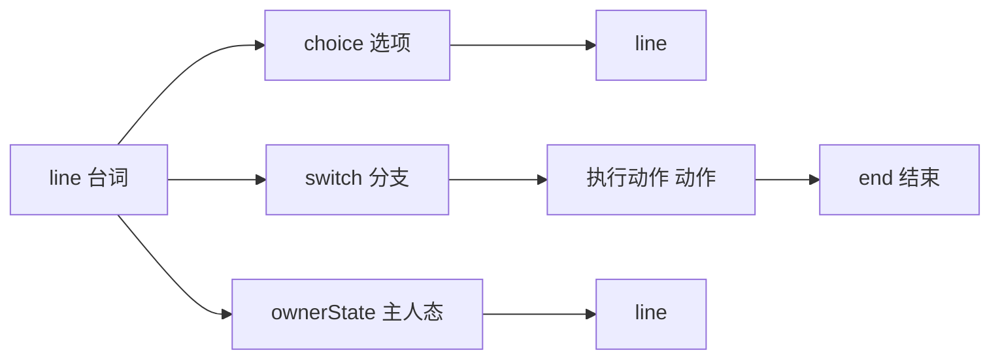
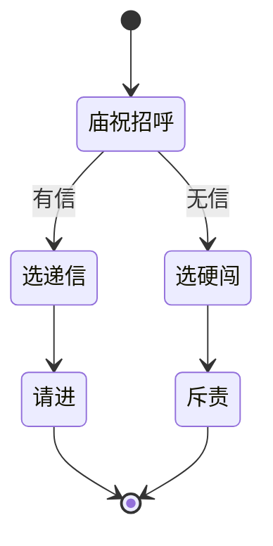

# 图对话面板

一句对白接一句、玩家选「信还是不信」、满足某任务才出现的隐藏选项——在 **图对话** 里用**节点**画出来，用线指明「说完去哪」。它比纯表格更贴策划脑中的「分支图」，也和 [叙事状态机](./narrative)、[任务](./quest) 共享同一套 [条件](../concepts/conditions) 与 [动作](../concepts/actions)。

主编辑器里的图对话页内嵌专用图编辑器；你也可以从菜单打开独立图对话工具，本质编的是同一份图。

---

## 这块面板管什么

- **整张对话图**：图 id、入口节点、图级前置条件（可选）。
- **七种节点**：台词、选项、分支开关、跑动作、主人态/上下文态、结束。
- **连线**：谁的下一句是谁；选项每条线一个目标。
- **节点内文本**：说话人、台词、[富文本](../concepts/rich-text) 引用。

场景 NPC、热区观察、过场、任务奖励里「开始某图对话」都会指向这里的图 id + 入口。

---

## 怎么打开

1. `./dev.sh editor` → **叙事编排 → 图对话**。
2. 列表选图，或新建一张图。
3. 画布上放节点、拖端口连线；右侧检视器改选中节点。
4. Apply；到 [场景](./scene) 给 NPC 绑图对话与入口，预览里点人验证。

:::info[配图：图对话画布]
截关二狗相关小图：line 节点 + choice 节点，一条边指向下一个 line，检视器露出 speaker 与 text。
:::

---

## 七种节点怎么用

| 节点 | 干什么 |
|---|---|
| **台词 line** | 一人一句或连播多拍；说话人有四种身份可选（见下表），也可以多拍连播 |
| **选项 choice** | 多选项，每选项文案、下一跳、花费、规矩提示、禁用提示、条件门控 |
| **分支 switch** | 按条件挑一条往下走，无匹配走默认 |
| **跑动作 执行动作** | 执行一串 [动作](../concepts/actions) 再 next |
| **主人态 / 上下文态** | 按叙事图当前状态选不同出口（与 [叙事状态机](./narrative) 联动） |
| **结束 end** | 对话收束 |

连线两种方式：检视器 **下一跳** 填节点或点「选择…」；或在画布 **拖端口** 到另一节点。

### 台词节点的「说话人」到底该选哪种

这四种身份表面看差不多，选错了会闹出「头像挂错脸」的笑话，务必按场景分清楚：

| 说话人类型 | 什么时候用 |
|---|---|
| 玩家 player | 这句是主角自己说的 |
| NPC（跟随触发者）| 一张图打算给**好几个不同 NPC 共用**（比如同一句「哟，寻狗啊？」谁点都能说），说话人自动跟着「玩家当前点的是谁」走 |
| 场景 NPC | **点名**某一个具体的场景 NPC 实例说这句话——哪怕玩家点的不是他 |
| 纯字面 literal | 旁白、系统提示这类不需要头像和具体身份的文字 |

**容易踩的坑**：如果一张图是「两个人对话」（比如关二狗和庙祝轮流说话），说话人不能都设成「跟随触发者」的 NPC 类型——那样两句话都会被解析成「玩家当前点的那个人」，脸和名字全对不上。这种场景下，除了玩家实际点开对话的那个人，其余角色的台词都要显式指定成「场景 NPC」，点名具体是谁。

台词的头像和表情跟着说话人身份自动配，不用你额外去哪儿单独挑一张图——把说话人类型选对，脸自然就对了。

---

## 怎么新建一张图

1. **新建图**，id 如 `guan_ergou_dock_smalltalk`。
2. 设 **入口节点**（第一个 line 的 id）。
3. 拖入 **line**，speaker 选关二狗（关联 [角色登记](./character)），text 写「哟，寻狗啊？」。
4. 接 **choice**：「打听码头怪事」「算了」各指不同 line。
5. 若某选项要任务进行中才显示，在选项上设 **条件门控**。
6. 分支复杂时用 **switch** 按旗标/任务状态分路。
7. 结束前若要给人东西，插 **执行动作** 节点。
8. Apply。

---

## 怎么改

- **改台词**：点 line 节点，右侧改 text；多拍台词用 lines 列表追加。
- **改分支**：改 next、改 choice 的 option 目标，或画布重连线。
- **加门控**：选项或 switch case 上挂条件；图级 preconditions 控制整张图能否启动。

### 选项 choice 每一项都是什么

一个选项能填的不止「文案 + 下一跳」，全部摊开是这些：

| 项 | 用途 |
|---|---|
| 文案 | 玩家看到的那行选项文字，可走 [富文本](../concepts/rich-text) |
| 下一跳 | 选完去哪个节点 |
| 门槛：单条旗标 | 最轻量的门槛——「必须持有某旗标/旗标是某个值」这种一句话能说清的判断 |
| 门槛：完整条件 | 能力更强的条件树，能把任务状态、剧本阶段、旗标等组合起来判断；比单条旗标复杂但更灵活 |
| 花费 | 选它要花多少铜钱，游戏里点了就扣 |
| 规矩提示 | 选项旁给玩家一个「这跟哪条规矩相关」的暗示，配合 [规矩面板](./rule) |
| 禁用提示 | 选项因为门槛不满足被禁用时，玩家点了它会看到的提示文案（不是啥反应都没有） |

单条旗标门槛和完整条件门槛可以看情况二选一：只判断一条旗标用前者更省事，牵扯多个条件组合再上条件树。

### 分支 switch 怎么摆

switch 节点里是一串「条件 + 下一跳」的分支项，从上到下按顺序判断，都不满足就走默认下一跳。条件既可以用简单的「与」内联写法（只支持旗标/任务/剧本这三类判断），复杂一点就用结构化的条件树（覆盖旗标/任务/剧本/剧情台词状态/叙事状态五类判断，和别处的条件编辑器同款）。

### 主人态 / 上下文态节点

这两种节点按叙事状态来分支出口：「主人态」看的是这张对话图**所属对象**当前处于哪个叙事状态，「上下文态」看的是**当前情境**处于哪个叙事状态——具体挂的是哪张 [叙事状态机](./narrative) 图、当前是哪个状态，在节点检视器里选。用来做「同一句招呼语，根据关系进展或剧情阶段说出不同版本」这类需求。

---

## 怎么删

- 删节点前确认没有别的节点 next 还指着它；断线会导致预览走到空。
- 删整张图前全局查谁还引用该图 id（NPC、热区、任务、过场）。

---

## 当心什么

节点编辑是**数据无损往返**的，不用担心丢字段：对已经认识的节点类型，台词的多拍内容、文本引用、头像这些活字段都会**完整保存并读回**，哪怕里面数据写得有点畸形，也会原样带过去；对编辑器**不认识的节点类型**，则是整块原样保留、不动它一个字，同样不会丢。真正要注意的是这两条和数据丢失无关的限制：

| 要注意的点 | 说明 |
|---|---|
| switch 内联 AND | 只支持旗标/任务/剧本类，别写太花 |
| 条件嵌套过深 | 与全局条件上限一致，太深编不过 |

选项里可挂 **规矩提示 id**（玩家点选项前看见规矩相关暗示），与 [规矩面板](./rule) 配合。

---

## 雾津例子：城隍庙门口的试探

1. 图 `temple_gate_ask`：庙祝 line「施主何事？」→ choice 三项：递介绍信 / 硬闯 / 离开。
2. 「递介绍信」条件门控：持有某物品或旗标；next 到庙祝 line「请进」→ 执行动作 开门旗标 → end。
3. 「硬闯」next 到 line「不可无礼」→ 可接 [遭遇](./encounter) 或降好感动作。
4. switch 节点：若剧本阶段已到「夜访」，默认 next 改到夜场台词 line。
5. 场景庙门 NPC 绑此图，入口 `start`。

:::info[配图：庙门三分支]
画布圈出 choice 三选项与条件图标；预览里无信时第三项灰掉截图。
:::

---

## 常见问题

| 现象 | 原因 | 怎么办 |
|---|---|---|
| 头像/名字挂错人 | 多人共用一张图时，某句台词的说话人还是「跟随触发者」的 NPC 类型 | 把非当前点击者的台词说话人改成「场景 NPC」并点名具体是谁 |
| 选项该出现却没出现 | 门槛（单条旗标或完整条件）没满足，或写反了 | 预览里开关对应旗标/任务状态核对 |
| 选完对话卡在原地不动 | next 没连、或指向的节点被删了 | 画布里重新拖线，检查断线的节点 |
| switch 走了默认分支，明明该匹配某一项 | 内联「与」写法只支持旗标/任务/剧本三类，用了别的类型条件不生效 | 复杂判断改用结构化条件树 |
| 删了图之后场景/任务报错 | 还有 NPC、热区、任务、过场引用着这张图的 id | 删前全局搜一遍谁还指着这个图 id |

---

## 和相关面板怎么配合

| 面板 | 关系 |
|---|---|
| [场景](./scene) | NPC/热区启动图对话 |
| [角色登记](./character) | line 的 NPC 说话人头像 |
| [叙事状态机](./narrative) | 主人态/上下文态节点 |
| [规矩](./rule) | 选项规矩提示 |
| [动作总表](./actions) | 查 执行动作 能做什么 |

---

## 相关概念

- [怎么编排动作](../concepts/actions)
- [怎么设条件](../concepts/conditions)
- [怎么写带引用的文本](../concepts/rich-text)
- [危险区](../concepts/danger-zone)
