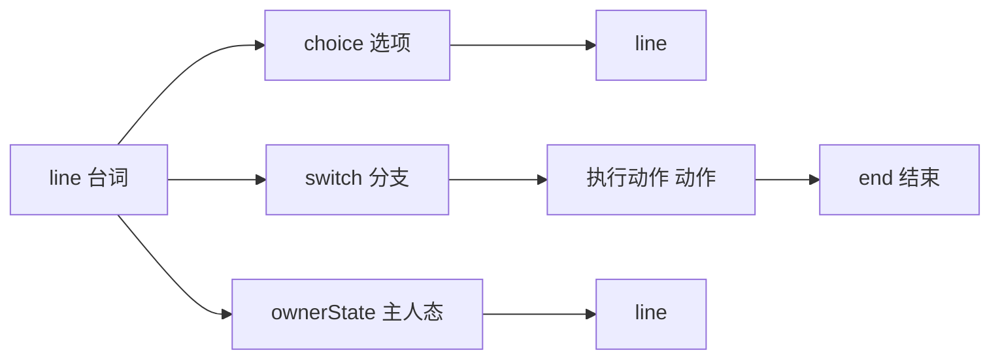
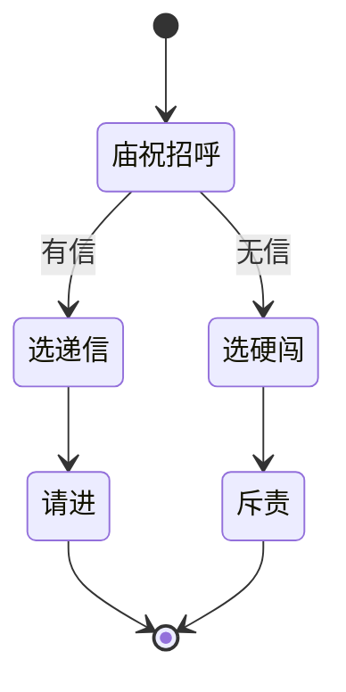

# 图对话面板

一句对白接一句、玩家选「信还是不信」、满足某任务才出现的隐藏选项——在 **图对话** 里用**节点**画出来，用线指明「说完去哪」。它比纯表格更贴策划脑中的「分支图」，也和 [叙事状态机](./narrative)、[任务](./quest) 共享同一套 [条件](../concepts/conditions) 与 [动作](../concepts/actions)。

主编辑器里的图对话页内嵌专用图编辑器；你也可以从菜单打开独立图对话工具，本质编的是同一份图。

---

## 这块面板管什么

- **整张对话图**：图 id、入口节点、图级前置条件（可选）。
- **七种节点**：台词、选项、分支开关、跑动作、主人态/上下文态、结束。
- **连线**：谁的下一句是谁；选项每条线一个目标。
- **节点内文本**：说话人、台词、[富文本](../concepts/rich-text) 引用。

场景 NPC、热区观察、过场、任务奖励里「开始某图对话」都会指向这里的图 id + 入口。

---

## 怎么打开

1. `./dev.sh editor` → **叙事编排 → 图对话**。
2. 列表选图，或新建一张图。
3. 画布上放节点、拖端口连线；右侧检视器改选中节点。
4. Apply；到 [场景](./scene) 给 NPC 绑图对话与入口，预览里点人验证。

:::info[配图：图对话画布]
截关二狗相关小图：line 节点 + choice 节点，一条边指向下一个 line，检视器露出 speaker 与 text。
:::

---

## 七种节点怎么用

| 节点 | 干什么 |
|---|---|
| **台词 line** | 一人一句或连播多拍；说话人可以是玩家、具名 NPC、场景 NPC、纯字面旁白 |
| **选项 choice** | 多选项，每选项文案、下一跳、花费、规矩提示、禁用提示、条件门控 |
| **分支 switch** | 按条件 CASE 往下走，无匹配走默认 |
| **跑动作 执行动作** | 执行一串 [动作](../concepts/actions) 再 next |
| **主人态 / 上下文态** | 按叙事图当前状态选不同出口（与 [叙事状态机](./narrative) 联动） |
| **结束 end** | 对话收束 |

连线两种方式：检视器 **下一跳** 填节点或点「选择…」；或在画布 **拖端口** 到另一节点。

---

## 怎么新建一张图

1. **新建图**，id 如 `guan_ergou_dock_smalltalk`。
2. 设 **入口节点**（第一个 line 的 id）。
3. 拖入 **line**，speaker 选关二狗（关联 [角色登记](./character)），text 写「哟，寻狗啊？」。
4. 接 **choice**：「打听码头怪事」「算了」各指不同 line。
5. 若某选项要任务进行中才显示，在选项上设 **requireCondition**。
6. 分支复杂时用 **switch** 按旗标/任务状态分路。
7. 结束前若要给人东西，插 **执行动作** 节点。
8. Apply。

---

## 怎么改

- **改台词**：点 line 节点，右侧改 text；多拍台词用 lines 列表追加。
- **改分支**：改 next、改 choice 的 option 目标，或画布重连线。
- **加门控**：选项或 switch case 上挂条件；图级 preconditions 控制整张图能否启动。

---

## 怎么删

- 删节点前确认没有别的节点 next 还指着它；断线会导致预览走到空。
- 删整张图前全局查谁还引用该图 id（NPC、热区、任务、过场）。

---

## 当心什么：危险区

| 风险 | 说明 |
|---|---|
| **打开并保存过的节点会被重建** | 你在节点上多塞的未支持字段，保存后**丢失**；没打开过的节点可能原样保留——别赌，只填面板有的 |
| 图级前置里非结构化叶子 | 某些特殊写法会被单独保留，与节点重建规则不同——仍以检视器为准 |
| switch 内联 AND | 只支持旗标/任务/剧本类，别写太花 |
| 条件嵌套过深 | 与全局条件上限一致，太深编不过 |

选项里可挂 **规矩提示 id**（玩家点选项前看见规矩相关暗示），与 [规矩面板](./rule) 配合。

---

## 雾津例子：城隍庙门口的试探

1. 图 `temple_gate_ask`：庙祝 line「施主何事？」→ choice 三项：递介绍信 / 硬闯 / 离开。
2. 「递介绍信」requireCondition：持有某物品或旗标；next 到庙祝 line「请进」→ 执行动作 开门旗标 → end。
3. 「硬闯」next 到 line「不可无礼」→ 可接 [遭遇](./encounter) 或降好感动作。
4. switch 节点：若剧本阶段已到「夜访」，默认 next 改到夜场台词 line。
5. 场景庙门 NPC 绑此图，入口 `start`。

:::info[配图：庙门三分支]
画布圈出 choice 三选项与条件图标；预览里无信时第三项灰掉截图。
:::

---

## 和相关面板怎么配合

| 面板 | 关系 |
|---|---|
| [场景](./scene) | NPC/热区启动图对话 |
| [角色登记](./character) | line 的 NPC 说话人头像 |
| [叙事状态机](./narrative) | ownerState/contextState 节点 |
| [规矩](./rule) | 选项 ruleHint |
| [动作总表](./actions) | 查 执行动作 能做什么 |

---

## 相关概念

- [怎么编排动作](../concepts/actions)
- [怎么设条件](../concepts/conditions)
- [怎么写带引用的文本](../concepts/rich-text)
- [危险区](../concepts/danger-zone)
