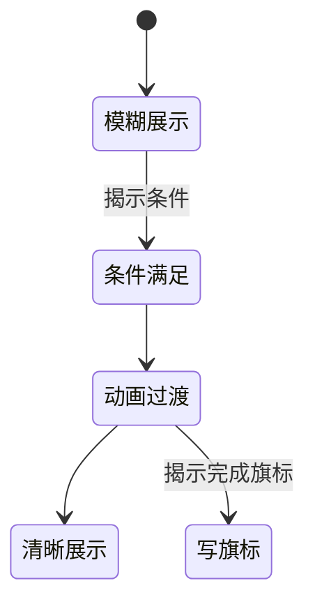

# 文档揭示面板

有些文书不能一眼看清——先模糊，满足条件后 **渐显为清晰图**，并设 **已揭示旗标**、屏幕 **位置与大小**、可选 **叠图 id**。**文档揭示** 编的就是这种 UI 片段；常用于 [档案](./archive) Companion、调查玩法、规矩验证现场。

---

## 这块面板管什么

- **id**：揭示实例代号。
- **模糊图 / 清晰图** 路径。
- **揭示条件**：五种模式之一（检视器里选）；用 [条件](../concepts/conditions) 语义。
- **动画**：durationMs、delayMs。
- **揭示完成旗标**：揭示完成后写入的旗标。
- **overlayId**（可选）：关联 [叠图](./overlay)。
- **布局**：xPercent / yPercent / widthPercent 屏幕百分比框。

---

## 怎么打开

1. `./dev.sh editor` → **资源 → 文档揭示**。
2. 列表选或新建。
3. 填图、条件、动画、旗标、位置。
4. Apply；动作用「显示文档揭示」类或场景热区触发。

:::info[配图：文档揭示表单]
截模糊/清晰路径、揭示条件、百分比布局示意框。
:::

---

## 流程

---

## 怎么新建

1. id `reveal_letter_miaozhu`。
2. blurredImage 糊信笺；clearImage 清晰扫描件。
3. 揭示条件：持有某物品或规矩 已验证层。
4. durationMs 800，delayMs 200。
5. 揭示完成旗标 `letter_miaozhu_read`。
6. xPercent/yPercent/widthPercent 摆在书桌区域。
7. Apply；读完 [档案](./archive) 见闻可要求此旗标。

---

## 怎么改 / 删

- 改条件：未揭示玩家看不到清晰图——预览两种存档状态。
- 删实例：查动作/热区引用。

---

## 当心什么

| 当心 | 说明 |
|---|---|
| 清晰图宽高比与布局框 | 拉伸丑 |
| 忘了 揭示完成旗标 | 揭示完系统不知读过 |
| 条件过严 | 永远糊 |
| 与档案重复 | 长文仍放档案；揭示适合「图证」 |

---

## 雾津例子

1. 庙祝秘函揭示：条件「庙祝信任」旗标。
2. 纸人巷调查：模糊侧影 → 清晰真容，揭示完成旗标 推 [遭遇](./encounter) 新选项。
3. overlayId 叠雾在揭示框外缘。

:::info[配图：揭示前后]
预览模糊与清晰两帧同位置。
:::

---

## 和相关面板怎么配合

| 面板 | 关系 |
|---|---|
| [叠图](./overlay) | overlayId |
| [旗标](./flags) | 揭示完成旗标 先注册 |
| [档案](./archive) | 文案互补 |
| [规矩](./rule) | 验证条件 |

---

---

## 实操检查清单

- [ ] 模糊图与清晰图宽高比接近，布局框百分比留足
- [ ] 揭示完成旗标 已在旗标表注册，揭示完成必写入
- [ ] 揭示条件可达成，预览「未满足/已满足」两种存档
- [ ] durationMs 与 delayMs 在预览里眼看舒适，勿过快或过慢
- [ ] 布局 x/y/width 百分比不挡关键 UI 与对话区
- [ ] 可选叠图 id 在叠图表存在
- [ ] 长文仍放档案，本面板适合图证式渐进
- [ ] 删实例前查热区、动作是否仍显示此揭示
- [ ] 与规矩验证、持有物类条件语义一致
- [ ] Apply 后两种条件状态各揭示一次

---

## 常见问题

| 现象 | 原因 | 怎么办 |
|---|---|---|
| 永远只看到模糊图 | 揭示条件过严或未满足 | 放宽条件或测真存档 |
| 揭示后进度没记 | 未填 揭示完成旗标 | 补旗标并注册 |
| 清晰图被拉变形 | 布局框比例与素材不符 | 调百分比或换图 |
| 揭示框点不到 | 位置百分比偏出屏 | 重调布局 |
| 与档案内容重复 | 分工不清 | 长文迁档案，此留图证 |

---

## 预览验证

1. 填好双图、条件、动画、旗标与布局，Apply。
2. 用未满足条件的存档触发，应维持模糊。
3. 满足条件后再触发，看渐显动画与清晰图。
4. 确认 揭示完成旗标 写入后，档案或遭遇新选项解锁。
5. 若有叠图，看框外缘雾气是否自然。
6. 改 duration 后再测，直到过渡不突兀。

---

庙祝秘函宜在「庙祝信任」旗标为真后才渐显——你应用假存档各测一遍，防剧透。纸人巷侧影揭示若推遭遇新选项，揭示完成旗标 必须与遭遇条件同一键。书桌区域布局框宜偏右下，给左侧对话留位，雾津调查场景常同时开 talk 与图证。

---

## 相关概念

- [怎么编排动作](../concepts/actions)
- [怎么设条件](../concepts/conditions)
- [怎么写带引用的文本](../concepts/rich-text)
- [危险区](../concepts/danger-zone)
