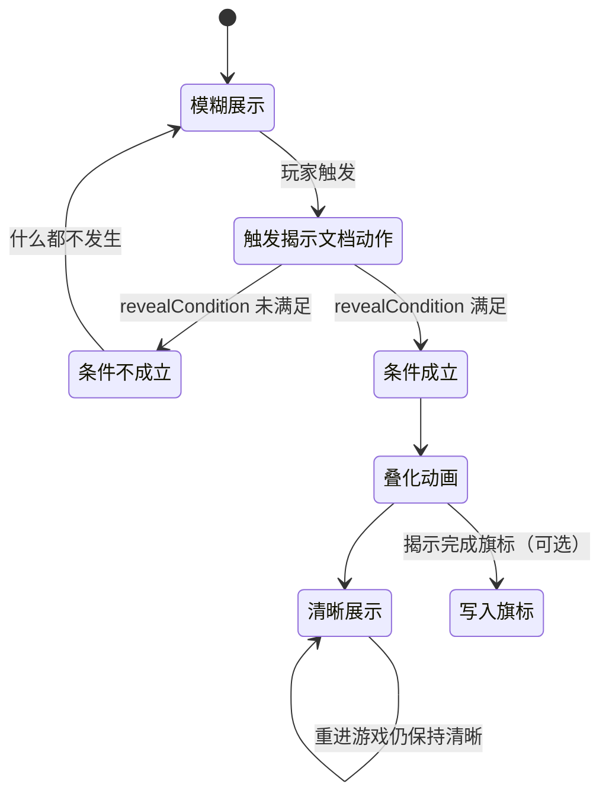

# 文档揭示面板

有些文书不能一眼看清——先是一团模糊，等玩家满足某个剧情条件后，才 **渐显为清晰图**。**文档揭示** 面板编的就是这一整套"模糊 → 清晰"的揭示包：两张图、一个触发条件、一段叠化时长、可选的"已揭示"记录。常用于[档案](./archive) 的配套证据、调查玩法、规矩验证现场。读完这页你能独立配好一条揭示、接对触发动作，并搞清楚它和"叠图"面板到底是不是一回事（不是）。

---

## 这是什么（30 秒看懂）

想象庙祝手里那封被水浸糊的信——玩家要先集齐线索、或者剧情推进到某一步，信上的字迹才"洇"出清楚来。这层效果就是**文档揭示**在管：它把"一张模糊图、一张清晰图、什么条件下切换、切换要多久、切换完要不要记一笔"打包成一条条目，交给一个专门的动作去触发。

它和上一页的[叠图](./overlay)面板**不是同一套东西**：叠图管的是"呈现叠图/叠化叠图"这几个动作的图片来源，文档揭示的模糊图/清晰图是**各自独立选文件**，跟叠图登记表完全无关；连它里面那个看起来很像的图层句柄字段，也只是内部代号，不是引用叠图表——这些容易搞混的地方，进阶部分会逐条讲清楚。

---

## 入门：手把手做第一次

1. 打开主编辑器 → **资源 → 文档揭示**。
2. 点"添加"新建一条：**id** 建议和对应的[档案](./archive)文档同名（方便联想），也可以点"生成唯一 id"让编辑器自动分配。
3. **模糊图** 和 **清晰图** 各自点浏览选一张图片（建议尺寸、构图尽量一致，叠化才不会显得"跳"）。想偷懒的话，选好清晰图后可以用"涂抹生成"按钮，手绘水墨涂抹烘焙出一张同尺寸的模糊图，不用另外画一版。
4. **揭示条件** 先选最常用的"Scenario 阶段"模式：挑一条剧情线、一个阶段、要求达到"已完成"状态。
5. **过渡时序**：叠化时长填 2000（2 秒），起播延迟留 0（立即）。
6. **位置**：x/y 百分比先用默认 50/50（正中），宽度百分比填 40（占四成屏宽）。
7. 可选填一个**揭示完成旗标**，比如 `letter_miaozhu_read`。
8. 点 Apply 保存。
9. 去[图对话](./dialogue-graph)的动作序列或[过场](./cutscene)里加一条**揭示文档**动作，「这条揭示对应的文档」选你刚建的这条 id。
10. 运行预览，用一个还没满足条件的存档触发这条动作——应该还是模糊图；再用满足条件的存档触发一次，看叠化动画和最终清晰图。

**雾津小例子**：庙祝书案上有一封秘函，模糊图是水渍信纸，清晰图是墨迹工整的扫描件；揭示条件设成"庙祝信任"这条剧情线到达"已完成"阶段；玩家在跟庙祝对话到位后，去检查这封信的热区触发"揭示文档"，信才真正显出内容。

---

## 进阶：每一项都讲透

### 基本信息

- **id**：这条揭示的标识，剧情侧靠它触发——"揭示文档"动作里"这条揭示对应的文档"下拉选它。可以和[档案](./archive)里一条文档同名，让"看揭示"和"翻档案"联动起来；没想好名字就点"生成唯一 id"。
- **模糊图**：揭示前显示的"看不清"图，直接选文件路径，**不走叠图登记表的短 id**。
- **清晰图**：揭示后显示的"看清"图，叠化结束后就一直保留这张，同样是直接选文件。建议和模糊图同尺寸同构图，叠化才自然；如果懒得单独画模糊图，用"涂抹生成"按钮对清晰图手绘涂抹烘焙一张即可。

### 揭示条件（五种模式逐条讲）

这是整个面板的核心，决定"什么时候真的会揭示"：

1. **Scenario 阶段**（最常用）：选一条剧情线（scenario），选它的某个阶段（phase），选要求达到的状态（一般用"已完成 done"），还可以选填一个具体的 outcome（要求这个阶段是某个特定结局值才揭示，不需要就留空）。
2. **Flag 条件**：从旗标登记表里选一个已注册的 flag，选比较方式（`==`最常用，也支持 `!= > < >= <=`），填要求达到的值。
3. **任务状态**：选一个[任务](./quest)，选要求它到达的状态（如"已完成"或"进行中"）。
4. **JSON（高级：条件表达式）**：直接写一段条件表达式，给需要复杂且/或/非组合、又想手写的老手用。
5. **表达式树（all/any/not…）**：可视化拼且/或/非，效果等价于第 4 种，但用界面拖拽而不是手写，语义和通用的[条件](../concepts/conditions)控件一致。

日常内容用前三种基本够用，第 4/5 种留给确实需要组合逻辑（比如"A 完成 且 （B 或 C）"）的场合。

### 过渡时序（animation）

- **叠化时长**：叠化用多久（毫秒），2000 就是 2 秒，眼看着从模糊渐变到清晰。
- **起播延迟**：触发后先等多久再开始叠化（毫秒），0 就是立即开始，留一点延迟可以让玩家先意识到"发生了什么"再看画面变化。

### 位置与可选字段

- **揭示完成旗标（可选）**：揭示成功后自动写为真的一个 flag。想让别处的条件、对话分支知道"这条已经看过了"，就给它填一个；不需要跨系统联动就留空。
- **水平/垂直位置百分比**：清晰图（以及模糊图）中心贴在屏幕的水平/垂直百分比位置，50/50 是正中。
- **宽度百分比**：图的显示宽度占屏幕宽度的百分比，高度按图自身比例自动算，不用你手动配比。
- **高级：图层句柄（一般留空）**：**这不是叠图登记表的引用**，只是给这层揭示动画本身起的一个内部"把手"名字，留空时系统会自动生成一个。只有极少数需要用其它动作专门去寻址/关闭这一层的高级场景才需要手填，绝大多数情况完全不用碰这个字段。

### 怎么让它真正触发——揭示文档动作

文档揭示登记好之后**不会自己触发**，必须在[图对话](./dialogue-graph)的动作序列、[过场](./cutscene)，或其它能挂动作的地方加一条**揭示文档**动作，「这条揭示对应的文档」选这条登记的 id：

- 玩家触发这个动作时，系统才会去检查这条的揭示条件是否成立。
- **成立**：播放模糊到清晰的叠化动画、写入揭示完成旗标（若填了）、并把"已揭示"状态记进存档——下次重新进入游戏依然保持清晰，不会重播叠化。
- **不成立**：什么都不发生，玩家看到的仍然是模糊图。这意味着你完全可以把这条"揭示文档"动作挂在一个反复可点的检查类热区上——玩家没达成条件时点了也没关系，条件一旦满足再点一次就会真正揭示。

### 和"叠化叠图"动作的关系与迁移建议

早期做法是直接在过场/图对话里手写[叠图](./overlay)面板下的**叠化叠图**动作，给它填两张图路径来做"模糊变清晰"的效果。项目现在建议：这类"告示揭示真相"式的效果优先用**文档揭示 + 揭示文档动作**来做——条件判断、完成旗标、存档持久化都是专门支持好的，不用你在动作参数里手写来拼凑；只有确实不需要"记住是否揭示过"的一次性叠化效果，才继续用叠化叠图动作。

### 批量做法与效率窍门

- 一批"先糊后清"的信件/告示，先把清晰图画好，用"涂抹生成"批量刷出对应模糊图，省一版单独素材。
- id 与对应档案文档同名，玩家"揭示了信件"和"翻档案能查到同一条"体验上更连贯。
- 调 x/y/宽度百分比时可以对着编辑器自带的"揭示过渡预览"（Qt 近似渲染，和运行时叠化逻辑同源）边调边看，不用来回进游戏试。

---

## 危险区与边界

- **模糊图/清晰图比例不一致**会导致清晰图被拉伸变形——建议两图同尺寸同构图。
- **最容易踩的坑**：面板里登记好了一条，却忘了在图对话/过场里挂"揭示文档"动作——这样玩家永远碰不到触发点，画面会永远停在模糊图，看起来像是"这功能没做"。
- **揭示完成旗标不是必填**，但不填的话别处系统没法知道"这条到底揭示过没有"，只能靠揭示条件本身重复判断。
- **图层句柄不要填图片路径**——它是内部把手名字，不是"贴哪张图"的字段，图永远填模糊图/清晰图两个专门的位置。
- 长篇文字内容仍然放[档案](./archive)，本面板更适合"图证式"的渐进揭示，别把大段文案塞进这里凑数。
- 更多编辑器整体可编辑边界见 [危险区](../concepts/danger-zone)。

---

## 常见问题

| 现象 | 原因 | 怎么办 |
|---|---|---|
| 永远只看到模糊图 | 没有任何地方挂"揭示文档"动作，或挂了但揭示条件一直未满足 | 检查图对话/过场是否加了揭示文档动作；用满足条件的存档测试 |
| 揭示完成后进度没被记住 | 没填揭示完成旗标 | 补上这个字段并 Apply |
| 清晰图被拉变形 | 布局宽度百分比与素材原始比例不符 | 调整宽度百分比或换成同比例的图 |
| 图层句柄填了图片名但没用 | 这个字段不是图片引用，是内部把手 | 图片改填模糊图 / 清晰图对应的字段 |
| 和叠图面板的图混着改 | 两套图片各自独立，互不联动 | 图片改动分别去对应面板改 |
| 重进游戏又看到叠化动画重播一遍 | 揭示状态会持久化，不会重播；如果重播了，通常是这条 id 被误删后又重建过 | 核对 id 是否被改名/重建，必要时恢复原 id |

---

## 相关

- [叠图](./overlay)——图片各自独立选文件，两者不共用素材登记
- [档案](./archive)——长文与本面板"图证式"内容互补
- [规矩](./rule)——常作为揭示条件的验证来源之一
- [旗标](./flags)——揭示完成旗标需要先在这里注册
- [怎么编排动作](../concepts/actions)
- [怎么设条件](../concepts/conditions)
- [危险区](../concepts/danger-zone)
