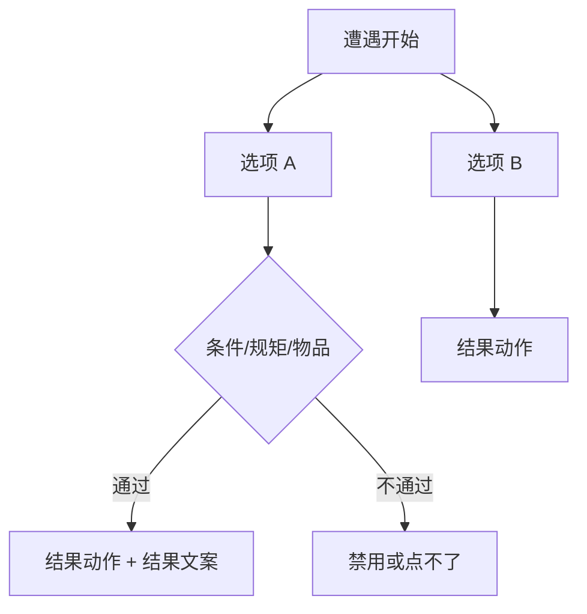
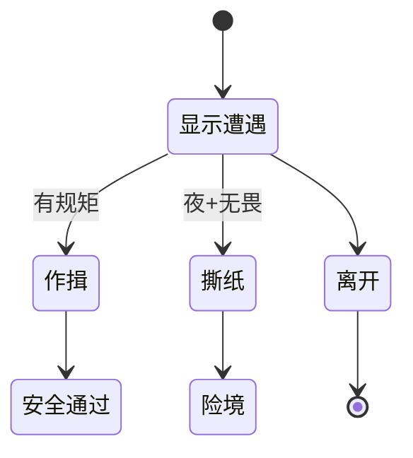

# 遭遇面板

不是每段冲突都适合用图对话慢慢聊。**遭遇**是「一页多个选项」的玩法：每个选项有文案、类型、可能要守的 [规矩](./rule)、消耗的物品、满足才点的 [条件](../concepts/conditions)，点完跑 **结果动作** 并显示 **结果文案**。雾津里城隍庙前的对峙、纸人巷的抉择，都适合做成遭遇挂在场景热区上。

---

## 这块面板管什么

- **遭遇身份**：id、叙事铺垫文案（给玩家看的前后文）。
- **选项列表**：每条选项的显示、逻辑、消耗、结果。
- **选项排序**：上下移动调显示顺序。
- **生成唯一 id**：新建选项时可用工具生成，避免手写撞车。

---

## 怎么打开

1. `./dev.sh editor` → **叙事编排 → 遭遇**。
2. 列表选遭遇或新建。
3. 中部编选项，右侧或行内改字段。
4. Apply；在 [场景](./scene) 加热区类型 **遭遇**，填遭遇 id，预览触发。

:::info[配图：遭遇选项表]
截三条选项：一条要规矩、一条耗物品、右侧 resultText 区域。
:::

---

## 选项里有什么

| 字段 | 玩家感受 |
|---|---|
| 选项文案 | 按钮上写什么 |
| 类型 | 影响样式或逻辑分类（按项目配置） |
| 所需规矩 | 必须持有/遵守某条规矩才能选 |
| 规矩层 | 象理术等分层规矩时选哪一层 |
| 条件 | 额外门控 |
| 消耗物品 | 选这项要扣什么 |
| 结果动作 | 成功后 [动作](../concepts/actions) 一串 |
| 结果文案 | 选完反馈给玩家的文字 |

---

## 怎么新建遭遇

1. 新建 id，如 `temple_standoff`。
2. 叙事区写开场说明（富文本可引 [物品](../concepts/rich-text)/人名）。
3. **添加选项**：「出示符纸」「硬闯」「逃走」。
4. 「出示符纸」：所需规矩选规矩、消耗物品填符纸、结果动作设开门旗标、结果文案写「庙祝让开了路」。
5. 「硬闯」：无规矩、结果动作 降好感或进战斗遭遇 id。
6. 调选项顺序：把「逃走」放最后。
7. Apply。

---

## 怎么改 / 删

- **改选项**：直接改行；改 结果动作 后预览必点一次。
- **删选项**：删行即可。
- **删遭遇**：确认场景热区、任务、对话没有还引用。

---

## 当心什么

| 当心 | 说明 |
|---|---|
| 规矩 id 写错 | 选项永远灰掉 |
| 消耗物品没配够 | 能点但扣失败或逻辑异常——预览测 |
| 结果动作太多 | 和图对话一样，用 执行动作 思想拆清 |
| 只写结果文案没动作 | 玩家看见字但世界没变 |

遭遇保存相对直接；联动 [规矩](./rule) 三层文本时，**所需规矩层**要和策划文档一致（象理/实证/口传等命名以游戏为准）。

---

## 雾津例子：纸人巷口抉择

1. 遭遇 `paper_alley_choice`：叙事「巷口纸人似乎在看你。」
2. 选项「作揖」（要规矩：民间禁忌·对纸人行礼）→ 结果动作 安全通过旗标。
3. 选项「撕纸人」（消耗无，条件：夜位面）→ 结果动作 进 [临场长按](./pressure-hold) 或掉血。
4. 选项「离开」→ 仅 resultText。
5. 场景热区 encounter 指向本 id；仅当旗标「已到巷口」时热区 conditions 显示。

:::info[配图：遭遇游戏内 UI]
预览里遭遇弹层 + 一选项因规矩不满足变灰。
:::

---

## 和相关面板怎么配合

| 面板 | 关系 |
|---|---|
| [场景](./scene) | encounter 热区 |
| [规矩](./rule) | 所需规矩 |
| [物品](./item) | 消耗物品 |
| [任务](./quest) | 结果动作推任务 |
| [图对话](./dialogue-graph) | 遭遇后可接对话 |

---

---

## 实操检查清单

- [ ] 遭遇 id 与场景热区 encounter 引用一致
- [ ] 每选项 结果动作 与 resultText 成对，勿只写字不变世界
- [ ] 所需规矩 与规矩层与策划文档一致
- [ ] 消耗物品 数量够，预览实点扣减
- [ ] 条件不满足时选项灰或不可点
- [ ] 选项顺序影响显示，把「离开」放最后
- [ ] 叙事铺垫富文本可引物品/人名
- [ ] 删遭遇前查热区、任务、对话引用
- [ ] 结果动作过多时用 执行动作 思想拆清
- [ ] Apply 后从热区触发测每条选项

---

## 常见问题

| 现象 | 原因 | 怎么办 |
|---|---|---|
| 选项永远灰 | 规矩 id 或层错 | 对齐规矩面板 |
| 点了没扣物 | consume 配置或数量不对 | 查物品与 preview |
| 字变了门没开 | 缺 结果动作 | 补动作 |
| 热区不弹遭遇 | 热区 conditions 或 id 错 | 查场景 |
| 硬闯无后果 | result 链空 | 补降好感或险境 |

---

## 预览验证

1. 编选项、规矩、消耗、结果，Apply。
2. 场景热区绑此遭遇，设显示条件。
3. 触发遭遇，逐一点选项。
4. 测规矩满足/不满足两态。
5. 测消耗物够不够两种库存。
6. 确认 result 推任务、旗标、长按等下游。

---

纸人巷口「作揖」要民间禁忌规矩，「撕纸」夜位面进长按——你在 preview 里白天撕应不可选或后果不同。城隍庙对峙出示符纸耗物品开门，硬闯应另一条险境链。离开选项只 resultText 即可，但前两项必须有动作。

---

## 相关概念

- [怎么编排动作](../concepts/actions)
- [怎么设条件](../concepts/conditions)
- [怎么写带引用的文本](../concepts/rich-text)
- [危险区](../concepts/danger-zone)
