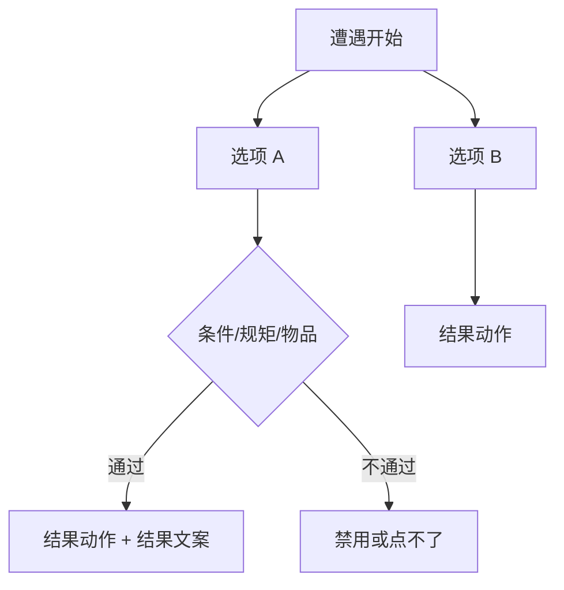
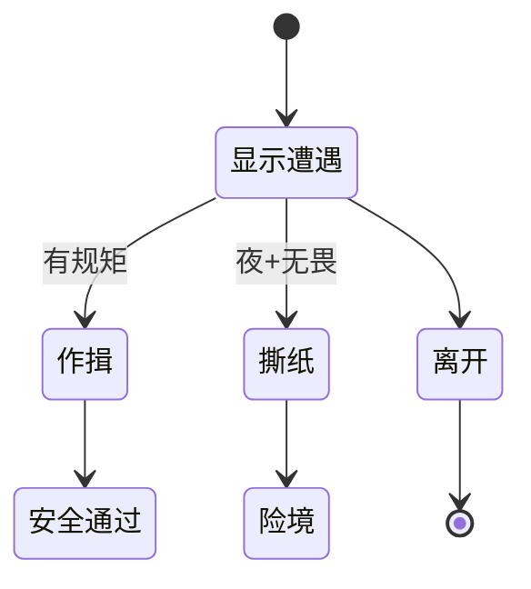

# 遭遇面板

不是每段冲突都适合用图对话慢慢聊。**遭遇**是「一页多个选项」的玩法：每个选项有文案、类别、可能要守的 [规矩](./rule)、消耗的物品、满足才点得了的 [条件](../concepts/conditions)，点完跑 **结果动作** 并显示 **结果文案**。雾津里城隍庙前的对峙、纸人巷的抉择，都适合做成遭遇挂在场景热区上。

读完这页你能：独立搭一个带规矩门槛和物品消耗的完整遭遇、看懂每一项字段具体怎么影响玩家体验、知道删改时要避开哪些坑。

---

## 这是什么（30 秒看懂）

把遭遇想成一张"临时抽出来的选择卡"：玩家走到某个热区，画面弹出这张卡，卡上写着开场铺垫和几个按钮。每个按钮背后可能锁着门槛（要有某条规矩、要扣某件物品），点了之后世界会真的发生变化（结果动作）并给玩家一句反馈（结果文案）。

*遭遇面板：左列遭遇，右侧叙述文本与选项后果。*

---

## 入门：手把手做第一次

1. `./dev.sh editor` → **叙事编排 → 遭遇**。
2. 新建一个遭遇，id 如 `temple_standoff`。
3. 叙事区写开场铺垫（富文本，可引[人名/物品](../concepts/rich-text)）。
4. **添加选项**：「出示符纸」「硬闯」「逃走」。
   - 「出示符纸」：所需规矩选一条规矩、消耗物品填符纸、结果动作设"开门"旗标、结果文案写「庙祝让开了路」。
   - 「硬闯」：不设规矩门槛，结果动作降好感或直接进另一个遭遇/险境。
   - 「逃走」：只写结果文案即可。
5. 用上下移按钮调选项顺序：把「逃走」放最后。
6. 保存；在[场景](./scene)加一个热区，类型选**遭遇**，填这个遭遇 id，预览触发验证。

:::info[配图：遭遇选项表]
截三条选项：一条要规矩、一条耗物品、右侧结果文案区域。
:::

**雾津小例子（纸人巷口抉择）**：遭遇 `paper_alley_choice`，叙事写「巷口纸人似乎在看你。」选项「作揖」要"民间禁忌·对纸人行礼"这条规矩，通过后结果动作给安全通过旗标；选项「撕纸人」不消耗物品但要求处在夜位面，结果动作把玩家送进[临场长按](./pressure-hold)或直接扣血；选项「离开」只写结果文案。场景热区绑这个遭遇 id，且只有旗标"已到巷口"为真时热区才显示。

---

## 进阶：每一项都讲透

### 遭遇本身

| 字段 | 说明 |
|---|---|
| id | 全表唯一，场景热区、动作、任务都靠这个 id 找到这条遭遇 |
| 叙事铺垫 | 玩家看到的开场文案，富文本，可插物品/人名等引用 |
| 生成唯一 id | 新建选项时编辑器可以帮你分配一个当前没被占用的 id，避免手写撞车 |

### 每条选项能填什么

| 字段 | 玩家感受 / 用途 |
|---|---|
| 选项文案（text） | 按钮上写什么 |
| 类别（type） | 三选一：**普通（general）**——没有特殊门槛的常规选项；**需规矩（rule）**——这个选项本质上要靠规矩门槛过关；**特殊（special）**——留给项目里其它特殊逻辑分类用。选哪个类别不改变门槛判定本身，主要影响样式/归类，真正的门槛还是看下面的所需规矩、条件字段 |
| 所需规矩 | 必须持有/满足某条[规矩](./rule)才能点这个选项，选完留空表示不需要规矩 |
| 所需规矩层 | 三个独立勾选框：**象**、**理**、**术**。全不勾＝要求这条规矩**完整掌握**才能选；勾了哪层，就只要求玩家**解锁了对应那一层**即可（比如只勾"象"，玩家哪怕还没学到"术"层也能选） |
| 条件 | 额外的门控，走通用[条件](../concepts/conditions)编辑器，可以叠加旗标/任务/剧本等判断 |
| 消耗物品 | 选这个选项要扣的物品和数量，可以填多条 |
| 结果动作 | 成功点选后跑的一串[动作](../concepts/actions)——改旗标、给物品、推任务、进另一个遭遇/临场长按都在这里编排 |
| 结果文案 | 选完之后反馈给玩家的文字，富文本 |

### 排序与批量技巧

- 选项**上下移**只影响显示顺序，不影响逻辑；把"逃走""放弃"这类兜底选项放最后，符合玩家阅读习惯。
- 结果动作串太长时，参考[怎么编排动作](../concepts/actions)里"用一个执行动作节点拆分复杂链"的思路，让每条选项的逻辑保持可读。
- 规矩层的三个勾选框可以任意组合勾选（比如同时勾"理"和"术"），表示玩家满足其中任一层已解锁即可，不是要求同时满足全部。

### 和相关面板怎么配合

| 面板 | 关系 |
|---|---|
| [场景](./scene) | 遭遇类型热区靠 id 找到这条遭遇 |
| [规矩](./rule) | 所需规矩、所需规矩层 |
| [物品](./item) | 消耗物品 |
| [任务](./quest) | 结果动作推进任务 |
| [图对话](./dialogue-graph) | 遭遇结束后可以接一段对话 |

---

## 危险区与边界

| 当心 | 说明 |
|---|---|
| 规矩 id 写错 | 选项会永远灰掉，点不了 |
| 消耗物品没配够 | 能点但扣减失败或逻辑异常——一定要在预览里实际点一次测 |
| 结果动作串太长 | 和图对话一样，建议拆成"执行动作"节点，别把几十步全堆在一个选项里 |
| 只写结果文案没配结果动作 | 玩家看到字，但游戏世界什么都没变——容易被误当 bug |
| 规矩层与策划文档不一致 | 象/理/术的命名和层级含义以游戏项目自己的规矩设计为准，联动前先和规矩面板对齐 |

遭遇本身保存相对直接、较少"重建丢字段"的风险；真正的坑在于**门槛配置和结果动作是否真的对齐了设计意图**。更完整的边界说明见[危险区](../concepts/danger-zone)。

---

## 常见问题

| 现象 | 原因 | 怎么办 |
|---|---|---|
| 选项永远灰 | 规矩 id 或规矩层配错 | 对照[规矩面板](./rule)核对 id 与层 |
| 点了没扣物品 | 消耗物品的数量或 id 配置不对 | 核对物品面板，预览里实点验证 |
| 结果文案变了，但门没开 | 缺少对应的结果动作 | 补上开门/改旗标等动作 |
| 热区不弹遭遇 | 场景热区绑定的遭遇 id 或显示条件写错 | 检查场景面板对应热区 |
| 硬闯选项没有任何后果 | 结果动作留空 | 补上降好感、进险境等后续动作 |

---

## 相关

- [场景面板](./scene)
- [规矩面板](./rule)
- [物品面板](./item)
- [任务面板](./quest)
- [图对话面板](./dialogue-graph)
- [临场长按面板](./pressure-hold)
- [怎么编排动作](../concepts/actions)
- [怎么设条件](../concepts/conditions)
- [怎么写带引用的文本](../concepts/rich-text)
- [危险区](../concepts/danger-zone)
