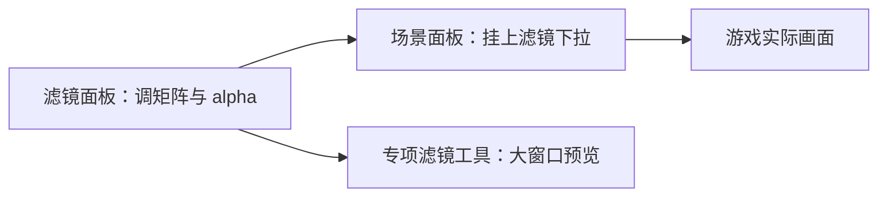

# 滤镜面板

同一张街景，黄昏要暖黄、回忆要褪色、鬼打墙要青灰——靠**滤镜**统一给整张画面染色。滤镜面板编辑每条效果的**颜色矩阵**（20 格数值，管 RGB 怎么混合）和**透明度**（alpha，整体叠加强度）；调好之后去[场景面板](./scene)的滤镜下拉挂上，才能真正用起来。读完这页你能调出一条能用的滤镜，并搞清楚滤镜 id 那个「一旦定下就不能改名」的硬限制。

---

## 这是什么（30 秒看懂）

把滤镜想成蒙在整张画面上的一层**有色玻璃**：颜色矩阵决定这层玻璃怎么扭曲原本的红绿蓝，alpha 决定这层玻璃有多不透明。同一个场景资源不用改一笔美术，只要在场景上换挂一条滤镜，就能让白天的雾津老街变成黄昏、变成回忆里褪色的样子、变成鬼打墙时那种发青发灰的诡异感。滤镜面板负责**登记**这些颜色配方，专项的滤镜工具能给你更直观的大预览，但数据登记这一步始终在滤镜面板完成。

---

## 入门：手把手做第一次

以「雾津黄昏」这条滤镜为例，从零做一遍。

1. 打开 `./dev.sh editor` → **规则与经济 → 滤镜**。
2. 点新建（这一步会生成一个新的滤镜文件，对应一个新 id——**这个 id 定下之后不能再改名**，取名前想清楚，比如叫 `filter_mist_dusk`）。
3. 从「中性」预设，或者复制一条相近的现有滤镜开始改，而不是从零瞎调 20 个矩阵格子。
4. alpha 先设在 0.3～0.6 之间试个初值，雾津黄昏可以偏暖橙调。
5. 调整矩阵让画面整体偏暖，具体数值以游戏内实时预览为准，不要只信编辑器里的小窗缩略图。
6. 点 Apply 保存。
7. 去[场景面板](./scene)，把「雾津老街」这个场景顶层的滤镜下拉选成刚才这条。
8. 进入运行预览，走进雾津老街，静止和走动各看几秒，注意颜色是否符合预期、角色脸部有没有因为矩阵过激而糊掉。

---

## 进阶：每一项都讲透

### 滤镜的三个字段

- **滤镜 id**：与滤镜文件本身绑定，**只读，不可改名**。新建时生成、决定之后就定死了。如果后来觉得取名不好，唯一的办法是新建一条新滤镜、把所有引用它的场景批量换绑到新 id、再删掉旧的那条——没有「重命名」这一步。
- **matrix**：20 个矩阵元素，控制画面的 RGB 通道怎么混合、扭曲。数值本身很抽象，改的时候不要盯着数字猜效果，永远以游戏里实时预览看到的颜色为准。
- **alpha**：整体叠加强度，值越高滤镜效果越强、原始画面被「盖」得越厉害。alpha 太高最直接的副作用是**角色脸部糊成一片**，看不清表情。

### 从哪儿起手调一条新滤镜

不要从零开始瞎调 20 个矩阵格子——效率低还容易调出诡异到没法用的颜色。更稳妥的做法：

1. 找一条已有滤镜里效果和你想要的方向接近的（比如想做黄昏就参考现有的暖色调滤镜），复制它的矩阵数值作为起点。
2. 或者从「中性」滤镜（矩阵接近不改变原始颜色）开始，一点点往你要的方向偏。
3. alpha 先给个中等初值（0.3～0.6），调完矩阵方向之后再微调 alpha 让强度合适，而不是两个一起乱试。

### 雾津常见滤镜方向

| 场景语境 | 调色方向 |
|---|---|
| 雾津老街·黄昏 | 偏暖橙，营造纸灯笼刚点上、河面起雾的感觉 |
| 夜雾津 | 偏青灰，比日常暗但不是简单压暗亮度 |
| 鬼打墙类[位面](./plane) | 明显偏青灰，和日常滤镜要有能感知到的区别，让玩家意识到「规则变了」而不只是「变暗了一点」 |
| 回忆、闪回 | 整体褪色，单独做一条，不要和日常黄昏共用一条滤镜，否则玩家分不清这段是不是「过去」 |

### 滤镜怎么用起来——和场景/位面的配合

滤镜本身不会自己生效，必须有人去引用它：

- 最常见的是[场景面板](./scene)顶层的滤镜下拉，给整个场景挂一条默认滤镜。
- 同一个场景在不同剧情阶段可能需要换滤镜——比如白天用「雾津黄昏」，进入鬼打墙[位面](./plane)后换成「鬼打墙青灰」，这时候通常是同一份场景资源、只是运行时把当前生效的滤镜换了一条,不需要为每种滤镜状态重新做一份场景。
- [过场](./cutscene)在切进一段回忆闪回前，可以切换场景滤镜，或者干脆通过转场直接进一个专门的「回忆场景」，两种做法都能实现「进入回忆」的视觉切换，具体选哪种看你的过场怎么编排。
- 滤镜和[位面](./plane)的光照设置是两套东西：光照管的是氛围感（比如整体亮度、光源效果），滤镜管的是整体色调。两者叠加使用时容易产生**双重偏色**，把画面染得过脏，遇到这种情况建议明确分工——光照负责氛围，滤镜负责色调，不要两边都往同一个方向使劲叠加。

### 效率技巧

- 新建滤镜之前先想好名字（虽然叫 id 只读，但取名尽量语义化，比如 `filter_mist_dusk` 比 `filter_02` 更容易在下拉里认出来），因为改名成本高。
- 回忆/闪回类滤镜和日常滤镜分开建，别图省事共用一条,共用会导致玩家分不清剧情发生在什么时间线上。
- 调完一条新滤镜后，习惯性地截图给美术过一眼方向对不对，比自己反复调色更省时间。

---

## 危险区与边界

- **滤镜 id 一旦定下不可改名**：新建即生成、不可重命名，想改名字只能新建一条、把所有引用它的场景批量换绑，再删掉旧条目。
- **删除滤镜前要先排查引用**：确认没有场景还挂着这个 id，否则删掉之后那些场景的滤镜下拉会指向一个空/失效的条目，容易在游戏里表现异常。
- **矩阵调得过激会让角色脸糊成一片**：这不是数据丢失风险，但是很容易被忽略的可用性问题，务必在游戏实际预览里检查，编辑器小窗预览不完全可信。
- **和位面光照叠加容易产生双重偏色**：不是编辑器本身的问题，是两套颜色/亮度系统叠加导致的效果问题，需要你在预览里主动切换对比。
- 整体来说滤镜数据结构比较直白，重建丢字段的风险低；系统性了解每个面板哪里改了会丢、哪里编辑器根本够不到，参见[危险区](../concepts/danger-zone)和[可编辑面·危险区参考](/docs/reference/danger-zone)。

---

## 常见问题

| 现象 | 原因 | 怎么办 |
|---|---|---|
| 场景色调完全没变化 | 场景顶层没有选中这条滤镜，或者选错了 | 回场景面板核对滤镜下拉并重新保存 |
| 角色脸糊成一片看不清 | 矩阵调得过激，或者 alpha 太高 | 把 alpha 往下调，矩阵向中性方向回调 |
| 想给滤镜改个名字，但改不了 | 滤镜 id 与文件绑定，只读不可改名 | 新建一条新滤镜，把引用它的场景批量换绑，再删掉旧条目 |
| 鬼打墙和黄昏叠在一起看着很脏 | 位面光照和滤镜同时往同一个方向叠色 | 明确分工：光照管氛围，滤镜管色调，避免两边同时使劲 |
| 删了某条滤镜之后场景表现异常 | 还有场景挂着这条已删除的滤镜 id | 先给那些场景换绑或解绑，再删除滤镜条目 |

---

## 相关

- [场景面板](./scene)——滤镜真正生效的挂载点
- [位面](./plane)——光照与滤镜的分工
- 专项滤镜工具——更大的实时预览窗口
- [怎么编排动作](../concepts/actions)、[怎么设条件](../concepts/conditions)、[怎么写带引用的文本](../concepts/rich-text)
- [危险区](../concepts/danger-zone) / [可编辑面·危险区参考](/docs/reference/danger-zone)
