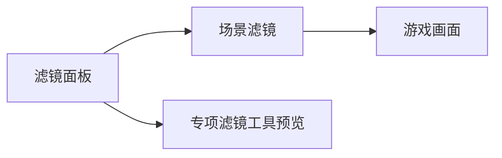

# 滤镜面板

同一场景，黄昏要暖黄、回忆要褪色、鬼打墙要青灰——靠 **滤镜**。滤镜面板编辑每条效果的 **颜色矩阵**（20 格）和 **透明度**；[场景](./scene) 顶层滤镜下拉挂上。专项 **滤镜工具** 也能预览，主面板管数据登记。

---

## 这块面板管什么

- **滤镜 id**：与文件名绑定，**只读不可改名**——要改名只能删了重建新文件。
- **matrix**：20 个矩阵元，管 RGB 通道混合。
- **alpha**：整体叠加强度。

---

## 怎么打开

1. `./dev.sh editor` → **规则与经济 → 滤镜**。
2. 列表选滤镜；右侧调矩阵与 alpha。
3. Apply；场景里选此滤镜预览。

:::info[配图：滤镜矩阵]
截「雾津黄昏」矩阵滑块/格与 alpha，旁附场景预览对比小图。
:::

---

## 使用链

---

## 怎么新建滤镜

1. **新建**（会生成新 id 文件）；id 一旦定 **不能改**。
2. 从「中性」或复制相近滤镜改矩阵。
3. alpha 先 0.3–0.6 试；雾津黄昏可偏橙、夜雾偏青。
4. Apply。
5. [场景](./scene) 雾津老街滤镜选它。

---

## 怎么改 / 删

- **改矩阵**：实时感以游戏预览为准，编辑器小窗若有也看。
- **删滤镜**：确认没有场景还挂着此 id；删后场景下拉变空项会出问题。

---

## 当心什么

| 当心 | 说明 |
|---|---|
| id 想改名 | 不支持——新建 + 场景批量换绑 |
| 矩阵过激 | 角色脸糊成一片 |
| 与光照叠 | [位面](./plane) 光照 JSON + 滤镜双重偏色 |
| 忘记场景绑定 | 滤镜做了没用上 |

滤镜保存较直白；重建风险低。

---

## 雾津例子

1. `filter_mist_dusk` 老街黄昏。
2. `filter_ghost_cyan` 鬼打墙 [位面](./plane) 场景仍用同.scene 但 filter 换这个。
3. [过场](./cutscene) 闪回步骤前切场景 filter 或靠场景转场进回忆.scene。

:::info[配图：同场景两滤镜]
预览 normal vs ghost_cyan 同机位截图。
:::

---

## 和相关面板怎么配合

| 面板 | 关系 |
|---|---|
| [场景](./scene) | 场景滤镜绑定 |
| [位面](./plane) | 光照与滤镜分工 |
| 专项滤镜工具 | 大预览 |

---

---

## 实操检查清单

- [ ] 新建滤镜时从中性或相近预设复制，而非从零乱调矩阵
- [ ] alpha 初值落在零点三到零点六之间试色，再微调
- [ ] 雾津黄昏偏暖橙、夜雾与鬼打墙偏青灰，方向与美术稿一致
- [ ] 改完矩阵后在游戏里预览，不以编辑器小窗为唯一依据
- [ ] 确认目标场景已绑定此滤镜，避免做了滤镜却未挂上
- [ ] 与位面光照叠加时各试一遍，防止双重偏色把脸糊没
- [ ] 删滤镜前全局搜一遍是否还有场景引用
- [ ] 滤镜 id 一旦定下不再试图改名，需换名则新建并批量换绑
- [ ] 回忆、闪回类滤镜单独存一条，勿与日常黄昏混用
- [ ] Apply 后切到绑定场景亲眼看一轮完整昼夜
- [ ] 过场切滤镜时与场景默认滤镜对表，避免闪屏色差

---

## 常见问题

| 现象 | 原因 | 怎么办 |
|---|---|---|
| 场景色调毫无变化 | 场景未选滤镜或选错 | 回场景检视器核对绑定并保存 |
| 角色脸糊成一片 | 矩阵过激或 alpha 过高 | 降低 alpha，矩阵向中性回调 |
| 想改滤镜名改不了 | id 与文件绑定只读 | 新建滤镜、场景批量换绑后删旧条 |
| 鬼打墙与黄昏叠太脏 | 位面光照与滤镜双重偏色 | 分工：光照管氛围、滤镜管整体色调 |
| 删滤镜后场景异常 | 仍有场景挂着已删 id | 先解绑或换绑，再删滤镜条目 |

---

## 预览验证

1. 在滤镜面板调好矩阵与 alpha，Apply 保存。
2. 打开已绑定此滤镜的代表场景（如雾津老街）。
3. 运行预览，静止与行走各看十秒，注意肤色与背景分离度。
4. 若有鬼打墙位面，切换后对比同机位下滤镜与光照叠效。
5. 截屏给美术确认黄昏/夜雾方向无误。
6. 改 alpha 后重复第三、四步，直到可读性与氛围平衡。

---

雾津老街黄昏应让玩家感到「纸灯笼刚点上、河面起雾」——滤镜 alpha 略高即可，勿把招牌字染到看不清。鬼打墙同场景换滤镜时，你最好在预览里来回切两次，确认玩家能感到「规则变了」而不只是「变暗了一点」。回忆闪回若与日常黄昏共用一条滤镜，玩家会分不清时间线，宜单独做褪色版。仓库夜访若只压暗不换滤镜，与鬼打墙位面的「规则异变」不易区分。

---

## 相关概念

- [怎么编排动作](../concepts/actions)
- [怎么设条件](../concepts/conditions)
- [怎么写带引用的文本](../concepts/rich-text)
- [危险区](../concepts/danger-zone)
