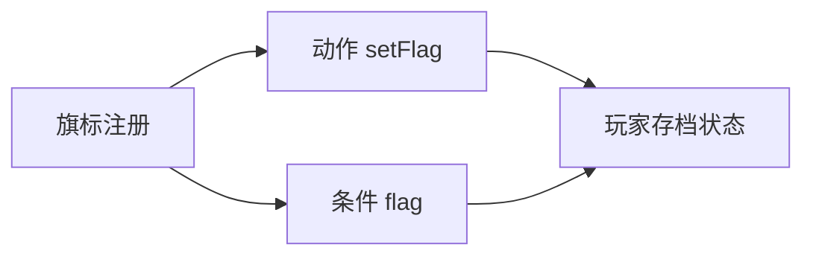

# 旗标面板

任务完成了没有、玩家有没有见过湿鞋、庙门开没开——这些**进度事实**常用 **旗标**（flag）记录。**旗标面板**（旗标注册表）不是改当前存档里的 true/false，而是声明**工程里允许有哪些键**、类型是什么、动态 id 怎么拼（模式规则）。真正改玩家进度在 [动作](../concepts/actions)「设旗标」或剧本 exposes。

---

## 这块面板管什么

### 静态旗标 static

- **key**：旗标名。
- **valueType**：布尔、数字等类型声明。

### 模式 模式规则

- 动态实体 id 的前缀/后缀/来源规则——例如每个 NPC 一个「已对话」旗标，不用手写一千条 static。

### 盲区（重要）

- **迁移块**、**运行时块** 等：**GUI 完全不暴露**。
- 它们会**原样保留**在数据里，但人类在面板里**看不到、改不到**。
- 若你的工作流需要改迁移规则或运行时注册，属于 **超出编辑器可协作范围**——要找程序 升级或专门流程，别假装「在旗标面板里能维护」。

---

## 怎么打开

1. `./dev.sh editor` → **注册 → 旗标**。
2. 编辑 静态旗标表或 模式规则。
3. Apply。

:::info[配图：旗标 static 与 模式规则]
截 静态旗标列表几条雾津进度键；模式规则 一行示例。
:::

---

## 与条件/动作的关系

[条件](../concepts/conditions) 里选 flag 叶子：key、比较符、值（可插 [富文本](../concepts/rich-text) tag）。

---

## 怎么新建 static

1. 添加 key `dock_unlocked`；valueType 布尔。
2. 添加 `clue_shoe`、 `temple_entered`……
3. 命名稳定、全项目统一 snake 或点分风格，别 `flag1`。
4. Apply；[剧本](./scenarios) exposes 写入这些键。

---

## 怎么新建 pattern

1. 模式规则 添加：prefix `npc_talked_` + idSource 来自 NPC id 等（按检视器选项）。
2. 用于「和关二狗说过话」`npc_talked_guan_ergou` 不必每条 static。

---

## 怎么改 / 删

- 改 valueType **极危险**：已有存档语义变——通常只加不改。
- 删 静态键：所有 [条件](../concepts/conditions) 还引用会失效。

---

## 当心什么

| 当心 | 用户说法 |
|---|---|
| **迁移块是盲区** | 面板里找不到 ≠ 不存在；别让人手改完以为 界面 能审 |
| **运行时块是盲区** | 同上 |
| 没注册就 setFlag | 调试可能有效，协作/校验可能报警 |
| 与任务状态重复 | quest 已完成 vs flag 双写要对表 |

必读 [危险区](../concepts/danger-zone) 盲区章节。

---

## 雾津例子

1. static：`xungou_ch1_done` 章标记。
2. pattern：`archive_read_` + 档案条目 id。
3. [地图](./map) unlock 读 `dock_unlocked`。
4. 若工程里有旧键迁到新键的迁移规则——**你看不见这块**，问程序或看工程说明，别在策划会里声称「我在旗标面板改好了迁移」。

:::info[配图：条件里选旗标]
截任务 completion 条件编辑器选 flag key 下拉。
:::

---

## 和相关面板怎么配合

| 面板 | 关系 |
|---|---|
| [剧本](./scenarios) | exposes |
| [任务](./quest) | 有时用 quest 条件代替 flag |
| [全局配置](./config) | 开局旗标 |
| [动作总表](./actions) | setFlag |

---

---

## 实操检查清单

- [ ] 新 静态键 命名全项目统一，勿 flag1 类废名
- [ ] valueType 选定后极少改，改型极危
- [ ] pattern 用于 NPC 已对话类重复键，减 static 膨胀
- [ ] 知悉 迁移块、运行时块 为盲区，不在策划会声称 界面 已改迁移
- [ ] setFlag 的键应先在此注册
- [ ] 条件编辑器选 flag 时 key 应出现在下拉
- [ ] 删 key 前搜剧本 exposes、任务、地图 unlock
- [ ] 与任务 quest 状态双写时对表
- [ ] 开局旗标 在全局配置的键也要注册
- [ ] Apply 后 preview 设一次读一次条件

---

## 常见问题

| 现象 | 原因 | 怎么办 |
|---|---|---|
| 条件下拉无此键 | 未 static 注册 | 添加 static |
| 存档语义变了 | 改 valueType | 避免改型，加新键迁移 |
| 迁移不生效 | 迁移块 在盲区 | 找程序或找程序 |
| setFlag 报警 | 键未注册 | 先登记再动作 |
| 地图不亮 | 旗标名与 exposes 不一致 | 统一命名 |

---

## 预览验证

1. 注册 static 或 pattern，Apply。
2. 在剧本 exposes 或动作里写入此键。
3. 运行 preview 触发写入。
4. 用条件编辑器选同一 key 测真/假。
5. 读档确认持久化。
6. 若用 pattern，测一个具体实例 id 键是否生成。

---

dock_unlocked 应在剧本「渡口」phase exposes 写入，地图 unlock 读同一键——你在 preview 里 phase 完成前后各开地图一次。archive_read 类 pattern 可避免每条见闻手写 static；首次阅读 动作设的 read 旗标要与档案 unlock 条件一致。 迁移块 若从旧键迁到新键，你看不见 界面 里那块，验收要靠程序或测试档。

---

## 相关概念

- [怎么编排动作](../concepts/actions)
- [怎么设条件](../concepts/conditions)
- [怎么写带引用的文本](../concepts/rich-text)
- [危险区](../concepts/danger-zone)
