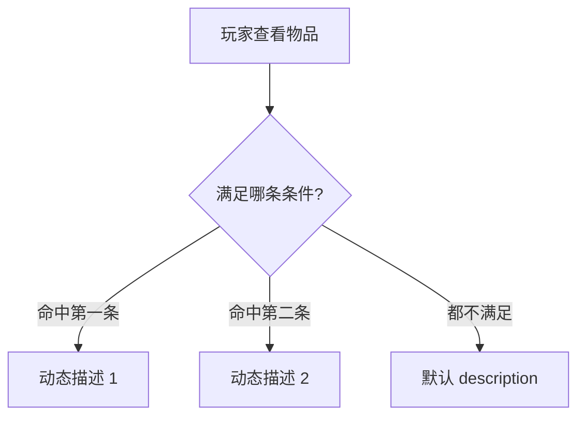

# 物品面板

玩家背包里的湿鞋、符纸、铜钱——都要先在**物品面板**立档：id、显示名、类型、静态描述、最大堆叠数、参考买入价，以及**按条件变的描述**（玩家满足某个[条件](../concepts/conditions)时，背包里显示另一段说明）。[商店](./shop)卖你、场景热区拾取引用你、[富文本](../concepts/rich-text)里的物品标签也认这些 id。读完这页你能建出一件「会随剧情变说明」的物品，并搞清楚动态描述该怎么增删。

---

## 这是什么（30 秒看懂）

把物品面板想成雾津当铺柜台后头那本**物件登记簿**：每件东西记一行——叫什么、什么类、值多少钱、平时怎么描述。特别的是，这本簿子还留了空白，可以在某个条件下追加一段新说明，比如「这双湿鞋，庙祝看过之后，鞋底的字就显出来了」——玩家在没满足条件前看到的是普通描述，满足了就换成更详细的那段。所有引用同一件物品的地方（商店卖价、拾取热区、任务判断持有）都靠同一个物品 id 对齐，这个 id 是物品身份的根。

---

## 入门：手把手做第一次

以「湿鞋」这件物品为例，从零做一遍。

1. 打开 `./dev.sh editor` → **规则与经济 → 物品**。
2. 新建，id 填 `item_wet_shoe`，name 填「湿鞋」，type 选「杂物」。
3. description 填一句短的默认说明：「从水里捞上来的旧鞋。」
4. 切到动态描述区，点**添加**一行：条件选「旗标」→ 选中「已晾干」这个键 → 值填「真」；对应文本填「鞋干了，鞋底有字……」
5. 最大堆叠数填 1（任务类物品通常不需要堆叠）；参考买入价填 0（表示这件东西不能买，是剧情里捡到的）。
6. 点 Apply 保存。
7. 去[水域小游戏](./water-minigame)面板，把「捞起成功」的结果动作设成「给物品」，物品 id 选 `item_wet_shoe`。
8. 进入运行预览：先在没有「已晾干」旗标的情况下捞起湿鞋，打开背包看默认描述；再设置旗标为真、重新打开背包，确认描述切换成了带鞋底字的那段。

---

## 进阶：每一项都讲透

### 基础字段

- **id**：全局唯一引用键。商店商品表、场景拾取热区、任务持有条件、富文本物品标签，全都靠它对齐。**改 id 基本等于新建一件物品再迁移**——编辑器不提供批量改名，所有引用要你自己一处处找出来重新绑定，动手前先全局搜一遍这个 id 有没有被别处用到。
- **name**：玩家看到的物品名字，比如「湿鞋」「引路符」。
- **type**：物品的类型分类（比如杂物、任务道具、消耗品，具体以你项目当前的类型下拉为准）。type 会影响背包里「使用」「丢弃」这类交互 UI 表现是否合理，填错可能导致某类操作出不来或者出现了不该有的操作。
- **description**：默认描述，也就是没有任何动态描述条件命中时玩家看到的说明。建议写得短一些，把「会变化」的长内容放到动态描述里，默认描述只兜底。
- **最大堆叠数**：这件物品在背包里最多能堆几个。任务类关键道具通常设 1（避免玩家囤积/误用），消耗品、货币类可以设更大的堆叠上限。
- **参考买入价**：策划参考买入价，不是商店里的实际售价。真正决定「这东西在某家店卖多少钱」的是[商店面板](./shop)商品表里独立填的 price，两者不会自动同步，改了这边记得也去对应商店那边核对一遍。

### 动态描述——按条件变的说明

动态描述列表里每一条由**条件 + 一段文本**组成：某个[条件](../concepts/conditions)（旗标、任务状态等）成立时，背包详情里显示这段文本而不是默认描述。常见用法：

- 「未鉴定 / 鉴定后」：捡到一件来历不明的东西，鉴定前描述含糊，鉴定后（对应某个旗标）描述变详细。
- 「白天看 / 夜里看」：同一件东西在不同[位面](./plane)语境下换一种说法。
- 「庙祝看过之后」：像湿鞋这个例子，某个 NPC 互动过后追加一段揭示性描述。

如果多条动态描述的条件同时成立，具体显示哪一条按游戏内部判断逻辑走，**建议在预览里把每种组合都实际点开背包看一遍**，不要只凭编辑器里的顺序假设结果。

### 怎么删——动态描述能增能删

| 操作 | 能不能做 |
|---|---|
| 删掉整件物品 | 可以，但要先确认没有别处还在引用这个 id |
| 改物品的基础字段（name、description、参考买入价 等） | 可以，随时改 |
| **删掉单条动态描述** | **可以** —— 每一条动态描述旁边都有独立的删除按钮，点了就能删掉这一条 |

写错一条动态描述之后，直接点这条自己的删除按钮删掉重写就行，不用绕弯子。删完记得点 Apply 保存，再去预览里确认对应条件下描述显示正常。

### 物品和其他面板的配合

- **[商店](./shop)**：商店商品表引用物品 id，标它自己的售价，和物品的参考买入价各管各的。
- **[场景](./scene)**：拾取类热区（type 为 pickup）直接指定物品 id、物品名称、数量、是否货币，玩家走进去或点击时给这件物品。
- **[任务](./quest)**：任务的完成条件可以判断「玩家是否持有某物品」，直接引用物品 id。
- **[文本库](./strings)**：如果物品名字、描述需要走本地化/文本库的引用体系，另外在文本库里维护外部文案，物品面板这边的字段本身也支持[富文本](../concepts/rich-text)标签引用。

### 效率技巧

- 命名 id 时统一前缀风格（比如都用 `item_` 开头），方便下拉列表里搜索定位，也方便你在别的面板里选对物品而不是选错同名近似项。
- 一批同类物品（比如各种符纸）可以先建好基础字段，动态描述留到确定好剧情触发点之后再统一补，避免过早写错又改不掉。
- 涉及货币类物品（铜钱袋一类）记得在物品这边标好货币标记，配合[商店](./shop)那边的说明一起看，别和普通杂物混着标。

---

## 危险区与边界

- **动态描述能增能删**：每条都有独立删除按钮，写错了直接删掉重写，不用靠再加一条去覆盖。
- **改 id 没有官方「改名」操作**：本质是新建+迁移，所有引用点都要自己找到重新绑定，改之前先全局搜索这个 id。
- **条件顺序影响哪条动态描述生效**：多条同时命中时的实际表现要以游戏运行逻辑为准，编辑器列表顺序不能保证就是判断顺序，靠预览逐条验证。
- **type 填错影响背包交互**：不是数据丢失风险，但会让「使用」「丢弃」这类 UI 表现不符合预期，值得在预览里为每个新类型实际点一遍。
- 更系统的「这个面板哪里改了会丢、哪里编辑器根本够不到」，参见[危险区](../concepts/danger-zone)和[可编辑面·危险区参考](/docs/reference/danger-zone)。

---

## 常见问题

| 现象 | 原因 | 怎么办 |
|---|---|---|
| 动态描述写错了想删掉 | 这条本身有独立删除按钮 | 直接点删除，重新写一条 |
| 背包里描述内容不对 | 动态描述的条件没命中，或者多条同时命中出现顺序问题 | 逐条在预览里测试条件是否按预期成立 |
| 捡到东西了，但任务却没完成 | 任务持有条件引用的物品 id 和拾取给的物品 id 不一致 | 统一两处的物品 id |
| 商店里没有这件东西可卖 | 商店那边商品表没有加对应行 | 去[商店面板](./shop)补一行，选中这件物品并填价 |
| 改了物品 id 之后，好几处都不对了 | 改 id 本质是新建，旧引用还指着老 id | 全局搜索旧 id，把商店、拾取热区、任务条件等逐一改回指向新 id |

---

## 相关

- [商店面板](./shop)——售卖引用来源，商店售价与物品参考买入价的关系
- [场景面板](./scene)——拾取热区怎么给物品
- [任务面板](./quest)——持有物品类完成条件
- [文本库](./strings)——物品名外的本地化文案
- [怎么编排动作](../concepts/actions)、[怎么设条件](../concepts/conditions)、[怎么写带引用的文本](../concepts/rich-text)
- [危险区](../concepts/danger-zone) / [可编辑面·危险区参考](/docs/reference/danger-zone)
