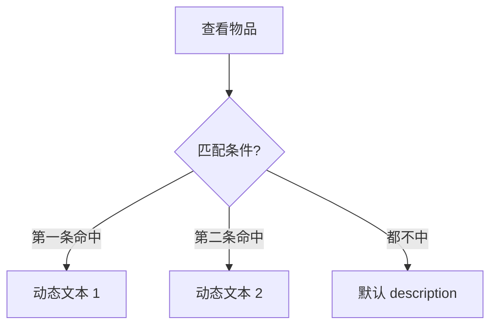

# 物品面板

玩家背包里的湿鞋、符纸、铜钱——先在 **物品面板** 立档：**id**、显示名、类型、静态描述、最大堆叠、参考买入价，以及 **按条件变的描述**（满足某 [条件](../concepts/conditions) 时背包里显示另一段说明）。商店 [引用](./shop) 你、热区拾取 [引用](./scene)、[富文本](../concepts/rich-text) 里 `[物品:…]` 也认这些 id。

---

## 这块面板管什么

- **基础**：id、name、type、description、maxStack、buyPrice。
- **动态描述列表**：每条 = 条件 + 文本；用于「未鉴定 / 鉴定后」「白天看 / 夜里看」不同说明。

---

## 怎么打开

1. `./dev.sh editor` → **规则与经济 → 物品**。
2. 列表选或新建。
3. 填基础；动态描述区 **添加** 行。
4. Apply。

:::info[配图：物品动态描述]
截物品「湿鞋」：一条默认 description + 一条条件「已鉴定」变长文案。
:::

---

## 动态描述

---

## 怎么新建物品

1. id `item_wet_shoe`；name「湿鞋」；type 杂物。
2. description 短句「从水里捞上来的旧鞋。」
3. 动态描述区添加：条件「旗标 已晾干」→ 文本「鞋干了，鞋底有字……」
4. maxStack 1；buyPrice 0（不可买）。
5. Apply；[水域小游戏](./water-minigame) 捞起成功时给此物品。

---

## 怎么改

- 改正名、改图标路径（若有字段）、改 buyPrice。
- **添加** 动态描述行：新条件+文。

---

## 怎么删 —— 当心动态描述

| 操作 | 能不能 |
|---|---|
| 删整条物品 | 可以（先解引用） |
| **删单条动态描述** | **不能** —— 界面 **只能加不能删** 单条 |

写错一条动态描述时，不能指望点垃圾桶删掉：**只能再加一条更优先/更正确的**，或找程序/L2 处理整条物品数据。这是本面板最著名的「用户说法」坑。

---

## 其它当心

| 当心 | 说明 |
|---|---|
| id 改名 | 全局拾取/商店/任务断链 |
| 条件顺序 | 多条命中时行为以游戏逻辑为准——预览每条 |
| type 乱填 | 使用/丢弃 UI 可能不对 |

---

## 雾津例子：湿鞋与符纸

1. `item_wet_shoe` 动态描述在「庙祝看过」后变。
2. `item_talisman` 可堆叠；商店与 [遭遇](./encounter) 消耗共用 id。
3. 任务 completion「持有湿鞋」指此 id。

:::info[配图：背包两条描述]
预览同一物品条件前后描述变化。
:::

---

## 和相关面板怎么配合

| 面板 | 关系 |
|---|---|
| [商店](./shop) | 售卖 |
| [场景](./scene) | 拾取热区 |
| [任务](./quest) | 持有条件 |
| [文本库](./strings) | 名外文案 |

---

---

## 实操检查清单

- [ ] 每个物品 id 全局唯一，拾取、商店、任务共用同一 id
- [ ] 动态描述条件语义清晰，多条命中时预览各测
- [ ] 知悉单条动态描述界面不能删，写错只能加不能减
- [ ] 默认 description 短，变长内容放动态描述
- [ ] maxStack 与 type 符合玩法（任务物常 1，消耗品可堆叠）
- [ ] buyPrice 作参考，商店实际价在商店面板另填
- [ ] 改 id 前全局搜引用，改 id 等于新建加迁移
- [ ] 图标路径（若有）与背包 UI 一起预览
- [ ] 与富文本物品引用 tag 用词一致
- [ ] Apply 后在背包、商店、拾取三处各看一次

---

## 常见问题

| 现象 | 原因 | 怎么办 |
|---|---|---|
| 动态描述删不掉 | 面板只支持添加 | 加更高优先级条或找程序 处理 |
| 背包描述不对 | 条件未命中或顺序问题 | 逐条测条件 |
| 拾取后任务不完成 | 物品 id 与任务条件不一致 | 统一 id |
| 商店无此物 | 未在商店表加行 | 去商店面板补商品 |
| 改 id 后全链断 | 引用仍指旧 id | 全局换绑 |

---

## 预览验证

1. 新建或改动物品，含动态描述，Apply。
2. 用 give 类动作或小游戏奖励获得此物。
3. 打开背包看默认描述。
4. 满足动态条件后再看，应切换文案。
5. 在商店购买（若可售），确认名图标一致。
6. 触发任务 completion「持有此物」，确认能完成。

---

湿鞋默认一句「从水里捞上来的旧鞋」即可，庙祝看过后再变长并提鞋底有字——你在预览里先无旗标后有旗标各看一遍。符纸与商店、遭遇消耗共用 id 时，堆叠数与扣减逻辑要实买实耗测一次。任务 completion 写「持有湿鞋」时，别在物品侧另起一名近义物。

---

## 相关概念

- [怎么编排动作](../concepts/actions)
- [怎么设条件](../concepts/conditions)
- [怎么写带引用的文本](../concepts/rich-text)
- [危险区](../concepts/danger-zone)
