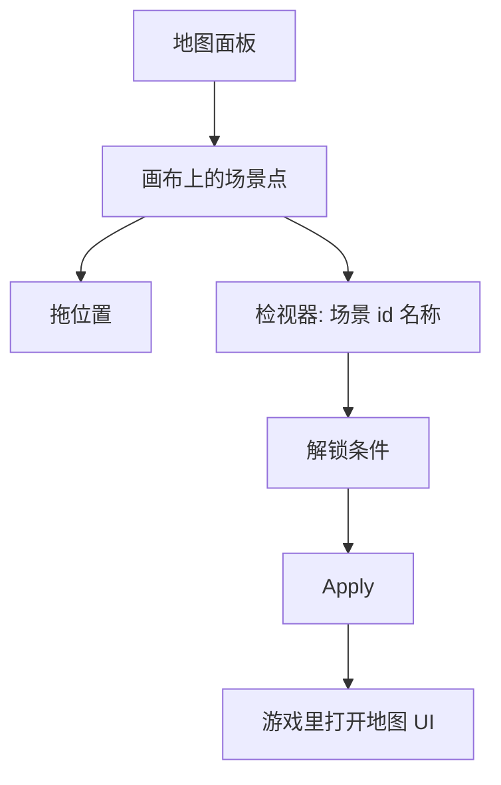
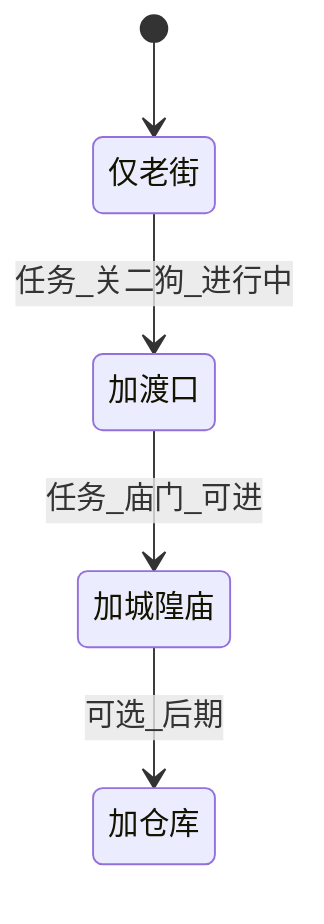

# 地图面板

玩家按地图键，看见雾津折叠在纸上的简图：码头、老街、城隍庙、仓库有没有亮、点一下能不能跳——**地图面板**管的就是这张**世界地图上的点**，不是场景里怎么走（那是 [场景面板](./scene)）。每个点对应一张场景，有坐标、显示名、以及「还没解锁时灰掉」的条件。

---

## 这块面板管什么

*地图面板：左列节点，右侧手绘水墨大地图，蓝点为节点。*

- **地图上的场景节点**：显示名、在画布上的 x/y、对应哪张场景。
- **解锁条件**：满足什么任务/旗标/剧本阶段，玩家才能在地图上点这个点（或看见它）。
- **可视化排布**：拖拽调整各场景在地图上的相对位置，方便玩家认路。

地图**不替代**场景内转场热区：室内小地图、推门进门仍在场景里做；世界地图是跨场景的「导航页」。

---

## 怎么打开

1. `./dev.sh editor` → 左侧 **物理世界 → 地图**。
2. 画布上出现现有场景点（雾津各街区）。
3. 选中一点改右侧属性，或直接拖点改位置。
4. Apply 后，游戏里打开地图界面验证。

:::info[配图：地图画布拖拽]
截世界地图画布，至少三个点（码头、老街、城隍庙），右侧 解锁条件 区域可见。
:::

---

## 界面怎么走

---

## 怎么加一个地图点

1. 点 **添加**（或工具栏新建节点）。
2. **对应场景**：下拉选已存在的场景 id（场景本身在场景列表里，不能在本面板新建场景）。
3. **显示名**：地图上给玩家看的短名，如「渡口」「城隍庙」——可走 [富文本](../concepts/rich-text) 若需强调。
4. 在画布上 **拖到** 合适位置；或检视器里填 x/y——这个坐标是「在地图这张图上的位置」，跟场景内部的世界坐标是两码事，互不影响。
5. **解锁条件**：默认可空=始终可见可点；若要「做完某任务才出现码头」，加 [条件](../concepts/conditions)。这里能用的条件跟别处一样五花八门——不光是任务状态，旗标、剧本阶段、叙事状态都能拿来做门槛，挑最贴合你想要的那种判断即可。
6. Apply。

**这一个地图点，能填的项就是这几样**：对应场景、显示名、坐标、解锁条件。没有单独的图标样式、颜色、大小之类的视觉选项——地图点长什么样，由目标场景和美术给的世界地图底图决定，编辑器这层摸不到更多花样（算是这块面板的天花板，想要更炫的表现得找美术资源或另外提需求）。

---

## 怎么改

- **挪位置**：画布拖点，玩家眼里的地理关系会变。
- **改名**：只影响地图 UI，不改场景内部名。
- **换绑场景**：极少做；换绑前查转场热区、任务是否还指着旧场景 id。
- **改解锁**：任务线推进后新点亮起是常见需求；条件语法见 [条件概念页](../concepts/conditions)。

---

## 怎么删

1. 确认没有任务 [动作](../concepts/actions) 依赖「地图显示某点」的叙事（通常没有硬依赖，但玩家会迷路）。
2. 删除地图节点**不会删除场景本身**——只是世界地图上不显示这个入口。
3. Apply。

---

## 当心什么

| 当心 | 说明 |
|---|---|
| 有场景无地图点 | 玩家只能凭场景转场摸路，地图上空一块 |
| 有地图点无场景转场 | 地图能点但落地场景没出生点或没内容 |
| 解锁条件写反 | 点一直灰或第一章就全开城隍庙 |
| 坐标重叠 | 多个点挤在一起点不到 |

地图条目保存相对直白；解锁条件与别处共用同一套条件编辑器，**嵌套过深**（超过组合上限）会编不过——保持逻辑清晰。

---

## 雾津例子：寻狗记前期的地图节奏

1. 游戏开局地图只亮 **老街** 与 **自家院子** 关联场景（条件：初始或某旗标）。
2. 关二狗任务推进后，条件满足，**渡口** 点亮起；显示名「雾津渡口」。
3. 城隍庙相关任务完成后，解锁 **城隍庙** 节点；坐标放在老街北侧，和美术世界地图底图对齐。
4. 仓库若不想 spoiler，可设「见过某档案条目」或任务完成才显示。

玩家在预览里反复开关任务旗标，看地图点是否按设计灰/亮。

---

## 和相关面板怎么配合

| 面板 | 关系 |
|---|---|
| [场景](./scene) | 每个地图点指向一张场景；转场热区管「走进去」 |
| [任务](./quest) | 常用任务完成/进行中作为解锁条件 |
| [旗标](./flags) | 探索进度记旗标后地图亮起 |
| [全局配置](./config) | 初始场景、fallback 场景影响读档落点 |

---

---

## 实操检查清单

- [ ] 每个重要场景在世界地图上有对应节点
- [ ] 显示名短而可辨，与场景内部名分工
- [ ] unlock 条件与任务、旗标、剧本 exposes 对表
- [ ] 画布上节点勿重叠，拖开可点
- [ ] 有地图点必有场景转场或出生点能落地
- [ ] 剧透区域（仓库等）用条件晚亮
- [ ] 改绑场景 id 前查转场热区与任务
- [ ] 删节点不删场景本身，但玩家会迷路——慎删
- [ ] 坐标与美术底图大致对齐
- [ ] Apply 后开关关键旗标看灰/亮

---

## 常见问题

| 现象 | 原因 | 怎么办 |
|---|---|---|
| 地图空一块 | 有场景无地图点 | 补节点 |
| 能点进黑屏 | 场景无出生点或空 scene | 回场景查 spawn |
| 第一章就全亮 | unlock 条件空或写反 | 加条件或改逻辑 |
| 点不到某点 | 多节点坐标重叠 | 画布拖开 |
| 改名后玩家仍见旧名 | 只改了场景未改地图显示名 | 改地图显示名 |

---

## 预览验证

1. 摆好节点位置与 unlock，Apply。
2. 开新档或章初存档打开地图。
3. 确认仅设计内节点亮/灰。
4. 推进任务或设旗标，看渡口等是否按节奏亮。
5. 点击可点节点，确认落地场景正确。
6. 重叠区域多点几次，无点错。

---

寻狗前期只亮老街与院子关联点，渡口要等关二狗线推进——你在 preview 里 toggle 旗标比读表直观。城隍庙放老街北侧要与水彩底图对齐，否则玩家认路靠猜。仓库若晚亮，条件可绑「见过某档案」防 spoiler。

---

## 相关概念

- [怎么编排动作](../concepts/actions)
- [怎么设条件](../concepts/conditions)
- [怎么写带引用的文本](../concepts/rich-text)
- [危险区](../concepts/danger-zone)
