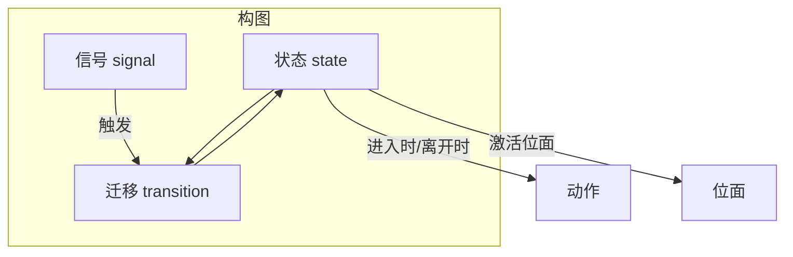
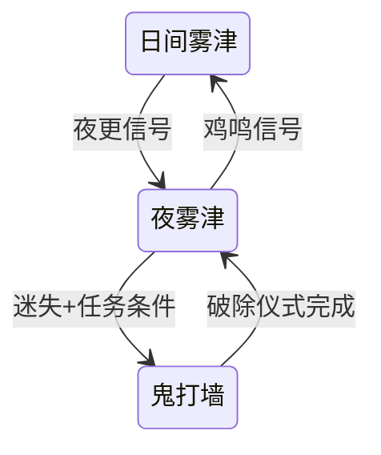

# 叙事状态机面板

任务面板管「接了什么、交什么」；图对话管「这句怎么说」；**叙事状态机**管更高一层：**故事现在处于哪个阶段、什么信号一来就跳转、进哪个位面**。寻狗记里日夜切换、剧本线推进、主动激活某「位面」——很多要在这里画成**状态**和**迁移**。

本面板在主编辑器里是嵌网页画布的形态（你仍是在主编辑器里操作，只是中间那块是流程图 UI）。读完这页你能：看懂画布上的状态与连线、独立搭一条完整的迁移链、用面板自带的「安全改名」「模板」「任务总线」「运行时调试」这些老手工具、以及知道哪里改了会影响全局。

---

## 这是什么（30 秒看懂）

把雾津的整条故事想成一张地铁图：每一个站是一个**叙事状态**（「日间雾津」「夜雾津」「鬼打墙」……），站与站之间的铁轨是**迁移**，什么时候发车由**信号**决定。玩家在地图上任意时刻只会停在一个站——这个站决定了「现在世界是什么规则」（配合[位面](./plane)）、「进这站要做什么」（播过场、改旗标）。

叙事状态机不管对话怎么说、任务怎么给奖励——它管的是"故事此刻走到哪一步"这件**全局唯一**的事。正因为它牵一发动全身，改动前要格外小心（见下文危险区）。

任务主路径改状态请优先走叙事图，不要依赖调试专用的「硬设叙事状态」类动作——那类动作是给调试用的旁路，走它会绕过叙事图本身的迁移逻辑。

---

## 入门：手把手做第一次

1. `./dev.sh editor` → **叙事编排 → 叙事状态机**。
2. 选要编的**构图**（一个作品可以有主图，也可以拆出子图；先从主图开始）。
3. 画布左上角有**编辑 / 连线 / 调试**三种模式切换：
   - **编辑**模式下能拖状态、改属性；
   - **连线**模式专门用来拉线建迁移，不容易误拖坏画布；
   - **调试**模式只用来看关系和跑运行时快照，不会改任何数据——放心切进去看，不会手滑改坏东西。
4. 在**编辑**模式下，画布空白处**新建状态**，命名如「寻狗·码头打听」。
5. 切到**连线**模式，从「上一状态」拖一条线到新状态，生成一条**迁移**；边上选触发（信号或被动条件）、加[条件](../concepts/conditions)。
6. 若这个状态代表某种特殊规则（比如「鬼打墙」），在侧栏给它选好**激活位面**（下拉，对应[位面面板](./plane)里登记的位面）。
7. 保存构图。
8. 用运行预览 + [工作台运行时调试](../workbench/overview) 或本面板自带的**运行时快照**（见下文）看状态是否按预期跳。

:::info[配图：叙事图画布]
截主图局部：至少两个 state、一条 transition、侧栏 激活位面 下拉，以及顶部编辑/连线/调试三态切换按钮。
:::

**雾津小例子**：日夜切换最简单也最常用——「日间雾津」有一条「夜更信号」迁移到「夜雾津」；「夜雾津」进入时换 BGM、改环境旗标；再从「夜雾津」拉一条「迷失+任务条件」迁移到「鬼打墙」，并在「鬼打墙」状态上把**激活位面**指到鬼打墙位面。

---

## 进阶：每一项都讲透

### 状态里能填什么

| 字段 | 说明 |
|---|---|
| 标签 / 描述 | 给策划自己看，半年后回来记得这个状态是干嘛的 |
| 是否初始 | 故事从哪个状态开始 |
| 进入时广播 | 进这个状态时是否对外通知——这会自动生成一个「系统信号」（见下）供别处监听 |
| 激活位面 | 进这个状态时哪个位面生效，下拉选已登记位面，与[位面面板](./plane)对应 |
| 进入 / 离开动作 | 进/离开状态时跑的[动作](../concepts/actions)串，播过场、改旗标、推任务都放这里 |

### 迁移里能填什么

- **从 / 到**：检视器的结构化表单里这两项是**只读**的，正常改法是切回画布**连线**模式重新拉线，最不容易手滑。检视器里其实还有一个**「高级 JSON」**页，把这条迁移的原始数据摊开给你看，需要的话也能在那页直接改起止点——不是绝对摸不到，只是这条路更容易改错格式，一般情况优先用连线模式，「高级 JSON」当成老手的旁路手段就好。
- **触发**：作者自定义信号，或"被动反应"类型（不等信号，条件一满足就自动尝试走这条边）。
- **条件**：满足才走这条边；同一状态引出多条边时，用**优先级**决定先判定哪条。

### 信号：作者信号 vs 系统信号

- **作者信号**：你自己起的信号 id，像「玩家进庙」「夜更敲响」，还能给它写备注方便自己记。别处的[动作](../concepts/actions)或玩法逻辑发一条同名信号，就能把这张图往前推。
- **系统派生信号**：只读，编辑器自动生成，不用你手填。最典型的是勾了"进入时广播"的状态——系统会自动派生一个"该状态被进入"的信号，供别的地方监听（比如任务面板想知道"玩家是不是已经进了夜雾津"）。

### 构图、子图与黑盒封装

一个作品可以只有一张主图，但故事一旦复杂，全塞一张图会变成谁都看不懂的蜘蛛网。这时可以把一段完整的子流程**封装成子图**，在主图里当成一个普通节点摆着——展开才看到里面的细节，主图保持干净。哪些整段剧情该拆成独立子图、哪些该留在主图里，凭你自己对复杂度的判断；原则是**一张图里的东西一眼能看懂**。

### 安全改名：改信号 / 状态 / 图名字不用自己满世界找引用

以前想给一个信号、一个状态或一张图改名字，得自己去翻遍全项目看哪里引用了它，改漏一处就断链。现在面板里改名走的是"重构"流程：

1. 你要改名前，面板会先扫一遍全项目，告诉你这个信号/状态/图**当前被谁引用**（哪些迁移、哪些动作、哪些别的图）。
2. 确认要改，执行后编辑器**自动把所有引用点都同步成新名字**，不用你手动一个个改。
3. 改错了？面板记了一条"重构日志"，可以**整体撤销**这次改名，全项目一起退回去。

这比手工改名安全得多——尤其是信号名，散落在动作、条件、别的图里，手工改极易漏改。

### 模板：一次搭好，到处"盖章"复用

雾津里有些叙事结构是可以重复用的套路——比如"护送某人从 A 到 B，路上可能被打断"这种模型，遇几次做几次会很烦。面板支持：

1. 把一张已经搭好的构图**提炼成模板**，并标出其中哪些是"参数"（比如护送对象是谁、目的地是哪、完成后翻哪个旗标）。
2. 下次要做"下一段护送"时，直接**用这个模板灌入新参数**，一键生成一份新的构图，不用重画状态和连线。
3. 盖章的同时还能顺手生成一份**镜像任务**和**对话占位稿**，减少后续手工对齐的工作量。

模板本身只是编辑器给你的生产力工具，**不会进游戏正式数据**，运行时永远不会加载模板表。

### 分类与画布分组：纯粹帮你整理，不影响游戏

构图/子图数量一多，找起来费劲。面板允许你：

- 给构图、子图打**分类标签**（自己定义的归类名，比如"主线""支线""日常"）；
- 在大画布上圈出**分组框**，把相关的一堆状态框在一起加个标题。

这两个都是编辑器专属的"整理层"，存的是你个人的记事贴，**不会写进正式叙事数据、不影响运行时**。删掉某个状态/图时，即使它原来带着分类标签也不会报错——分类会变成孤儿标签，下次编辑分类时自动清理，完全无害。

### 任务总线：一眼看清这张构图牵动了什么

选中一张构图，面板能给你列出这张图关联的**任务、位面、场景实体**清单，双击可以直接跳转过去核对。做完一次改动想知道"这张图动了会不会影响到别的系统"，先看一眼任务总线比自己满世界搜靠谱。

### 在运行预览里直接调试，不用从头玩一遍

编辑器和运行预览联动时，面板能：

- **拉取运行时快照**：当前故事实际跑到了哪张图的哪个状态，一目了然；
- **手动发一个信号**：不用真的在游戏里触发那个条件，直接在面板里发信号看这张图会不会按预期跳；
- **强制把运行中的游戏"传送"到某个状态**：想测后半段内容，不用从头走一遍前置流程，直接跳过去。

这三个功能都只在**调试**模式下用，不会污染正式叙事数据——是给你验证逻辑用的快捷方式，验证完该走的正式路径（叙事图迁移）还是要走一遍确认真实体验没问题。

### 和相关面板怎么配合

| 面板 | 关系 |
|---|---|
| [位面](./plane) | 激活位面 点名 |
| [剧本](./scenarios) | 剧本阶段与信号对齐 |
| [任务](./quest) | 任务推进发信号，或读叙事状态做条件 |
| [信号 Cue](./cue-signal) | 叙事状态发的是逻辑信号，表现层用 Cue 播 |
| [图对话](./dialogue-graph) | 主人态/上下文态节点读叙事状态分支 |

---

## 危险区与边界

| 风险 | 说明 |
|---|---|
| 迁移端点只读 | 结构化表单里 from/to 确实只读，正常改法是切到连线模式重新拉线；检视器的「高级 JSON」页也能直接改这两个值，是给老手用的旁路，别把「结构化表单只读」当成「哪儿都改不了」 |
| 旧跨图端点 | 历史遗留的跨图连接可能编不了，需人工清理或找程序处理 |
| 状态里的隐藏信息，结构化表单没有对应的框 | 运行时如果状态上带着编辑器不认识的附加信息，结构化表单确实没给它留输入框；但检视器的「高级 JSON」页能看到并直接改这块原始数据，不是彻底摸不到，只是普通表单没有入口，需要动它就去「高级 JSON」页手改 |
| 与任务双写 | 任务完成和叙事迁移各自维护各自的进度判断，容易不同步，团队要先定好"以哪边为准" |
| 改名重构影响全项目 | 虽然有安全改名工具，但一次改名会牵动全项目文件，操作前建议先用 git 或备份 |

叙事图是**全剧中枢**，改之前用 git 或备份；一次改多条迁移，建议在预览里用运行时调试逐条打信号验证，而不是全部改完才第一次测试。

更完整的"哪里能安全改、哪里编辑器够不着"参考 [危险区](../concepts/danger-zone)。

---

## 常见问题

| 现象 | 原因 | 怎么办 |
|---|---|---|
| 迁移连错了起点终点 | 结构化表单里 from/to 只读 | 切连线模式重新拉线，或去检视器的「高级 JSON」页直接改这两个值 |
| 改了信号名，别处却没跟着变 | 没走安全改名流程，手动改了原始数据 | 用面板的重构/改名功能，别手改信号字符串 |
| 进了鬼打墙规则仍像白天 | 状态没设 激活位面 | 检查该状态的 激活位面 是否选对 |
| 改错名想改回去 | 已执行的重构 | 用"撤销重构"整体回退（会覆盖当前未保存的画布改动，先确认） |
| 分类/分组标签消失了 | 对应状态或图被删除，标签变孤儿后自动清理 | 属正常现象，重新打标签即可，不影响正式数据 |
| 模板生成的东西看起来不对 | 参数填错，或模板本身取的构图有问题 | 盖章支持"预览不落盘"，先看结果再决定要不要真正生成 |

---

## 相关

- [位面面板](./plane)
- [剧本面板](./scenarios)
- [任务面板](./quest)
- [信号 Cue 面板](./cue-signal)
- [图对话面板](./dialogue-graph)
- [怎么编排动作](../concepts/actions)
- [怎么设条件](../concepts/conditions)
- [怎么写带引用的文本](../concepts/rich-text)
- [危险区](../concepts/danger-zone)
