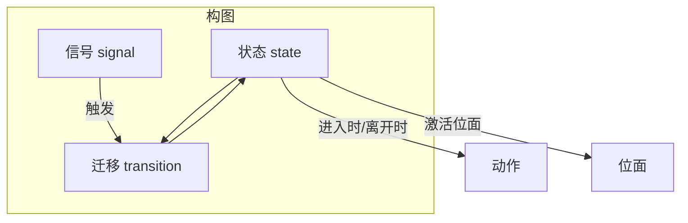
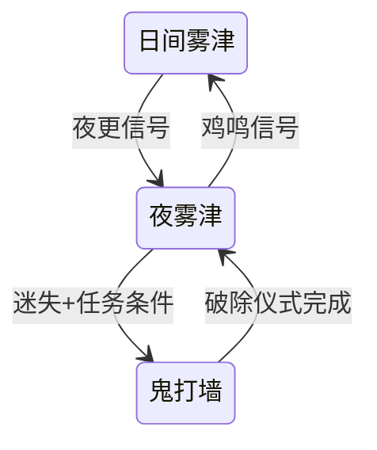

# 叙事状态机面板

任务面板管「接了什么、交什么」；图对话管「这句怎么说」；**叙事状态机**管更高一层：**故事现在处于哪个阶段、什么信号一来就跳转、进哪个位面**。寻狗记里日夜切换、剧本线推进、主动激活某「位面」——很多要在这里画成**状态**和**迁移**。

本面板在主编辑器里是嵌网页画布的形态（你仍是在主编辑器里操作，只是中间那块是流程图 UI）。

---

## 这块面板管什么

- **作品 / 构图**：主图与子图、黑盒封装。
- **状态**：当前叙事停在什么节点；进入/离开状态时跑 [动作](../concepts/actions)。
- **迁移**：从 A 到 B 的边；触发方式（信号、被动条件）、优先级、条件。
- **信号**：作者定义的信号名；系统派生信号只读。
- **位面点名**：某状态可声明 **激活位面**（与 [位面面板](./plane) 里登记的位面对应）。

任务主路径改状态请优先走叙事图，不要依赖调试专用的「硬设叙事状态」类动作。

---

## 怎么打开

1. `./dev.sh editor` → **叙事编排 → 叙事状态机**。
2. 选要编的构图（主图或子图）。
3. 画布拖状态、连线做迁移；侧栏编属性。
4. 保存后，用运行预览 + [工作台运行时调试](../workbench/overview) 看状态是否按预期跳。

:::info[配图：叙事图画布]
截主图局部：至少两个 state、一条 transition、侧栏 激活位面 下拉。
:::

---

## 核心元素

### 状态

- **标签 / 描述**：给策划自己看。
- **是否初始**：故事从哪开始。
- **进入时广播**：进状态是否通知别处。
- **激活位面**：进这个状态时哪个位面生效（下拉选已登记位面）。
- **进入/离开动作**：播过场、改旗标、推任务等。

### 迁移

- **从 / 到**：只能在画布上连线改，检视器里只读——拖错线就拖回来。
- **触发**：作者信号、被动反应等类型。
- **条件**：满足才走这条边；多条边时用 **优先级** 决定谁先匹配。

### 信号

- 你起的信号 id，像「玩家进庙」「夜更敲响」；别处 [动作](../concepts/actions) 或玩法可 **发信号** 推图往前走。

---

## 怎么加状态与迁移

1. 画布 **新建状态**，命名如「寻狗·码头打听」。
2. 右侧设 进入时：例如 开始图对话 不在这做也行，常放改旗标、推剧本 phase。
3. 从「上一状态」拖线到新状态，创建 **迁移**。
4. 迁移上选触发信号或被动，加 [条件](../concepts/conditions)。
5. 若此状态代表「鬼打墙位面」，在侧栏 **激活位面** 选对应位面。
6. 保存构图。

---

## 怎么改 / 删

- **改状态属性**：点状态，侧栏改；注意 进入时 改动后预览要走一遍完整路径。
- **改迁移**：选边，改条件/优先级；起点终点只能画布改。
- **删状态**：先删掉所有连入连出边，确认没有任务还假设「叙事一定在此状态」。

---

## 当心什么

| 风险 | 说明 |
|---|---|
| 迁移端点只读 | 改错 from/to 必须画布重连 |
| 旧跨图端点 | 历史遗留连接可能编不了，要人工清理或找程序 |
| 状态 meta 无界面 | 运行时若有 meta，GUI 维护不到——算 [盲区](../concepts/danger-zone) |
| 与任务双写 | 任务完成和叙事迁移各改各的容易不同步，定好「谁为主」 |

叙事图是**全剧中枢**，改之前用 git 或备份；一次改多条迁移，预览里用信号工具逐条打。

---

## 雾津例子：日夜与「阴间位面」

1. 状态「日间雾津」：激活位面 为普通位面；迁移「夜更信号」→「夜雾津」。
2. 状态「夜雾津」：激活夜位面；进入时 换 BGM、改环境旗标。
3. 状态「鬼打墙」：激活位面 选鬼打墙位面；进入 进入时 播 [过场](./cutscene) 或压迫感 cue。
4. 迁移条件：任务「寻狗记_章二」进行中 AND 旗标「已失方向」。
5. [剧本面板](./scenarios) 的 phase 与叙事状态用信号对齐，避免玩家卡在中间态。

:::info[配图：夜位面迁移]
画布圈出「夜雾津」状态的 激活位面 与一条带条件的迁移边。
:::

---

## 和相关面板怎么配合

| 面板 | 关系 |
|---|---|
| [位面](./plane) | 激活位面 点名 |
| [剧本](./scenarios) | 剧本阶段与信号 |
| [任务](./quest) | 任务推进发信号或读状态 |
| [信号 Cue](./cue-signal) | 表现层；叙事发逻辑信号 |
| [图对话](./dialogue-graph) | ownerState 节点读叙事 |

---

## 相关概念

- [怎么编排动作](../concepts/actions)
- [怎么设条件](../concepts/conditions)
- [怎么写带引用的文本](../concepts/rich-text)
- [危险区](../concepts/danger-zone)
