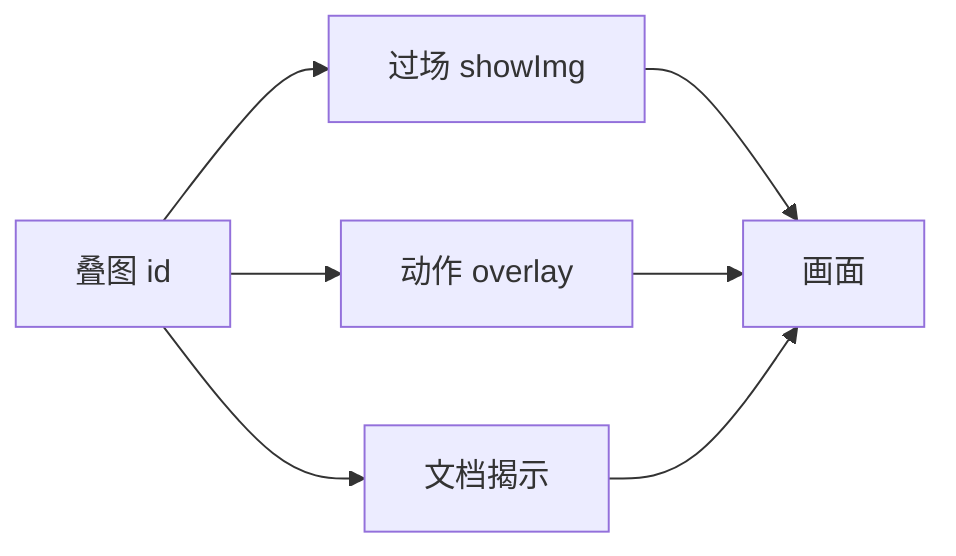

# 叠图面板

闪白之外，你还要叠一张符咒、雾霭、旧照片在画面上——**叠图**（overlay images）用 **短 id** 映射到图片路径。过场 showImg、动作 showOverlayImage/blendOverlayImage、[文档揭示](./doc-reveal) 的模糊/清晰图，都认这里登记的 id。

---

## 这块面板管什么

- **短 id**：策划好记的代号，如 `overlay_fog`、`overlay_talisman`。
- **路径**：指向工程内图片资源。

表格式增删改；id 稳定即可。

---

## 怎么打开

1. `./dev.sh editor` → **资源 → 叠图**。
2. 列表添加行：id + 选文件。
3. Apply。

:::info[配图：叠图表]
截三行：雾、符、血月；路径列。
:::

---

## 引用链

---

## 怎么新建

1. id `overlay_mist_light`；选雾纹 PNG（带 alpha）。
2. [信号 Cue](./cue-signal) blendOverlayImage 用此 id，透明度在动作参数里调。
3. 过场步骤 showImg 同 id 全屏一闪。

---

## 怎么改 / 删

- 换路径：换图；id 不变则引用不用改。
- 删 id：查过场/cue/揭示是否还引用。

---

## 当心什么

| 当心 | 说明 |
|---|---|
| 图太大 | 加载慢；走压缩管线 |
| id 与档案插图混淆 | 档案 `[img:]` 是富文本；叠图是屏幕叠层 |
| 比例与 safe area | 全屏图要留 UI 边 |
| 与滤镜叠 | [滤镜](./filters) 改色调，叠图改内容 |

---

## 雾津例子

1. `overlay_paper_man` 纸人剪影用于鬼打墙 cue。
2. [文档揭示](./doc-reveal) clearImage 也可指向叠图登记路径（按字段选法）。
3. 过场闪回 showImg `overlay_old_photo`。

:::info[配图：叠图游戏内]
预览 blend 雾气叠图半透效果。
:::

---

## 和相关面板怎么配合

| 面板 | 关系 |
|---|---|
| [过场](./cutscene) | showImg |
| [信号 Cue](./cue-signal) | overlay 动作 |
| [文档揭示](./doc-reveal) | 图像路径 |
| 资源导入工具 | 供图 |

---

---

## 实操检查清单

- [ ] 每条叠图 id 语义清晰，一看知是雾、符、旧照还是纸人剪影
- [ ] 全屏图留 UI 安全边，勿把任务栏或对话区挡死
- [ ] 带透明通道的 PNG 优先，避免白底硬边穿帮
- [ ] 大图走压缩管线后再登记，控制加载时间
- [ ] 登记后立刻在过场或信号 Cue 里试引一次，确认 id 生效
- [ ] 换图路径时保持 id 不变，免得多处引用要改
- [ ] 删 id 前查过场、Cue、文档揭示是否仍引用
- [ ] 区分叠图层与档案插图：叠图管屏幕叠层，档案管正文配图
- [ ] 与滤镜分工明确：滤镜改色调，叠图改画面内容
- [ ] 半透叠图在鬼打墙、叫魂等暗场景各预览一遍

---

## 常见问题

| 现象 | 原因 | 怎么办 |
|---|---|---|
| 引用 id 后画面无叠层 | id 拼错或未 Apply | 核对登记表拼写并保存 |
| 叠图加载慢或卡顿 | 原图过大未压缩 | 走资源压缩后再换路径 |
| 全屏图挡住对话按钮 | 未留 safe area | 裁切或缩小有效区域 |
| 与档案插图搞混 | 两类资源用途不同 | 屏幕叠层用本面板，长文配图用档案 |
| 删 id 后某段演出黑块 | 过场或 Cue 仍引用旧 id | 先改引用或恢复 id |

---

## 预览验证

1. 在叠图表新增或修改一行，Apply 保存。
2. 在信号 Cue 或短过场里用叠图动作引用此 id，透明度设中等。
3. 运行预览触发 Cue，看半透边缘与背景融合是否自然。
4. 再测全屏一闪类用法，确认 UI 仍可操作。
5. 若文档揭示也引用，分别测模糊态与清晰态下叠图位置。
6. 鬼打墙进场 Cue 与日常场景各测一次，防暗底过曝。

---

纸人剪影叠在鬼打墙进场时，透明度宜低、边缘柔，让玩家感到「不对」而非「贴图错了」。旧照片闪回若占满屏，记得给字幕留底——雾津回忆线常在叠图上加一行手写体 subtitle。符咒叠层与滤镜青灰同时开时，红色符纸仍要跳眼，否则术式反馈会弱。

---

## 相关概念

- [怎么编排动作](../concepts/actions)
- [怎么设条件](../concepts/conditions)
- [怎么写带引用的文本](../concepts/rich-text)
- [危险区](../concepts/danger-zone)
