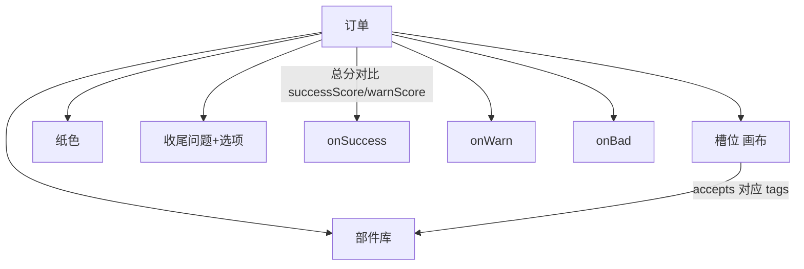

# 扎纸小游戏面板

雾津丧仪常见扎纸人、纸马、纸轿。**扎纸小游戏**让玩家按一份订单的要求挑纸色、拼部件、答收尾问题，系统按分数判定过关、勉强过关还是砸了招牌。读完这页你能搭出一整份「糊一个纸人」的订单，并搞懂分数到底是怎么算出来的。

---

## 这是什么（30 秒看懂）

想象雾津纸扎铺的日工活：庙祝或苦主递来一份订单——「糊一个随葬纸人，要像人但不能太像活人」，你（玩家）得选对纸色、拼对头脸手脚、选对收尾方式（要不要点睛、要不要封口），铺子里的老师傅照着规矩（有些是忌讳，选错要扣分）打分，够格就交货，勉强够格师傅皱眉但收下，太糟就被打回。

面板管的就是这整套「订单」怎么定义：一份订单要求什么纸、有哪些部件能拼、槽位摆在画布哪里、纸色和收尾选项各值多少分、以及最后按总分走成功/警告/失败哪条路。面板结构：**索引与实例**（一关一个背景图）→ 实例下挂**若干订单**，订单再挂**部件库、槽位、纸色、收尾选项**这几张子表。

槽位有**画布**，拖框比填坐标直观。

---

## 入门：手把手做第一次

### 步骤

1. `./dev.sh editor` → **叙事编排 → 扎纸小游戏**。
2. 索引新增一行（如 `funeral_paper_horse`），实例填 label 与背景图（比如灵堂长案）。
3. 「订单」Tab 新增一单：标题、描述（可用[富文本](../concepts/rich-text)）、目标提示、正确纸色、合格分、警告分。
4. 「部件」子表新增几个部件：显示名、分数、结果标签（tags）、贴图。
5. 「槽位」画布上拖出几个接受区，每个槽位选它能接受哪些部件标签（accepts）、是否可选（optional）。
6. 「纸色」子表新增几种纸，各配分数、色值（tint）、结果标签。
7. 填收尾问句与收尾选项，各带分数。
8. 「完成反馈」分组：填 **成功 / 警告 / 失败** 三条各自的[动作](../concepts/actions)。
9. Apply，从对话或任务进关，实际拼一遍看分数走向。

### 雾津小例子：城隍庙备纸马，照着抄

1. 索引新增 `funeral_paper_horse`，背景选灵堂长案图。
2. 订单「纸马」：desc 写清「要齐整但别太像活马」；正确纸色指定「黄裱纸」；合格分 76、警告分 50。
3. 部件库放马头、马身、马鞍、马腿，各自打分；「歪头」「驼背」类瑕疵部件打低分或负分。
4. 槽位画布拖四个接受区（头、身、鞍、腿），accepts 分别填对应部件的标签。
5. 纸色放黄裱纸（高分）、白纸/青纸（低分或负分）、红纸（大负分，红白相冲的忌讳）。
6. 收尾问句「是否点睛？」，选项「点」给正分或负分（看规矩是否已解锁），「不点」保守但也有分。
7. 成功时给规矩碎片；警告时播庙祝嘀咕；失败时播一句训斥或进小遭遇。
8. Apply，用错纸测一次警告、用对纸测一次成功，确认分数和反馈对得上。

---

## 进阶：每一项都讲透

### 分数是怎么算出来的（这是全篇最该弄懂的一段）

一局的**总分 = 每个已填槽位对应部件的分数之和 + 玩家选的纸色分数 + （如果这份订单填了正确纸色：选对纸色额外 +12，选错纸色额外 −12）+ 玩家选的收尾选项分数**。

算出总分后：
- 总分 ≥ **合格分** → 走**成功**。
- 总分 ≥ **警告分** 但没到合格分 → 走**警告**。
- 总分连警告分都没到 → 走**失败**。

也就是说，**正确纸色不是「必须选它才能过关」的硬门槛**，而是一份「选对加分、选错倒扣」的加成/惩罚——不填正确纸色就没有这层加减。想让某种纸色成为「铁律」，得靠这层加权分再配合本身纸色的高低分，别指望它会强制拦人。

### 实例层

- **label**：这一整套小游戏的显示名。
- **背景图**：这一关的背景图（比如灵堂长案），槽位坐标都是相对这张背景摆的。

### 订单层

- **title / description**：标题与描述，描述支持[富文本](../concepts/rich-text)，可以引用物品、旗标等标签，但预览时留意别写太长挤占画面。
- **目标提示**：给玩家一个方向性暗示（比如「纸人要站得直，手脚齐，别点眼」），不是标准答案，别写成剧透式的「正确答案是……」。
- **正确纸色**：见上面「分数怎么算」——它是加分/惩罚项，从纸色列表里选。
- **合格分 / 警告分**：合格线与警告线，两者之间要留出足够缓冲，不然警告状态几乎不可能触发，玩家永远只在「过」和「惨败」之间横跳。
- **收尾问句**：收尾环节问玩家的问题（比如「是否点睛？」）。
- **收尾选项**：一份选项列表，每项有显示名、分数、结果标签；这是整局最后一步加分/减分，适合放"有忌讳的抉择"（点不点睛、封不封口）。
- **成功 / 警告 / 失败动作**：三档结局各自的[动作](../concepts/actions)，建议至少给成功和失败两档都配上明确反馈，警告档也给一句「师傅皱眉但收了」类的台词，别让玩家糊里糊涂过关却毫无察觉。

### 部件库（parts）

- **label**：显示名。
- **score**：填进对应槽位后计入总分的分数，可以是负数（代表犯忌讳的部件）。
- **tags**：结果标签，决定这个部件能塞进哪些槽位（槽位的 accepts 要包含这个标签，两边才能对上）。
- **image**：贴图。

### 槽位（slots，有画布）

- **label**：显示名（比如「头脸」「双臂」）。
- **optional**：是否可选——不可选的槽位不填就拼不出一份完整成品（具体是否允许交空稿，看整体分数机制，但至少提示玩家这里该填）。
- **x / y / width / height**：画布上拖出的接受区位置和大小。
- **accepts**：这个槽位接受哪些部件标签——**必须和部件的 tags 字面一致**，差一个字都对不上，玩家会发现某个部件怎么拖都放不进去。

### 纸色

- **label**：显示名（黄裱纸、白纸、青纸、红纸……）。
- **score**：选中这张纸色计入总分的分数。
- **tint**：色值，决定这张纸在画面上呈现的颜色。
- **tags**：结果标签，供成功/警告/失败文案或后续系统引用这次选了哪种纸带来的"味道"（比如"纸色偏香火""红白相冲"）。

### 收尾选项

同上，label / score / tags 三项，是整局的最后一道加减分与风味标签来源。

### 和相关面板怎么配合

| 面板 | 关系 |
|---|---|
| [规矩](./rule) | 成功时常用来发规矩碎片 |
| [任务](./quest) | 任务完成条件常绑"玩过某订单且 success" |
| [遭遇](./encounter) | 失败时可以直接进一个小遭遇 |
| [物品](./item) | 需要消耗纸材料一类的前置，可选 |

### 效率与老手技巧

- 换背景图之后**必须重新摆槽位**——槽位坐标是相对背景图的，换图不换槽位，部件会浮空错位。
- 警告分和合格分之间留够缓冲（不要挨得太近），警告档才有意义地被触发到，而不是形同虚设。
- 想复用一批部件/纸色到另一份订单，目前没有跨订单的复制功能，得手动新建再照抄。

---

## 危险区与边界

- 索引与实例的 id 必须一致，实例被索引删除后要留意别的地方（任务、场景、对话）是否还在引用它。
- 扎纸面板整体的高级字段已经补得比较齐，是三个小游戏面板里**盲区最少**的一个；但仍然不建议往实例外层手写编辑器不认识的键——一旦打开面板保存过，不认识的键照样会被抹掉。
- 分数公式（正确纸色加减 12 分）是运行时固定行为，编辑器不提供修改这个加减幅度的入口——如果这套加权数值不符合设计诉求，需要先确认是否有别的解法（比如干脆不填正确纸色，纯靠纸色本身分数拉开差距）。
- 更多细节见[危险区](../concepts/danger-zone)与[参考·可编辑面](/docs/reference/authoring-surface)。

---

## 常见问题

| 现象 | 原因 | 怎么办 |
|---|---|---|
| 部件放不进槽位 | 部件 tags 与槽位 accepts 没对上 | 统一标签命名，逐字核对 |
| 用了"正确纸色"却没有明显加分 | 加分只有 12 分，被别的负分部件抵消 | 检查其它槽位/收尾选项是否扣了更多分 |
| 警告档从来没触发过 | 合格分和警告分挨得太近 | 拉开两者差距，重新测试边界 |
| 换了背景图，部件全部错位 | 槽位坐标基于旧背景 | 画布里重新摆一遍槽位 |
| 开关报错 | 索引里的实例被删但别处仍引用 | 对齐索引与引用方 |
| 糊里糊涂过关，没什么感觉 | 警告/成功反馈太弱 | 补一句师傅台词或提示音 |

---

## 相关

- [规矩](./rule)
- [任务](./quest)
- [遭遇](./encounter)
- [物品](./item)
- [怎么编排动作](../concepts/actions)
- [怎么设条件](../concepts/conditions)
- [怎么写带引用的文本](../concepts/rich-text)
- [危险区](../concepts/danger-zone)
