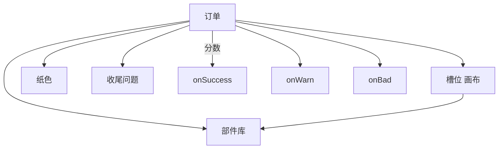

# 扎纸小游戏面板

雾津丧仪常见扎纸人、纸马。**扎纸小游戏**让玩家按订单选纸、贴部件、凑标签，系统算分过关。面板管：**实例**（背景图）、**订单**（要什么、合格线、三道结局动作）、**部件库**、**槽位**（画布摆位）、**纸色**、**收尾选项**。

槽位有 **画布**——拖接受区比填表快。

---

## 这块面板管什么

- **索引与实例**：id 一致；label、背景。
- **订单**：标题、描述、正确用纸、合格/警告分数、目标提示、收尾提问、成功/警告/失败各自动作。
- **部件**：标签、分数、标签组、图。
- **槽位**：是否可选、坐标、接受哪些部件标签。
- **纸色**：颜色、分数、tint、标签。
- **收尾**：最后一步多选标签与分。

子集合大多可 **增删重排**；高级字段已逐步补齐 GUI，仍读 [危险区](../concepts/danger-zone)。

---

## 怎么打开

1. `./dev.sh editor` → **叙事编排 → 扎纸小游戏**。
2. 选实例；订单 Tab 与槽位画布切换。
3. Apply 后从对话/任务进关预览。

:::info[配图：扎纸槽位画布]
截一张订单背景、三个槽位框、部件列表。
:::

---

## 数据关系

---

## 怎么新建一关

1. 索引 `funeral_paper_horse`。
2. 实例背景选灵堂长案图。
3. 订单「纸马」：desc 用 [富文本](../concepts/rich-text)；correctPaper 指定纸色 id；合格分 80、警告 60。
4. 部件：马头、马身、马鞍各 score/tags/image。
5. 槽位画布拖三个接受区，accepts 填对应 tags。
6. 纸色：黄裱纸、白纸、错色纸各不同分。
7. finishQuestion「是否点睛？」；收尾选项「点」加分、「不点」触发规矩相关。
8. onSuccess 给规矩碎片；onBad 播摊主骂声 cue。
9. Apply。

---

## 怎么改 / 删

- **改槽位**：画布挪位后预览点选是否好点到。
- **改分**：警告线介于合格与失败之间留缓冲。
- **删订单/部件**：确认别的实例没共用同 id 部件（若共用要小心）。

---

## 当心什么

| 当心 | 说明 |
|---|---|
| 标签对不上 | 槽位 accepts 与部件 tags 不一致永远放不进 |
| 只有 success 没 warn | 玩家糊里糊涂过关无反馈 |
| 背景与槽位坐标系 | 换背景图要重摆槽位 |
| 实例删了索引还在 | 开关报错 |

扎纸 界面 覆盖度高，盲区相对少；仍别手写实例外键。

---

## 雾津例子：城隍庙备纸马

1. 任务「帮庙祝扎马」完成条件：玩过 `funeral_paper_horse` 且 success。
2. 订单要求黄裱纸 + 马鞍必选；错纸 onWarn 庙祝嘀咕但不卡关。
3. 收尾「点睛」若规矩未解锁选「点」→ onBad 遭遇小惊吓。
4. [图对话](./dialogue-graph) 庙祝「材料在柜上」→ 动作开扎纸关。

:::info[配图：过关与警告]
预览 success 与 warn 两结局 UI。
:::

---

## 和相关面板怎么配合

| 面板 | 关系 |
|---|---|
| [规矩](./rule) | 奖励规矩碎片 |
| [任务](./quest) | 关卡绑定 |
| [遭遇](./encounter) | onBad 进遭遇 |
| [物品](./item) | 消耗纸材料可选 |

---

---

## 实操检查清单

- [ ] 索引与实例 id 一致，背景与槽位坐标系匹配
- [ ] 槽位 accepts 与部件 tags 一一对应，防永远放不进
- [ ] 合格分、警告分、失败分三档动作都有反馈
- [ ] 订单描述用富文本时预览可读，勿过长
- [ ] 画布拖槽位后实机试点选是否好点
- [ ] 纸色、部件、收尾选项分数逻辑在表面对齐
- [ ] 换背景图后重摆槽位
- [ ] onWarn 也要给庙祝嘀咕类反馈，勿只有 success/fail
- [ ] 任务 completion 与 success 动作绑同一关 id
- [ ] Apply 后从庙祝对话进关打 success/warn/bad 各一次

---

## 常见问题

| 现象 | 原因 | 怎么办 |
|---|---|---|
| 部件放不进槽 | tags 与 accepts 不匹配 | 统一标签命名 |
| 糊过关无反馈 | 缺 onWarn | 补警告分与动作 |
| 换背景槽位错位 | 坐标系随图变 | 画布重摆 |
| 开关报错 | 索引在实例删了 | 对齐索引与实例 |
| 点睛选错无后果 | 收尾选项未绑分 | 补规矩相关 bad |

---

## 预览验证

1. 配订单、部件、槽位、纸色、收尾，Apply。
2. 从对话或任务进扎纸关。
3. 故意用错纸测 warn，用对纸测 success。
4. 测收尾「点睛」在规矩未解锁时选点的 bad 路径。
5. 看分数条与庙祝台词是否匹配。
6. 确认任务在 success 后可 completion。

---

帮庙祝扎马订单要求黄裱纸加马鞍必选——错纸应 warn 不硬锁，让玩家知错仍可继续。收尾点睛若规矩未学全仍点，可走 onBad 小惊吓遭遇，比 silent fail 好。灵堂长案背景换图后，三个槽位必重拖，否则马头会浮空。

---

## 相关概念

- [怎么编排动作](../concepts/actions)
- [怎么设条件](../concepts/conditions)
- [怎么写带引用的文本](../concepts/rich-text)
- [危险区](../concepts/danger-zone)
