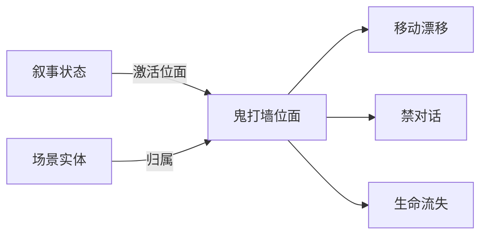

# 位面面板

雾津不只有一张物理地图。**位面**是叠在同一张场景上的另一套规则：能不能捡东西、能不能和 NPC 说话、走路是否漂移、镜头远近、每秒掉不掉「寿元」、光照氛围。玩家平时在**普通位面**；鬼打墙、神游、某些仪式里切到别的位面——场景里热区/NPC 还可标「只在某位面出现」。

---

## 这块面板管什么

- **位面列表**：每个位面的 id、显示名。
- **移动**：漂移、速度缩放、能否奔跑。
- **交互**：能否拾取、点热区、和 NPC 聊。
- **镜头**：默认缩放等。
- **生存**：每秒生命流失（险境位面常用）。
- **光照**：专家向 JSON 氛围（会原样写出，小数精度保留）。
- **子页**：配置、点名状态机、归属实体、问题诊断等 Tab（按你工程打开的为准）。

[叙事状态机](./narrative) 里状态可 **激活位面**；场景实体可设 **位面归属**。

---

## 怎么打开

1. `./dev.sh editor` → **叙事编排 → 位面**。
2. 列表选位面或新建（**普通/normal 位面不可删，id 只读**）。
3. 各 Tab 改参数，Apply。

:::info[配图：位面配置]
截两个位面对比：普通 vs 鬼打墙，突出 interaction 与 生命流失 差异。
:::

---

## 怎么新建位面

1. **添加** 新位面（勿动内置 normal）。
2. **id** 与 **label**：如 `ghost_wall` / 「鬼打墙」。
3. **移动**：漂移 xy、速度比例、是否允许跑——鬼打墙可设漂移让玩家晕向。
4. **交互**：禁拾取、禁 NPC 对话，逼玩家只解谜。
5. **镜头**：缩小一点增强压迫。
6. **生命流失PerSec**：险境每秒扣血，配合 [临场长按](./pressure-hold)。
7. 光照 JSON 按美术文档填。
8. Apply；在叙事图某状态 **激活位面** 选它。

---

## 怎么改

- 改交互/移动立即影响**该位面激活时**的全局行为。
- 场景里 [热区/NPC 位面归属](./scene)：多选空=全位面可见。
- 数值字段保存会保留足够小数位，反复 Apply 不会乱舍入。

---

## 怎么删

- **normal 位面拒绝删除**。
- 删自定义位面前：叙事图没有状态再 激活位面 点名它；场景没有实体只属此位面（否则孤儿显示）。

---

## 当心什么

| 当心 | 说明 |
|---|---|
| 忘了激活位面 | 叙事状态进了「鬼打墙」但没 激活位面，规则还是白天 |
| 实体归属错 | NPC 只在阴间位面，玩家在阳间看不见 |
| 光照 JSON 非法 | 保存失败或游戏里黑屏——改前备份 |
| 与场景 BGM 叠 | 位面光照与场景音乐各管各，预览时一起听 |

位面本身字段往返较保真；危险在**联动**（叙事、场景归属）没配齐。

---

## 雾津例子：鬼打墙位面

1. 位面 `ghost_wall`：不允许奔跑、canTalkNpcs=false、生命流失 微量、镜头 zoom 略大。
2. 叙事状态「鬼打墙」激活位面 指向它。
3. 码头 NPC 关二狗 **不属** 此位面；只留指路石碑热区 inspect。
4. [信号 Cue](./cue-signal) 进位面时播低鸣环境 + 屏幕叠图。
5. 破除仪式完成 → 叙事迁回「夜雾津」→ 位面回 normal 规则。

:::info[配图：位面切换对比]
预览同一.scene 在 normal 与 ghost_wall 下交互差异（NPC 消失、UI 压迫条）。
:::

---

## 和相关面板怎么配合

| 面板 | 关系 |
|---|---|
| [叙事状态机](./narrative) | 激活哪位面 |
| [场景](./scene) | 实体位面归属 |
| [临场长按](./pressure-hold) | 险境玩法 |
| [全局配置](./config) | 初始场景与位面无关但读档落点有关 |

---

---

## 实操检查清单

- [ ] 内置 normal 位面勿删勿改 id
- [ ] 鬼打墙等险境：交互禁、漂移、掉血、镜头一并设计
- [ ] 叙事状态 激活位面 与位面 id 一致
- [ ] 场景实体位面归属多选空=全可见，别误藏 NPC
- [ ] 光照专家内容改前备份，非法会导致保存失败或黑屏
- [ ] 删自定义位面前无叙事状态再激活它
- [ ] 与场景 BGM、Cue 表现同步测进出场
- [ ] 生命流失 与临场长按失败叠加是否过虐
- [ ] 数值字段多次 Apply 不乱舍入（仍要预览验证）
- [ ] 预览 normal 与特殊位面同 scene 各走一圈

---

## 常见问题

| 现象 | 原因 | 怎么办 |
|---|---|---|
| 进了鬼打墙规则仍像白天 | 叙事未激活位面 | 查状态机 进入时 |
| NPC 消失 | 实体只属阴间位面 | 改归属或切位面 |
| 黑屏 | 光照内容非法 | 回滚并修正 |
| 仍能捡东西 | 位面未禁拾取 | 改交互选项 |
| 删位面后报错 | 仍有状态激活它 | 先改叙事再删 |

---

## 预览验证

1. 配好位面移动、交互、镜头、掉血，Apply。
2. 叙事切到激活此位面的状态。
3. 同场景试拾取、对话、奔跑是否被禁/改。
4. 感受漂移与镜头 zoom 是否符合压迫设计。
5. 测 生命流失 与长按中断叠加体验。
6. 破除仪式后回 normal，规则应恢复。

---

鬼打墙位面应禁 NPC 对话、禁拾取，只留石碑 inspect——你在 preview 里点关二狗应无反应。漂移宜轻，配合 生命流失 微量，让玩家慌但不晕吐。进位面 Cue 与 激活位面 同一帧生效，若 Cue 先响规则未切，体感会裂。

---

## 相关概念

- [怎么编排动作](../concepts/actions)
- [怎么设条件](../concepts/conditions)
- [怎么写带引用的文本](../concepts/rich-text)
- [危险区](../concepts/danger-zone)
