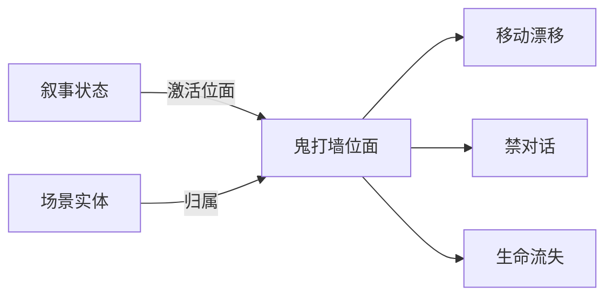

# 位面面板

雾津不只有一张物理地图。**位面**是叠在同一张场景上的另一套规则：能不能捡东西、能不能和 NPC 说话、走路是否漂移、镜头远近、每秒掉不掉「寿元」、光照氛围、能不能开地图快速旅行。玩家平时在**普通位面**；鬼打墙、神游、某些仪式里切到别的位面——场景里热区/NPC 还可标「只在某位面出现」。

读完这页你能：新建一个自定义位面并配齐它的规则、看懂「继承」是怎么帮你少填字段的、用面板自带的三个辅助 Tab 排查"这个位面到底被谁用着"。

---

## 这是什么（30 秒看懂）

把位面想象成雾津的"平行滤镜"：同一条码头街，套上"日间"滤镜就是正常世界，套上"鬼打墙"滤镜就变成禁语禁拾、镜头压近、每秒掉血的险境。滤镜本身（位面）只定义规则，谁来触发换滤镜是[叙事状态机](./narrative)的事——状态进入时**激活**某个位面，规则才真正生效。

---

## 入门：手把手做第一次

1. `./dev.sh editor` → **叙事编排 → 位面**。
2. 列表里选已有位面，或点**新增**建一个（**普通/normal 位面不可删，id 只读**——它是开局默认激活的位面）。
3. 填 **id** 与 **label**：如 `ghost_wall` / 「鬼打墙」。
4. 展开**移动**折叠区：漂移 xy、速度比例、是否允许跑——鬼打墙可设漂移让玩家晕向。
5. 展开**交互**折叠区：禁拾取、禁 NPC 对话，逼玩家只能解谜。
6. 展开**相机 / 掉阳气**折叠区：镜头缩小一点增强压迫；每秒掉血配合[临场长按](./pressure-hold)用。
7. 光照按专家 JSON 填（有对应美术文档时才动）。
8. 保存；回到[叙事状态机](./narrative)，在某个状态的**激活位面**下拉里选它。

:::info[配图：位面配置]
截两个位面对比：普通 vs 鬼打墙，突出交互与生命流失的差异。
:::

**雾津小例子**：位面 `ghost_wall`——不允许奔跑、禁止和 NPC 说话、每秒扣一点点生命、镜头 zoom 略大。码头 NPC 关二狗**不属于**这个位面，玩家进来后他直接消失，只留一块指路石碑能点。[叙事状态机](./narrative)里"鬼打墙"状态激活它，[信号 Cue](./cue-signal) 同时播一段低鸣环境音。破除仪式完成后叙事迁回"夜雾津"，位面回落到普通规则。

---

## 进阶：每一项都讲透

### 基本信息

| 字段 | 说明 |
|---|---|
| id | 全表唯一，被场景实体的位面归属与叙事状态的激活位面引用；`normal` 是开局默认激活位面 |
| label | 显示名，可留空，空则各处用 id 展示 |
| extends | 见下方"位面继承" |
| membership | 见下方"归属世界模型" |

### 位面继承（extends）：不用每个位面都从头填一遍

如果新位面只是在某个已有位面基础上小改几项，不用把六大类规则全部重填一遍。给它指定 **extends**（继承自哪个位面），规则按"整块"继承：

- 你**显式填了**的那一整块（比如"移动"）用你自己填的；
- 你**没填**的那一整块，沿着继承链往上找，用最近一个祖先填了的那一整块。
- `normal`（普通位面）不能继承别人。
- 继承链如果指向一个不存在的位面，或者绕成了环，编辑器会**当场标红提示**，运行时则会安静地忽略掉这段继承——所以看到红字提示要及时修。
- 面板会在"继承生效"这一行告诉你：每一块规则**实际生效的值来自哪个位面**，不用自己顺着链条推。

雾津例子：可以先做一个基础"阴间位面"定好整体压抑的相机与光照，再让"鬼打墙""迷路小巷"这些具体险境都 extends 它，各自只再单独覆盖自己独有的漂移或掉血数值。

### 归属世界模型（membership）：没写归属的实体在这个位面存不存在

场景里的热区/NPC/区域可以显式标注"我属于哪些位面"；但**没标注**归属的实体呢？这就是 membership 管的：

- **（继承/缺省）**：不特别设置——有继承对象时沿链条继承，否则按缺省规则处理（相当于"共享"）。
- **共享世界型（shared）**：没标归属的实体照样存在，相当于"这个位面是在日常世界上加一层修饰，大部分东西还在"。
- **独立世界型（exclusive）**：没标归属的实体**不存在**，相当于"这是一个完全独立的异世界，场景近乎清空，只有明确写了归属这个位面的实体才会出现"。
- `normal` 永远是共享世界型。

雾津例子：普通的"夜雾津"适合用共享——大部分白天的热区、NPC 换个光照继续用；而"鬼打墙"这种彻底异化的险境适合用独立——整条街清空，只留几个专门为险境摆的物件。

### 六大类规则槽逐条讲

每一类规则在表单里是一个可折叠区块，且都带一个"本位面显式配置"的开关：**勾选**才会真正写下这一整块（哪怕全部留默认值也算显式覆盖，会盖掉继承来的值）；**不勾选**就不写这块，乖乖沿继承链或缺省值走。

| 规则块 | 里面填什么 |
|---|---|
| 移动 movement | 漂移 xy（世界单位/秒，让玩家不受控地被推）、移速系数（乘在场景基础移速上）、是否允许奔跑 |
| 交互 interaction | 能否拾取、能否点热区、能否和 NPC 对话——三项独立开关，缺省都是"允许" |
| 相机 / 掉阳气 | 相机缩放档（覆盖场景默认镜头）、每秒生命流失（掉血值，配合[临场长按](./pressure-hold)营造险境紧迫感） |
| 旅行 travel | 是否允许打开地图做快速旅行——这个位面激活期间想不想让玩家中途跑掉，就靠这个开关 |
| 光照 lighting | 专家向 JSON，局部覆盖场景光照氛围（key、环境光、阴影、色调强度等），编辑器提供一个专门的 JSON 编辑窗口，格式不对会当场拦下不让你存 |

数值字段（漂移、速度比例、掉血）保存时会保留足够小数位，反复保存不会被舍入舍成整数或规整值，放心多次微调。

### 三个辅助 Tab：搞清楚这个位面被谁用着

除了配置本身，面板还有三个 Tab，专门帮你排查"这个位面到底牵连了什么"：

- **点名状态机**：列出哪些[叙事状态机](./narrative)的哪些状态，把**激活位面**指向了当前选中的位面；双击一行能直接跳到叙事编辑器定位到那个状态。
- **归属实体**：列出场景里所有显式归属（位面归属字段里含这个 id）当前位面的实体，按场景分组；双击能跳到场景编辑器并打开对应的位面视图。
- **问题**：手动点一下"运行校验"，会跑一遍全量校验并只保留和位面相关的问题（比如上面提到的 extends 断链、成环）。

删除一个自定义位面前，**先看这三个 Tab 清空没有**——没有叙事状态还在激活它、没有场景实体只归属它，再删，否则会留下孤儿引用。

---

## 危险区与边界

| 当心 | 说明 |
|---|---|
| 忘了激活位面 | 叙事状态进了"鬼打墙"但没设激活位面，规则还是普通世界的 |
| 实体归属错 | NPC 只归属阴间位面，玩家在阳间就看不见他 |
| 光照 JSON 格式错 | 编辑器的 JSON 编辑窗口会挡下明显的格式错误不让你存；但字段名/数值这类"语义"错误编辑器不校验，运行时才会暴露（可能表现异常甚至黑屏）——改前备份 |
| extends 断链或成环 | 编辑器会标红提示，运行时则安静地忽略掉这段继承——数据意义被悄悄改掉，务必留意红字 |
| 与场景 BGM 叠加 | 位面光照与场景音乐各管各，预览时要一起听、一起看 |
| normal 拒绝任何改名/删除 | id 只读、不可删——它是系统兜底位面 |

位面本身字段的保存较为可靠；真正的风险在**联动**——叙事状态有没有激活它、场景实体归属对不对、extends 链干不干净。更完整的边界说明见[危险区](../concepts/danger-zone)。

---

## 常见问题

| 现象 | 原因 | 怎么办 |
|---|---|---|
| 进了鬼打墙规则仍像白天 | 叙事状态没设激活位面 | 用"点名状态机"Tab 检查，或去叙事图补 |
| NPC 消失 | 实体只归属阴间位面 | 用"归属实体"Tab 核对，改归属或切位面 |
| 黑屏 | 光照内容语义非法 | 回滚并修正 lighting JSON |
| 仍能捡东西 | 位面未禁用拾取，或该规则块根本没勾"显式配置" | 检查交互块是否真的勾了显式覆盖 |
| 删位面后报错 | 仍有状态/实体在引用它 | 先用三个辅助 Tab 清空引用再删 |
| 继承的值好像没生效 | extends 链断了或成环 | 去"问题"Tab 跑一遍校验看红字 |
| 想开地图快速旅行但打不开 | 当前激活位面的 travel 槽禁用了 | 检查 travel 块的"允许地图快速旅行"开关 |

---

## 相关

- [叙事状态机](./narrative)——激活哪个位面
- [场景](./scene)——实体的位面归属
- [临场长按](./pressure-hold)——险境玩法常搭配生命流失
- [全局配置](./config)
- [怎么编排动作](../concepts/actions)
- [怎么设条件](../concepts/conditions)
- [怎么写带引用的文本](../concepts/rich-text)
- [危险区](../concepts/danger-zone)
