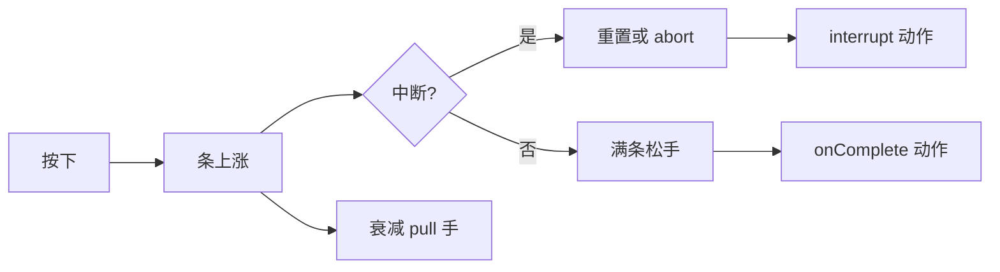

# 临场长按面板

有些时刻不能靠点选项：**长按**蓄满一条气，松在正确时机才成功；松早了失败，鬼摸头还可能**打断**进度。叫魂、屏息过瘴气、贴符念咒——用 **临场长按** 配 id、提示文案、蓄满秒数、衰减、音效、条颜色、中断点与完成 [动作](../concepts/actions)。

---

## 这块面板管什么

- **身份与提示**：玩家看见的主提示、松手提示。
- **手感**：充满要几秒、每秒衰减多少。
- **表现**：条颜色、按住时音效（多为裸填 id，下拉不全时手输要核对 [音频](./audio)）。
- **中断**：蓄到某比例时若发生什么事（被打断、惊吓），可重置到某比例或直接 abort 并跑动作。
- **完成**：蓄满松手后的一串动作。

图对话、遭遇、热区、信号 cue 都可 **启动某临场长按**。

---

## 怎么打开

1. `./dev.sh editor` → **叙事编排 → 临场长按**。
2. 列表选或新建。
3. 表单填参数；中断列表可多条。
4. Apply，在别处动作用「开始临场长按」类引用，预览长按测手感。

:::info[配图：临场长按表单]
截 fillSeconds、decay、interrupts 表、onComplete 动作区。
:::

---

## 参数怎么理解

| 参数 | 策划语义 |
|---|---|
| fillSeconds | 理想情况下按满要多久 |
| decayPerSecond | 松手或分心时掉多快 |
| interrupts | 在条长到某比例时，若触发中断条件，重置比例或放弃并执行动作 |
| onComplete | 成功时发生什么 |

---

## 怎么新建

1. id 如 `call_soul_hold`。
2. prompt「按住念咒」；releaseHint「松手唤名」。
3. fillSeconds 2.5，decay 适中，预览里调「太虐/太水」。
4. 按住音效 选手持音效；蓄力条颜色 选暗红色贴合雾津恐怖感。
5. interrupts：atRatio 0.6 时若旗标「鬼扰」为真 → resetToRatio 0.3 或 abort + 惊吓动作。
6. onComplete：改旗标、播 cue、接图对话。
7. Apply。

---

## 怎么改 / 删

- 改秒数/衰减后**务必预览**：文案难描述手感。
- 删中断行：确认剧情不再依赖该惊吓。
- 删整条长按：查动作总表与对话谁还引用。

---

## 当心什么

| 当心 | 说明 |
|---|---|
| 音效 id 手输错 | 长按静音 |
| 只有 onComplete 没中断 | 险境剧情打断了也没反馈 |
| 与位面掉血叠 | [位面](./plane) 生命流失 + 长按失败双重暴毙 |
| 蓄力条颜色 / 按住音效 无下拉 | 裸输入，以音频登记为准 |

临场长按条目本身较少「重建丢字段」；危险在**手感**和**联动动作**没测全。

---

## 雾津例子：叫魂临场

1. `call_soul_hold`：雾津河边叫魂，prompt 引 [富文本](../concepts/rich-text) 玩家名。
2. 蓄满 onComplete：发信号推 [叙事状态机](./narrative)、播 [信号 Cue](./cue-signal) 水面涟漪。
3. 中断：鬼打墙位面激活时 atRatio 0.4 abort，result 播尖叫音效 + 降 SAN 类旗标。
4. [遭遇](./encounter) 选项「强行叫魂」结果动作 启动此长按。

:::info[配图：长按 UI 与中断]
预览蓄条过半触发中断前后两帧对比。
:::

---

## 和相关面板怎么配合

| 面板 | 关系 |
|---|---|
| [信号 Cue](./cue-signal) | 完成/中断时播表现 |
| [音频](./audio) | 按住音效 |
| [位面](./plane) | 险境规则 |
| [动作总表](./actions) | 查启动类动作 |

---

---

## 实操检查清单

- [ ] fillSeconds 与 decay 在预览里手感优先于数值本身
- [ ] 按住音效 在音频表存在，手输 id 必核对
- [ ] interrupts 至少一条险境用，防打断无反馈
- [ ] onComplete 与 interrupt 动作分工清晰
- [ ] prompt 可引富文本玩家名，releaseHint 短而明确
- [ ] 蓄力条颜色 与雾津恐怖氛围一致
- [ ] 与位面 生命流失 叠加是否过难
- [ ] 删长按前搜对话、遭遇、热区引用
- [ ] atRatio 阈值在预览分段测 0.3/0.6/0.9
- [ ] Apply 后实按十遍找「太虐/太水」

---

## 常见问题

| 现象 | 原因 | 怎么办 |
|---|---|---|
| 长按全程静音 | 按住音效 id 错 | 回音频表改 |
| 鬼扰无反应 | 缺 interrupt 或条件不真 | 补中断与旗标 |
| 一松就过难/过易 | fill/decay 未调 | 预览迭代参数 |
| 成功但世界没变 | 只有 onComplete 空链 | 补旗标或 Cue |
| 双重暴毙 | 位面掉血加快失败 | 降 drain 或放宽 decay |

---

## 预览验证

1. 填 prompt、秒数、衰减、音效、颜色、中断、完成动作，Apply。
2. 从遭遇或热区启动长按。
3. 完整按满松手，看 onComplete 链。
4. 故意早松、中松，感受失败反馈。
5. 在鬼打墙位面测 interrupt 是否触发。
6. 调参后再测直到手感可交付。

---

叫魂长按 prompt 宜引玩家名，releaseHint 写「松手唤名」四字足矣。鬼打墙 active 时 atRatio 0.4 abort 配尖叫 sfx，你在 preview 里蓄到四成松手应被掐断——比 silent reset 好。onComplete 推叙事信号与水面 Cue 宜同帧，玩家才觉「唤出来了」。

---

## 相关概念

- [怎么编排动作](../concepts/actions)
- [怎么设条件](../concepts/conditions)
- [怎么写带引用的文本](../concepts/rich-text)
- [危险区](../concepts/danger-zone)
