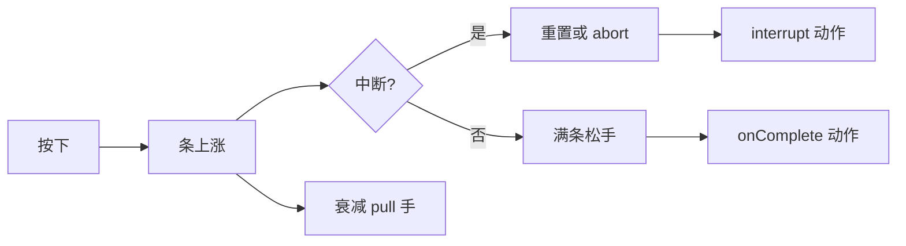

# 临场长按面板

有些时刻不能靠点选项：**长按**蓄满一条气，松在正确时机才成功；松早了失败，鬼摸头还可能**打断**进度。叫魂、屏息过瘴气、贴符念咒——用 **临场长按** 配 id、提示文案、蓄满秒数、衰减、音效、条颜色、中断点与完成 [动作](../concepts/actions)。

读完这页你能：独立搭一条带中断的完整长按、看懂每个参数具体怎么影响玩家手感、知道中断顺序和音效配置容易踩的坑。

---

## 这是什么（30 秒看懂）

把临场长按想成一根点燃的引线：按住不放，进度条一点点涨满；松手太早，什么都不会发生；涨到某个比例时如果剧情设了"惊吓点"，可能会被硬生生打断，进度回落甚至直接归零。涨满了松手，才算真正完成。图对话、遭遇、热区、信号 Cue 都可以**启动**某一条临场长按，让玩家从"选择"切换到"手感"体验。

*临场长按面板：右侧配蓄力时长、回落、音效、进度条、中断。*

---

## 入门：手把手做第一次

1. `./dev.sh editor` → **叙事编排 → 临场长按**。
2. 新建一条，id 如 `call_soul_hold`。
3. **提示（prompt）**填「按住念咒」；**松手提示**填「松手唤名」——两个都支持富文本，可以插玩家名等引用。
4. **蓄满秒数**先给个 2.5 秒左右的初始值，**衰减速度**给个适中值，后面靠预览反复调"太虐/太水"。
5. **按住音效**从下拉里选一个已登记的音效；选好后旁边有个"试听"按钮，可以直接在这里听效果，不用切去[音频面板](./audio)。
6. **蓄力条颜色**默认跟随系统默认色；如果想要专属颜色，勾选"自定义"再挑一个十六进制颜色（暗红色贴合雾津恐怖氛围）。
7. 添加一条**中断**：蓄到六成时如果旗标"鬼扰"为真，就把进度回落到三成，或者直接判定失败（abort）并播一段惊吓动作。
8. **进度满时执行**：改旗标、播 Cue、接图对话。
9. 保存，在别处动作里用"启动某临场长按"类动作引用它，预览里实按测试手感。

:::info[配图：临场长按表单]
截蓄满秒数、衰减、中断列表、进度满时执行 这几个区块。
:::

**雾津小例子（叫魂临场）**：`call_soul_hold`——雾津河边叫魂，蓄满后发一个信号推进[叙事状态机](./narrative)、同时播[信号 Cue](./cue-signal) 的水面涟漪效果；如果玩家在鬼打墙位面激活期间蓄到四成，直接判定失败（abort）并播尖叫音效、扣一点心理类旗标。[遭遇](./encounter)里"强行叫魂"这个选项的结果动作，就是启动这条长按。

:::info[配图：长按 UI 与中断]
预览蓄条过半触发中断前后两帧对比。
:::

---

## 进阶：每一项都讲透

### 身份与提示

| 字段 | 说明 |
|---|---|
| id | 全表唯一，别处靠这个 id 启动这条长按 |
| prompt | 长按过程中屏幕上常驻显示的引导文案，支持富文本 |
| 松手提示 | 松手瞬间闪现的提示，可留空 |

### 充能参数

| 参数 | 策划语义 |
|---|---|
| 蓄满秒数 | 理想情况下、不受衰减和中断打扰时，从零按满进度条要多久 |
| 衰减速度 | 松手或分心时进度每秒回落多少——数值越大越"考验手速不能停" |

这两个数字很难靠脑补判断手感，**改完必须预览实按**，光看数值猜不出"虐还是水"。

### 表现：音效与颜色

- **按住音效**：从已登记的[音频](./audio)里选，也允许手输 id（但手输容易打错字导致长按全程静音，建议优先用下拉选）；面板自带试听按钮，选完直接能听。
- **蓄力条颜色**：有一个"是否自定义"的开关。不勾选就用系统默认色；勾选后才需要（也才允许）挑一个具体颜色。

### 中断（interrupts）：进度条上的"惊吓点"

一条长按可以配多个中断点，每个中断包含：

| 字段 | 说明 |
|---|---|
| 触发比例 | 蓄到多少比例（0～1）时触发这个中断。**多个中断按触发比例从小到大排列**，面板里可以用上下移按钮调整顺序，务必保持严格递增，不然判定顺序会乱 |
| 回落比例 | 触发后进度回落到的比例（比如从六成回落到三成，而不是直接清零，让玩家"差点成功"） |
| abort | 勾选后这个中断变成"直接判定失败"，此时回落比例不再生效——不是回落，是整次长按当场终止 |
| 中断时执行的动作 | 这个中断触发时单独跑的一串[动作](../concepts/actions)，比如播惊吓音效、扣状态类旗标 |

**至少给险境类长按配一条中断**：只有完成动作、没有中断的长按，一旦剧情设定里本该有"被打断"的可能性，玩家会觉得"明明该被吓到却毫无反馈"。

### 完成动作

蓄满并松手后跑的一串[动作](../concepts/actions)——推进旗标、叙事信号、Cue 表现都放在这里，和中断动作分开维护，职责清楚。

### 和相关面板怎么配合

| 面板 | 关系 |
|---|---|
| [信号 Cue](./cue-signal) | 完成/中断时播放的表现效果 |
| [音频](./audio) | 按住音效的来源，先在这里登记好 |
| [位面](./plane) | 险境规则（比如同时叠加生命流失）常和长按搭配 |
| [动作总表](./actions) | 查"启动临场长按"这类动作怎么用 |

---

## 危险区与边界

| 当心 | 说明 |
|---|---|
| 音效 id 手输错 | 长按过程会全程静音，且不一定第一时间发现 |
| 只有完成动作、没有中断 | 险境剧情设计上本该有的"打断惊吓"缺了反馈 |
| 与位面生命流失叠加 | [位面](./plane)每秒掉血 + 长按失败的双重惩罚容易过虐，两边数值要一起测 |
| 中断顺序未按触发比例递增摆放 | 判定行为可能不符合预期，务必检查排列顺序 |
| 蓄力条颜色/按住音效为手输 | 这两项支持自由文本输入，没有强校验，务必和[音频面板](./audio)登记表核对一致 |

临场长按条目本身较少出现"重建丢字段"的风险；真正的风险在**手感调校**和**联动动作是否测全**。更完整的边界说明见[危险区](../concepts/danger-zone)。

---

## 常见问题

| 现象 | 原因 | 怎么办 |
|---|---|---|
| 长按全程静音 | 按住音效 id 写错或未登记 | 回[音频面板](./audio)核对，用下拉选而非手输 |
| 该被打断却毫无反应 | 没配中断，或中断的条件（如旗标）不成立 | 补一条中断并核对触发条件 |
| 一松就过难或过易 | 蓄满秒数 / 衰减速度 数值不合适 | 预览反复迭代参数，别只靠数值猜手感 |
| 蓄满了但世界没变化 | 完成动作串是空的 | 补旗标/信号/Cue 等动作 |
| 双重暴毙 | 位面掉血叠加长按失败惩罚过猛 | 降低位面掉血速度，或放宽衰减数值 |
| 中断判定顺序不对 | 多个中断的触发比例没按递增排列 | 用上下移按钮重新排序 |

---

## 相关

- [信号 Cue 面板](./cue-signal)
- [音频面板](./audio)
- [位面面板](./plane)
- [动作总表](./actions)
- [怎么编排动作](../concepts/actions)
- [怎么设条件](../concepts/conditions)
- [怎么写带引用的文本](../concepts/rich-text)
- [危险区](../concepts/danger-zone)
