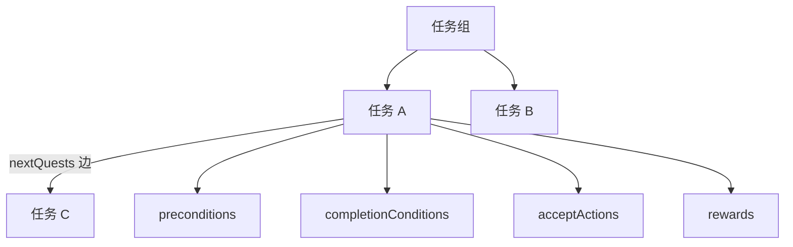

# 任务面板

玩家任务日志里「寻狗记：去渡口打听」——**任务面板**编的就是这个：分组树、单任务的标题描述、接取/完成[条件](../concepts/conditions)、接取时与完成时的[动作](../concepts/actions)、完成后解锁哪个下一环。读完这页你能搭出一条主线任务链，外加一条并行的支线，并搞懂"下一环"边上那些开关到底是什么意思。

---

## 这是什么（30 秒看懂）

想象雾津寻狗记的任务日志：主线一条"寻狗记"，下面挂着"湿了的鞋"「庙门」「纸人巷」几个任务，一个接一个解锁；旁边还有"帮货郎搬箱"这种独立的侧支线，跟主线互不干扰地并行推进。这块面板管的就是这整套任务的骨架：谁属于哪个分组、谁接完谁、接取和交差各要满足什么、完成时给什么奖励。

三栏布局：左边**分组树**，中间**关系图**，右边**属性表单**。拖拽能改任务的父子归属，编辑器带**环检测**——想把 A 拖成 B 的父任务、B 又是 A 的父任务这种死循环，会被直接拦下。

---

## 入门：手把手做第一次

### 步骤

1. `./dev.sh editor` → **叙事编排 → 任务**。
2. 左树选一个已有分组（或先新建分组），点「新建任务」，填 id（比如 `xungou_find_dog_01`）。
3. 右栏填 title、description（描述可用[富文本](../concepts/rich-text)引玩家名等标签）。
4. 填 **preconditions**：什么情况下玩家能看到/能接这个任务。
5. 填 **完成条件**：怎样算交差——持有某物品、满足某旗标、剧本到了某个阶段都可以。
6. 填 **接取动作**：接取瞬间发生什么（比如播一个[信号 Cue](./cue-signal)、打开地图点）。
7. 填 **rewards**：完成时发生什么（给道具、设旗标、解锁地图）。
8. 在 **下一环** 里新增一条边，选目标任务，视设计需要勾选是否"跳过前置"。
9. Apply，运行预览里接这个任务，走一遍确认能正常交差、能正常解锁下一个。

### 雾津小例子：寻狗记链，照着抄

1. 在分组「寻狗记」下新建 `xungou_01`「湿了的鞋」：completion 填"持有物品湿鞋 或 旗标 clue_shoe"（两条件用"或"组合，走[水域小游戏](./water-minigame)捞到鞋，或走别的路径拿到线索都算数）。
2. 下一环拉一条边到 `xungou_02`「城隍庙门」，不勾"跳过前置"（正常走完前置检查）。
3. `xungou_02` 的 completion 填"庙祝认可"旗标；rewards 给一份规矩碎片，同时接取动作播一句信号 cue，让玩家一接就有明确反馈。
4. 另开一个独立分组"支线"，建任务"帮货郎搬箱"，preconditions 与主线无关，可以随时接、随时做。
5. [全局配置](./config)里的初始任务指向 `xungou_01`，保证新档一开局就能接到第一个任务。
6. Apply，从新档开始接任务，走到 `xungou_02` 解锁为止，确认奖励和下一环都按预期出现。

---

## 进阶：每一项都讲透

### 任务组（左树）

- **id / name**：分组编号与显示名。
- **type**：`main`（主线分组）或 `side`（支线分组），决定这组任务在游戏里大致归为主线还是支线脉络。
- **父分组**：这个组挂在哪个组下面，形成分组嵌套；拖拽调整父子关系时带**环检测**——如果这么拖会让某个组绕回来变成自己的祖先，编辑器会拦下并提示，换一种拖法即可。

### 单任务

- **id**：任务编号，一旦有别的任务的下一环边或场景/对话的条件引用了它，就不要再随意改动或删除。
- **group**：归属的任务组。
- **type**：`main` 或 `side`。
- **支线细分类型**：仅当这是支线任务时才有意义的细分类型——`errand`（跑腿）、`inquiry`（打听）、`investigation`（查案）、`commission`（委托）几种，用来在任务日志里进一步归类支线的性质。
- **title / description**：标题与描述，描述支持富文本，能插入玩家名、物品名等引用标签。
- **preconditions**：决定这个任务对玩家"可见/可接"的[条件](../concepts/conditions)——想做"必须先完成上一个任务才会出现在日志里"的效果，主要靠这个字段，配合下一环的边条件一起把关。
- **完成条件**：决定"什么时候算交差"，同样是通用条件编辑器，可以用"与/或/非"组合多个判断（持有物品、旗标、剧本阶段、其它任务的状态等）。
- **接取动作**：任务被接取的瞬间触发的[动作](../concepts/actions)——常见用法是给玩家一句提示、更新一下日记、开一个地图点。
- **rewards**：完成任务时触发的动作——给道具、给规矩碎片、写旗标、解锁地图节点都在这里配。**只改旗标而不给玩家任何看得见的反馈**（提示、cue、日志更新）是最常见的疏漏——玩家往往不知道自己刚刚"获得"了什么，最好都配一句反馈。

### 下一环边（任务面板的关系网核心）

- 每条边指向一个目标任务（目标任务 id），带自己的**边条件**（用通用条件编辑器单独配，和目标任务自身的 preconditions 是两回事，是"从这条任务过来"专属的额外判断）。
- **跳过前置**：勾上之后，玩家从这条边走过去解锁目标任务时，会**跳过目标任务自身的 preconditions 检查**，直接可见可接。这常用来做"既可以按部就班从上一个任务解锁，也可以通过某个特殊事件直接跳进来"的设计；但如果误勾，等同于让玩家绕过原本设计好的前置门槛直接进入后面的任务——**勾选前务必想清楚这条边是不是真的该无视前置**。
- 多条边**可以上下移动排序**——下一环本身是一个有序数组，顺序在有些场景下会影响展示或判定的优先级，调整前后建议各走一遍预览确认行为符合预期。
- **旧式的单字段"下一任务 id"（历史遗留字段）已经废弃**：这是一次**废弃字段清理**——当前项目里所有任务都已经改用下一环边来表达先后关系，这个旧字段在现有数据里一处都没被用到，面板保存时顺手清掉它，不算丢任何真实数据；也不要在别处手写这个旧字段指望它还生效。

### 和相关面板怎么配合

| 面板 | 关系 |
|---|---|
| [剧本](./scenarios) | scenario 的 phase 常作为任务的前置/完成条件 |
| [物品](./item) | 完成条件常判断"持有某物品" |
| [规矩](./rule) | rewards 常发规矩碎片 |
| [图对话](./dialogue-graph) | 接取动作常用来打开一段对话 |
| [地图](./map) | rewards/接取动作常用来解锁地图节点 |

### 效率与老手技巧

- 三栏布局：左树选组/任务定位、中间关系图看结构、右栏改属性，习惯这个节奏比反复在树里点来点去更快。
- **面板没有复制按钮**：想做一批"结构相似但内容不同"的任务（比如同一类支线跑腿任务），只能新建后手动照抄各字段，没有一键复制。
- 删除一个任务前，先搜一遍有没有别的任务的下一环边指着它、场景热区或对话条件是不是还在判断它的状态，避免删除后出现"指向不存在任务"的悬空引用。
- 拖拽调整分组的父子关系只改变结构归属，**任务/分组的 id 本身不会变**——确认这确实是你想要的结构调整，而不是误触。

---

## 危险区与边界

- 旧式"下一任务 id"字段已废弃：当前所有任务都已用下一环边表达先后关系，这个旧字段现有数据里没有实际使用，保存时被清理属于**废弃字段清理**，不算丢数据，也不要依赖它。
- 分组/任务的拖拽带环检测，但**不会**替你检查逻辑上的死锁（比如完成条件永远无法满足）——这类"软锁"要靠预览逐条走一遍来发现。
- 没有复制功能，也没有跨任务的批量字段修改，重复劳动只能手动完成。
- 任务面板本身较少出现大范围"重建丢字段"的情况，条件与动作仍然走通用编辑器，参照它们各自的规则即可。
- 更多细节见[危险区](../concepts/danger-zone)与[参考·可编辑面](/docs/reference/authoring-surface)。

---

## 常见问题

| 现象 | 原因 | 怎么办 |
|---|---|---|
| 任务接不了 | preconditions 不满足 | 检查条件是否可达，或推进相应前置 |
| 完不成交差 | 完成条件过严或写反 | 用预览逐条单独满足，定位是哪一条卡住 |
| 完成了但没什么感觉 | rewards 只改了旗标，没配提示/cue | 补一条反馈动作 |
| 玩家跳过了一大段主线 | 下一环某条边误勾了"跳过前置" | 检查该边的跳过前置选项，按需取消 |
| 拖拽分组时被拦下 | 会形成环（自己变成自己的祖先） | 换一种拖法，或先把中间层级拆开 |
| 手写的旧"下一任务 id"没生效 | 该字段已废弃，当前数据没在用它，保存时会被清理（属正常的废弃字段清理，不是丢数据） | 改用下一环边 |

---

## 相关

- [剧本](./scenarios)
- [物品](./item)
- [规矩](./rule)
- [图对话](./dialogue-graph)
- [地图](./map)
- [怎么编排动作](../concepts/actions)
- [怎么设条件](../concepts/conditions)
- [怎么写带引用的文本](../concepts/rich-text)
- [危险区](../concepts/danger-zone)
