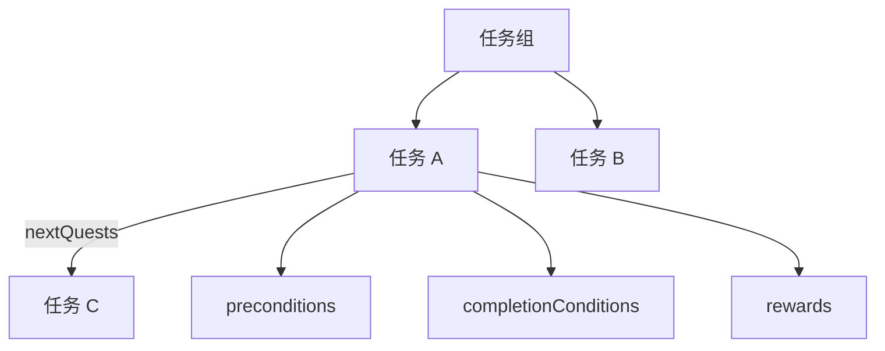
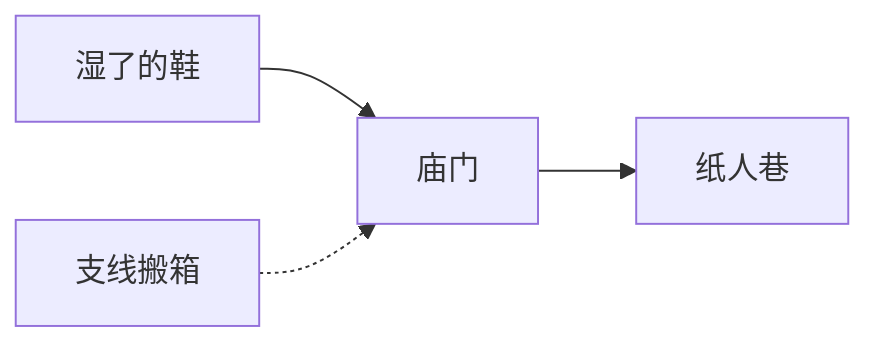

# 任务面板

玩家任务日志里「寻狗记：去渡口打听」——**任务面板**编的就是这个：**分组树**、单任务标题描述、接取/完成 [条件](../concepts/conditions)、接取时与完成时 [动作](../concepts/actions)、下一任务边（可绕过后续前置）。三栏布局：左分组、中图、右属性；拖拽改父子带 **环检测**，别拖成死循环。

---

## 这块面板管什么

- **任务组**：主线/支线分组、父子嵌套。
- **单任务**：id、组、类型、侧标类型、标题、描述。
- **preconditions**：谁能看见/能接。
- **completionConditions**：怎样算交差。
- **acceptActions / rewards**：接取与完成时发生什么。
- **nextQuests**：完成后解锁谁；边上有 bypass 与额外条件。

旧式「单字段下一任务 id」已废弃——用 nextQuests 边。

---

## 怎么打开

1. `./dev.sh editor` → **叙事编排 → 任务**。
2. 左树选组或任务；中栏看图；右栏改属性。
3. Apply；运行预览接任务走一遍。

:::info[配图：任务三栏]
截分组树、任务图节点、右侧 completionConditions。
:::

---

## 界面逻辑

---

## 怎么新建任务

1. 在组「寻狗记」下 **新建任务** id `xungou_find_dog_01`。
2. title「湿了的鞋」；description 用 [富文本](../concepts/rich-text) 引玩家名。
3. preconditions：剧本 phase 或旗标。
4. completionConditions：持有物品湿鞋 OR 旗标 `clue_shoe`。
5. acceptActions：播 [信号 Cue](./cue-signal) 或日记更新。
6. rewards：经验式旗标、开 [地图](./map) 点。
7. nextQuests 拉线到 `xungou_find_dog_02`，bypass 视设计勾选。
8. Apply。

---

## 怎么改分组

- **拖拽任务到另一组**：结构变，任务 id 不变。
- **拖拽改父子**：环检测拦循环——看到提示就换拖法。
- **无复制按钮**：类似任务要新建再抄属性。

---

## 怎么删

- 删任务：查 nextQuests 谁指着它、场景/对话条件是否 quest 状态。
- 删组：组内任务要先移走或删掉。

---

## 当心什么

| 当心 | 说明 |
|---|---|
| 完成条件过严 | 软锁；用预览逐项满足 |
| 奖励只改旗标没提示 | 玩家不知道完成了——加 result 文案或 cue |
| next 边条件与 bypass | bypass 开错等于跳过整段主线 |
| 与剧本/叙事双写 | 任务完成和剧本 exposes 要对表 |

任务面板少见大面积重建；条件/动作仍走通用编辑器。

---

## 雾津例子：寻狗记链

1. `xungou_01` 完成 → next `xungou_02`「城隍庙」；pre 要 `dock_unlocked`。
2. `xungou_02` completion：旗标「庙祝认可」；reward 规矩碎片。
3. 侧标「帮货郎搬箱」独立组，pre 与主线并行。
4. [全局配置](./config) initialQuest 指向 `xungou_01` 开局可接。

:::info[配图：任务日志游戏内]
预览任务列表显示标题与完成勾选。
:::

---

## 和相关面板怎么配合

| 面板 | 关系 |
|---|---|
| [剧本](./scenarios) | phase 与任务 pre |
| [物品](./item) | 完成条件持有物 |
| [规矩](./rule) | 奖励碎片 |
| [图对话](./dialogue-graph) | accept 开对话 |

---

---

## 实操检查清单

- [ ] 任务 id 稳定，nextQuests 边无环（拖拽时留意环检测）
- [ ] preconditions 与 completionConditions 可达成，防软锁
- [ ] acceptActions 与 rewards 至少一侧给玩家反馈（cue、旗标、文案）
- [ ] nextQuests 的 bypass 与边条件仔细勾，防跳主线
- [ ] 与剧本 phase、叙事信号对表，勿双写完成条件
- [ ] 标题描述可用富文本引玩家名
- [ ] 删任务前查谁 next 指向它、场景/对话 quest 条件
- [ ] 分组拖拽后结构变但 id 不变——确认 intentional
- [ ] 无复制按钮，类似任务需新建再抄
- [ ] Apply 后接任务 walkthrough 到 next 链尾

---

## 常见问题

| 现象 | 原因 | 怎么办 |
|---|---|---|
| 接不了任务 | pre 不满足 | 放宽或推前置 |
| 完不成交差 | completion 过严 | 逐条 preview 满足 |
| 完成无感知 | rewards 空且无 cue | 补反馈动作 |
| 跳过整段主线 | next bypass 开错 | 改边属性 |
| 拖分组成环 | 环检测拦或死锁 | 换拖法 |

---

## 预览验证

1. 设 pre、completion、accept、rewards、next，Apply。
2. 从 initialQuest 或测试档接任务。
3. 逐步满足 completion，看日志勾选。
4. 确认 rewards 推旗标/地图/规矩预期变化。
5. 测 next 边是否在完成时出现。
6. 支线并行组与主线 pre 互不意外锁死。

---

湿了的鞋 completion 可持有湿鞋或旗标 clue_shoe 二选一——你在 preview 里各路径各完成一次。庙门任务 reward 规矩碎片时，同时 cue 一声纸页，免玩家不知完成。next 到纸人巷若 bypass 误开，可能跳过城隍庙——勾 bypass 前 walkthrough 一遍。

---

## 相关概念

- [怎么编排动作](../concepts/actions)
- [怎么设条件](../concepts/conditions)
- [怎么写带引用的文本](../concepts/rich-text)
- [危险区](../concepts/danger-zone)
