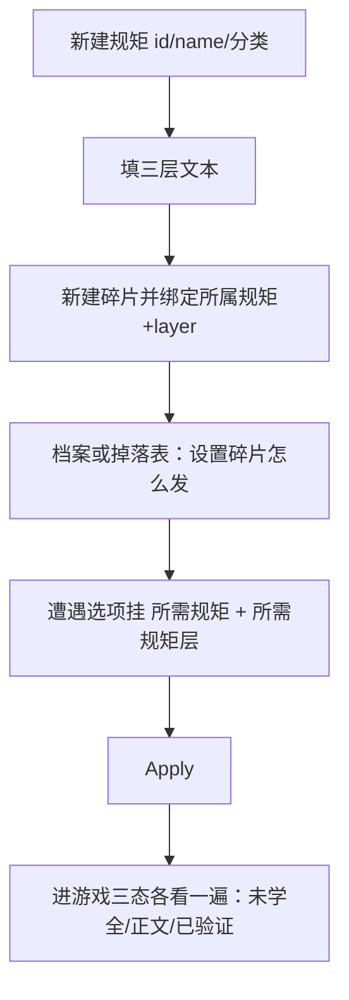

# 规矩面板

雾津的人办事讲**规矩**：城隍庙怎么拜、纸人不能乱撕、路边的祭品不能翻。**规矩面板**登记整条规矩与**碎片**（玩家一点点收集的条文），并维护规矩在游戏里呈现的三段文案。读完这页，你能立一条像模像样的规矩、把它接进遭遇选项，并搞懂「玩家不懂规矩会怎样、懂了会怎样、破了会怎样」这套雾津的核心玩法是怎么落地成表单数据的。

---

## 这是什么（30 秒看懂）

规矩不是提示牌，是**一套玩家要自己摸清楚、自己决定守不守的民俗禁忌**。你在雾津走街串巷，会撞见各种「老辈人说过的事」——路祭不能碰、纸人巷口要作揖、河边叫魂要念对词。这些事玩家一开始只是隐约听说（**没学全**），随着捡到碎片、读了见闻录，逐渐拼出全貌（**学会了**），甚至有机会被庙祝一类的人证实（**验证过**）。

规矩面板就是给这套「一点点摸清楚」的体验**登记数据**：这条规矩叫什么、分几类、在「没学全 / 学会了 / 验证过」三个阶段玩家分别看到什么文字。规矩面板自己不会让什么东西发生——它只负责「这条规矩长什么样」；真正让规矩产生游戏后果的，是[遭遇](./encounter)选项里的「需要这条规矩」「需要到什么层级」，以及玩家选了「照规矩办」还是「硬闯」之后触发的[动作](../concepts/actions)。规矩、遭遇、碎片来源（[档案](./archive)见闻或掉落）三者配合，才拼成完整的「守规矩／破规矩／有后果」玩法闭环。

---

## 入门：手把手做第一次

以「路祭不可动」这条规矩为例，从零做一遍。

1. 打开 `./dev.sh editor` → **规则与经济 → 规矩**。
2. 点新建，填 id `rule_no_touch_offering`（一旦保存，id 不建议再改，别的地方靠它引用）。
3. **完整名**填「路祭不可动」；**未学全时显示名**填「路边那些东西……」——玩家没学会前，列表里就看到这个含糊的名字，营造「还不知道叫什么」的感觉。
4. **分类**选「民俗禁忌」（或你项目里对应的分类，没有就先按现有分类挑一个近似的）。
5. 填三层文本（下一节详细讲每层怎么写）：
   - 未学全提示：「路边摆的那些纸人、供品，老辈人说碰不得。」
   - 正文：「路祭是给游魂的，摆好了别去动，尤其别在天黑后翻检。」
   - 已验证层：「城隍庙老庙祝证实：动了路祭要还愿，否则夜里会被『缠上』。」
6. 切到碎片区，新建一条碎片：id `frag_offering_1`，条文写「有人说路边那堆纸钱是不能捡的」，**所属规矩**下拉选回 `rule_no_touch_offering`，layer 选「口传」，来源标注「见闻录·守夜人闲谈」。
7. 点 Apply 保存。
8. 去[档案](./archive)面板，把「守夜人闲谈」这条见闻的「首次阅读」动作设成给这条碎片；或者去某个掉落表让某次拾取给这条碎片——碎片总要有个「玩家怎么捡到」的出口，不然规矩永远学不会。
9. 去[遭遇](./encounter)面板，找一个「巷口撞见路祭」场景，给某个选项挂上「所需规矩」= `rule_no_touch_offering`、「所需规矩层」= 口传。
10. 存档测试：没碎片时进游戏看规矩 UI，应该只看到「未学全提示」；捡到碎片后再看，应该切成「正文」；走到验证流程后，应该看到「已验证层」。

---

## 进阶：每一项都讲透

### 整条规矩的字段

- **id**：全局唯一的引用键。遭遇、图对话、档案掉落都靠它找到这条规矩，一旦有地方在用，不建议改名（编辑器不提供「改名」操作，实质是删旧建新，所有引用都要跟着换）。
- **完整名**：玩家学会之后，规矩列表/详情里显示的正式名字，比如「路祭不可动」。
- **未学全时显示名**：玩家还没学会时列表里显示的名字，通常写得含糊、留悬念，比如「路边那些东西……」。两个名字**都要填**，别图省事填成一样——一样的话「没学会」和「学会了」在列表里根本看不出区别，神秘感就没了。
- **分类**：项目里预先约定好的规矩类别（例如象理术、口传、实证，具体以你项目当前的分类下拉为准）。分类通常会被遭遇选项的「所需规矩层」引用去做门槛判断，所以起新规矩前先看看已有分类怎么分的，别自己发明一个野类目。

### 三层文本——规矩体验的核心

规矩不是一段话糊在一起，而是**分层呈现**，对应玩家「知道多少」：

| 层 | 什么时候玩家看到 | 雾津体感例子 |
|---|---|---|
| 未学全提示 | 玩家还没收集够碎片、规矩没学全 | 「似乎听过……但记不清全文」「路边摆的那些东西，老辈人说碰不得」 |
| 正文 | 玩家已经学会主体内容 | 能照着做的条文，比如「路祭是给游魂的，别去动」 |
| 已验证层 | 玩家走过验证流程（庙祝确认、亲身试验等） | 更权威的补充，往往带后果警告，比如「动了要还愿，否则夜里被缠上」 |

三层都要在编辑器里**分别**填，不要图省事把同一段话粘贴三次——这样玩家学全前后毫无区别，「摸清楚一条规矩」这件事的仪式感就没了。也不要留空指望「游戏里就不显示」：**空层保存时可能被回填成占位默认文案**，反而会让玩家看到莫名其妙的字，还不如自己写一句「（尚无补充）」之类的短句。

三层文本可以互相呼应、层层递进：未学全提示制造悬念、正文给出可执行的条文、已验证层补一句更狠的后果或更深的设定（比如提到某个[位面](./plane)里这条规矩有额外禁忌）。

### 碎片

- **id**：碎片自己的引用键，供动作「给规矩碎片」指定。
- **条文**：碎片本身显示的一小段文字，通常是规矩正文的一个片段或旁人的转述，比如「有人说路边那堆纸钱是不能捡的」。
- **所属规矩**：只读绑定到某条规矩的 id，决定这片碎片算谁的拼图。绑错会导致玩家收集了半天，进度条却挂在另一条规矩上。
- **layer**：这片碎片对应规矩的哪个层级/分类维度（比如象理术、口传），要和遭遇选项「所需规矩层」用的同一套值对齐，否则「捡够了碎片但选项还是灰的」。
- **来源**：标注这片碎片从哪儿来（见闻掉落、首次阅读、遭遇奖励等），方便你后续排查「这个碎片到底哪儿发的」。

碎片的意义是**把「学会一条规矩」拆成可以被玩家一点点探索到的动作**——捡一个物件、读一段见闻录、完成一次遭遇，都可能给一片碎片。规矩本身不管「怎么发」，那部分要在[档案](./archive)的首次阅读动作、[物品](./item)拾取、或[遭遇](./encounter)的结果动作里配置「给规矩碎片」。

### 规矩怎么变成真正的游戏后果——守/破/后果这套玩法

规矩面板只负责「文案是什么」，真正让规矩产生行为差异的，是别的面板怎么**引用**它：

- **门槛型**：[遭遇](./encounter)选项可以设「所需规矩」+「所需规矩层」。玩家没学到那个层级，这个选项要么不出现、要么显示为不满足，逼玩家先去摸清楚规矩再回来。这是「守规矩才能顺利过关」的最常见写法。
- **后果型**：如果你想做「玩家可以硬闯，但会付出代价」的设计——比如玩家明知没验证过路祭规矩，还是选了「翻一翻看有没有钱」——那这个选项本身不需要挂「所需规矩」门槛（谁都能选），但选中之后的[动作](../concepts/actions)（结果动作）要给出真实后果：扣状态、加一个「缠身」类旗标、影响后续遭遇的判定，而不是什么都不做。**规矩被破坏之后必须有能感知到的后果**，不然「破规矩」这件事在玩家体验里就是不存在的。
- **验证型**：玩家在「已学会」但「未验证」阶段做出的选择，可能触发一段验证流程（找庙祝问、亲自试一次），验证通过后规矩状态推进到「已验证」，这时再回来看这条规矩，就能看到已验证层里更狠的说法。

一条规矩通常会同时被多处引用：遭遇的选项门槛、图对话里提示玩家「这里需要某条规矩」、任务把某条规矩碎片当奖励。规矩面板是这些引用共同指向的「唯一权威定义」，改规矩文案时想清楚所有引用它的地方会不会跟着变。

### 批量与效率技巧

- 一次性把某类规矩（比如「民俗禁忌」）的三层文案都列在文档/表格里打好草稿，再逐条粘进编辑器，比边想边填快，也更容易保持三层的语气区分度（未学全含糊、正文明确、已验证权威）。
- 新规矩想不出「未学全提示」怎么写时，可以先写「听说过……但记不清」这种万能句式起手，再回头改成贴合具体规矩的版本。
- 碎片的 layer 定好之后，尽量复用同一套分类值，别每条规矩自造一套，方便遭遇那边统一下拉选择、减少对错层的概率。

---

## 危险区与边界

- **保存会重建整条规矩数据**：编辑器只认识当前表单里的字段，老存档里如果有过时的字段（比如旧版本遗留的 description、旧的 verified 混写字段），一旦在编辑器里打开这条规矩并 Apply，这些旧字段会被清掉。从老数据迁移过来的规矩，先 Apply 一次，回游戏里检查三层文案有没有丢，再继续往下编。
- **空层会被回填默认文案**：三层里哪层留空，保存后不一定是「空白不显示」，很可能被回填成一句占位文字。想清楚三层内容再填，别指望留白。
- **碎片的所属规矩字段是只读绑定**：新建碎片时选好所属规矩后不能中途改绑，如果发现绑错了，通常需要删了重建，而不是改这一个字段。
- **删除规矩前先全局排查引用**：遭遇的「所需规矩」、图对话的规矩提示、任务奖励碎片，都可能还指着这条规矩的 id，删除前务必确认没有别处还在用。
- 更系统的「这个面板哪里改了会丢、哪里编辑器根本够不到」，看[危险区](../concepts/danger-zone)与[可编辑面 / 危险区参考](/docs/reference/danger-zone)。

---

## 常见问题

| 现象 | 原因 | 怎么办 |
|---|---|---|
| 遭遇选项永远是灰的、点不了 | 所需规矩或所需规矩层配错，或者玩家碎片的 layer 和选项要求的层不一致 | 回规矩面板核对碎片 layer，回遭遇面板核对所需规矩、所需规矩层 |
| 玩家学全前后完全看不出区别 | 三层文本写成了同一段话 | 把未学全提示改成含糊、悬念的说法，和正文拉开差距 |
| 碎片怎么收集都收不齐 | 碎片的所属规矩绑到了别的规矩上 | 回碎片详情核对所属规矩 id，绑错的话删了重建 |
| 存档没内容却看到一段莫名文案 | 某一层留空被回填了默认占位文案 | 显式给这层写一句你想要的短句，别留空 |
| 验证流程走完了，规矩详情却还是没有额外说明 | 已验证层没填 | 补上已验证层的内容，通常放更权威的说法或后果警告 |
| 破坏规矩之后玩家毫无感觉 | 对应选项的结果动作没有给出真实后果 | 去动作编辑器给这个选项加惩罚类动作（扣状态、加旗标等），别让「破规矩」静默过去 |

---

## 相关

- [遭遇面板](./encounter)——规矩最常被引用的地方：所需规矩、所需规矩层
- [图对话](./dialogue-graph)——对白里提示玩家「需要某条规矩」
- [任务面板](./quest)——把规矩碎片当奖励发放
- [旗标](./flags)——记录规矩验证进度这类持久状态
- [档案面板](./archive)——见闻录首次阅读时发碎片
- [怎么编排动作](../concepts/actions)、[怎么设条件](../concepts/conditions)、[怎么写带引用的文本](../concepts/rich-text)
- [危险区](../concepts/danger-zone) / [可编辑面·危险区参考](/docs/reference/danger-zone)
