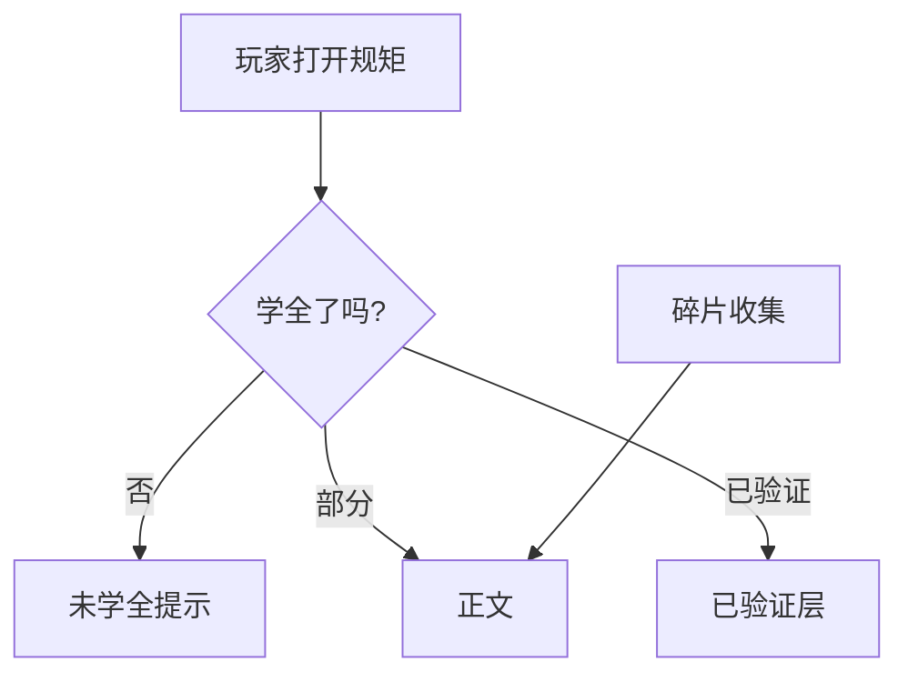

# 规矩面板

雾津的人办事讲**规矩**：城隍庙怎么拜、纸人不能乱撕、河边叫魂要念对词。**规矩面板**登记整条规矩与**碎片**（玩家一点点收集的条文），并维护**三层玩家可见文本**——不是一段话糊在一起，而是分层呈现「未学全 / 锁定提示 / 已验证」等不同阅读体验。

遭遇选项「需某规矩」、图对话规矩提示、档案解锁，都指着这里登记的 id。

---

## 这块面板管什么

### 整条规矩

- **id**、**完整名**、**未学全时显示名**、**分类**（象理术、口传等——以你项目分类为准）。
- **三层文本**（核心）：
  - **正文层**：玩家已掌握主体内容时看的正文。
  - **未学全提示**：还没学全时点开会看到的暗示/残缺提示。
  - **已验证正文**：验证通过后的补充说明或权威表述。

三层都要在编辑器里分别填；空层保存时可能被**回填默认值**——别留空指望「游戏里不显示」。

### 规矩碎片

- 碎片 id、条文、所属规矩 id（只读绑定）、来自哪层（layer）、来源（source）。
- 玩家捡到碎片 = 拼凑学会规矩。

---

## 怎么打开

1. `./dev.sh editor` → **规则与经济 → 规矩**。
2. 列表选规矩或碎片；右侧分 Tab 或分区编辑。
3. Apply；[遭遇](./encounter) 或图对话选项里下拉选规矩 id。

:::info[配图：规矩三层文本]
截同一条规矩三个文本框：正文 / 未学全提示 / 已验证 并排可见。
:::

---

## 三层怎么用

| 层 | 雾津体感 |
|---|---|
| 未学全提示 | 「似乎听过……但记不清全文」 |
| 正文 | 能照着做的条文 |
| 已验证层 | 庙祝认可、或实地验证后的注脚 |

---

## 怎么新建规矩

1. 新建 id `rule_bow_paper`。
2. name「纸人巷礼」；incompleteName「??礼法」；category 选民俗。
3. **正文** 写作揖要点；**未学全提示** 写「老人提过要拜一拜」；**已验证** 写庙祝补充。
4. 添加 **碎片**：「碎片·作揖」layer 对应、source 设见闻掉落。
5. Apply；[物品](./item) 或 [动作](../concepts/actions)「给规矩碎片」指向碎片 id。

---

## 怎么改 / 删

- **改正文**：只动对应层，别三层粘同一段——玩家进度体验会糊。
- **删规矩**：编辑器会清掉旧字段如过时 已验证层/description 混写字段——以当前表单为准。
- **删碎片**：确认没有掉落表还发此碎片。

---

## 当心什么

| 当心 | 用户说法 |
|---|---|
| 三层写成一样 | 学全前后没仪式感 |
| 遭遇 所需规矩层 对错层 | 选项永远不满足 |
| 碎片 所属规矩 绑错 | 收集半天不是这条规矩 |
| 空层被回填 | 莫名多出占位文案 |

规矩保存会**删旧 schema 字段**——从老档迁移时先 Apply 看丢没丢文案。

---

## 雾津例子：对纸人行礼

1. 规矩 `rule_bow_paper` 三层如上。
2. [遭遇](./encounter)「纸人巷口」选项作揖要此规矩 + 象理层。
3. [档案](./archive) 见闻「纸扎匠口述」首次阅读 给碎片。
4. 验证后 已验证层 层提到 [位面](./plane) 夜雾津额外禁忌。

:::info[配图：游戏内规矩 UI]
学全前未学全提示与学全后已验证层对比截图。
:::

---

## 和相关面板怎么配合

| 面板 | 关系 |
|---|---|
| [遭遇](./encounter) | 所需规矩 |
| [图对话](./dialogue-graph) | ruleHint |
| [任务](./quest) | 奖励规矩 |
| [旗标](./flags) | 验证进度 |

---

---

## 实操检查清单

- [ ] 三层正文、未学全提示、已验证层 分别填写，勿粘同一段
- [ ] 空层可能被回填占位，别留空指望不显示
- [ ] 碎片 所属规矩 绑定正确，layer 与遭遇 所需规矩层 一致
- [ ] incompleteName 营造「未学全」神秘感
- [ ] 分类（象理、口传等）与遭遇选项要求对齐
- [ ] 删规矩前查遭遇、对话、掉落表
- [ ] 从老 schema 迁移后 Apply 看是否丢 已验证层 文案
- [ ] 碎片 source 与档案 首次阅读 或见闻掉落一致
- [ ] 验证后 已验证层 层可提位面禁忌等进阶信息
- [ ] Apply 后在游戏规矩 UI 测学全前/后/验证后三态

---

## 常见问题

| 现象 | 原因 | 怎么办 |
|---|---|---|
| 选项永远灰 | 所需规矩 或层不对 | 对齐规矩 id 与层 |
| 学全前后没区别 | 三层写成一样 | 重写 未学全提示 |
| 碎片收不齐 | 所属规矩 绑错规矩 | 改碎片绑定 |
| 莫名占位文案 | 空层被回填 | 显式填 intended 短句 |
| 验证后仍缺注脚 | 已验证层 未填 | 补第三层 |

---

## 预览验证

1. 新建规矩与碎片，三层分别填，Apply。
2. 用未学全存档打开规矩 UI，应见 未学全提示。
3. 收集碎片后再开，见 text 正文。
4. 走验证流程（遭遇或场景），见 已验证层。
5. 在遭遇测 所需规矩 选项可点。
6. 对照档案掉落是否发对此碎片。

---

纸人巷礼 未学全提示 写「老人提过要拜一拜」，已验证层 由庙祝补充夜雾津禁忌——三层递进你在 preview 里要分三次存档看。遭遇作揖选项要象理层时，碎片 layer 别标口传。扎纸收尾「点睛」若规矩未解锁仍点，应扣 bad 分而非 silent——规矩 id 与层要在遭遇里对齐测。

---

## 相关概念

- [怎么编排动作](../concepts/actions)
- [怎么设条件](../concepts/conditions)
- [怎么写带引用的文本](../concepts/rich-text)
- [危险区](../concepts/danger-zone)
