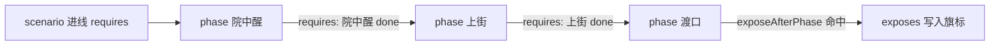

# 剧本面板

任务问「做完了吗」；剧本问「**这一章故事走到哪一拍**」。**剧本**（scenarios）定义一条剧情线的阶段（phase）、每阶段状态、解锁要什么、完成后**暴露哪些旗标**、是否要手动管这条线的生命周期。它和[叙事状态机](./narrative)互补：剧本偏「章节目录」，叙事偏「实时电路」。读完这页你能搭出一条有前置、有阶段、有暴露旗标的剧情线，并弄清楚哪个下拉框是"只做展示、不会真的生效"的陷阱。

---

## 这是什么（30 秒看懂）

把剧本想成雾津折子戏的一份"章回提纲"：章一叫「湿鞋」，分「院中醒」「上街」「渡口」几拍（phase），每拍要满足什么条件才能翻到，翻到某一拍完成后又会解锁哪些旗标（比如地图上多亮一个点、档案里多一条见闻）。剧本本身**不负责真的把台词演出来**——真正推动剧情前进的是[图对话](./dialogue-graph)或[叙事状态机](./narrative)里的动作在跑；剧本只是给这条线定规矩、记进度、决定完成后暴露什么。

---

## 入门：手把手做第一次

### 步骤

1. `./dev.sh editor` → **叙事编排 → 剧本**。
2. 左侧列表点「添加」新建一条剧本线，填 id（比如 `xungouji_ch1`）。
3. 填 description 说明这一线大概讲什么；如果这条线整体要靠人工按下"开始/结束"而不是自动判定，勾上「手动生命周期」开关（下面进阶细讲）。
4. 填「scenario 进线 requires」——整条线得满足什么才能启动。
5. 在 phases 表里「添加阶段」，逐个填阶段名，每个阶段自己的 requires（这里的叶子填别的 phase 名，意思是"那个阶段要先到 done"）。
6. 需要的话拖行号调整阶段顺序；设置「完成后暴露阶段」指定哪个阶段完成后触发暴露。
7. 「exposes」表里填这次要写入的旗标键与值。
8. Apply。

### 雾津小例子：章一「湿鞋」，照着抄

1. 新建剧本 `xungouji_ch1`，description 写"寻狗记开局，捡到一只湿鞋引出的第一条线索"。
2. phases 依次添加「院中醒」「上街」「渡口」；「上街」的 requires 填「院中醒 done」；「渡口」的 requires 填「上街 done」。
3. 「完成后暴露阶段」选「渡口」；exposes 表写入旗标 `dock_unlocked = true`。
4. [地图](./map)面板里，渡口节点的解锁条件读这个 `dock_unlocked` 旗标。
5. [图对话](./dialogue-graph)里用"设置剧本阶段"动作在"关二狗对话完成"之后把这条线推到「渡口」这一拍。
6. Apply，从新档走一遍，确认地图渡口节点在对话完成前后确实由灰变亮。

---

## 进阶：每一项都讲透

### 剧本顶层字段

- **id**：这条剧本线的编号，必须和图对话里"设置剧本阶段"动作填的剧本 id、以及各处条件里引用的 scenario 完全一致——不一致就是两条各说各话的线，谁也推不动谁。id 重复或留空，Apply/保存工程时会直接校验失败。
- **description**：仅供说明，不参与任何判定逻辑，随便写。
- **整条线手动激活/完成**：勾上之后，这条线**必须**先在某处执行"激活剧本"动作（会校验一遍进线 requires）才能开始"设置剧本阶段"；执行"完成剧本"动作之后，就禁止再改这条线的 phase 了。这两个动作可以由任意图对话、任务或别的地方在运行时先后触发——**编辑器不会替你做跨图的时序检查**，这个开关只是给这条线加一层"必须显式开场/显式收场"的门槛，具体什么时候触发、触发顺序对不对，全靠你自己在各个动作源头里安排好。
- **scenario 进线 requires**：整条线能不能启动的前置条件，支持「与」（多选，全部满足）、「或」（任一满足）、更复杂的非/嵌套关系用 JSON 模式手写；混用两种模式写法要保持一致，否则条件永远判定不满足。

### phases（阶段表，核心中的核心）

每一行是一个阶段，三列：

- **phase 名**：阶段的显示/引用名，图对话的"设置剧本阶段"动作与本剧本内其它阶段的 requires 都靠这个名字互相指认。
- **清单默认 status**：这一列**只是给你看的文档默认值，不是运行时的真实状态**——这是全篇最容易踩的坑：无论这一列写的是 pending / active / done / locked 哪一个，游戏运行时，任何阶段在真正被"设置剧本阶段"动作写入之前，一律按 pending（未开始）处理。把这一列手动改成 done，并**不会**让玩家一开局这条线就已经"完成"某一拍——阶段的真实推进，永远只能靠"设置剧本阶段"动作来做。
- **requires**：这一阶段本身要满足什么才能被认为"可以翻到"，同样支持与/或/JSON 三种模式；叶子填的是**别的阶段名**，语义是"那个阶段必须已经是 done"。

阶段行可以**拖行号调整顺序**——顺序会影响"完成后暴露阶段"这类"到某阶段之后"的语义，调完顺序建议整章从头预览一遍。

### 完成后暴露阶段与 exposes

- **完成后暴露阶段**：选一个阶段，当这个阶段被真正设为 status=done 时，触发下面 exposes 表的写入。
- **exposes**：一张"旗标键 → 写入值"的表。值的类型必须和[旗标](./flags)登记表里这个键的值类型一致（布尔/数值/字符串），类型对不上会出问题。

这一对搭配常用来控制"地图什么时候多亮一个点""档案什么时候多解锁一条见闻"——地图、档案那边的解锁条件去读这个 exposes 写出来的旗标即可，不需要另外重复一套判定逻辑。

### 关联图对话

这一项**只读**，展示的是当前有哪些图对话归属于这条剧本（由图那边自己标注归属、工程同步维护），双击列表项能跳转过去看，但**改对话内容、改图归属关系都不能在这里做**，得去[图对话](./dialogue-graph)面板。

### phase 的 outcome（这项界面完全没有）

有一个字段叫 outcome，理论上可以记录这个阶段"具体是怎么结束的"（比如"渡口"这一拍是靠成功捞到鞋结束、还是靠别的分支结束）——但编辑器目前**没有任何界面能填它**，就算你手写进 JSON，只要有人在这个面板里打开过、保存过，这个字段就会被无声丢弃。如果设计上确实需要记录"阶段是怎么完成的"这类信息，目前只能用别的机制（比如单独设一个旗标）来代替，别指望 outcome 能长期存活。

### 和相关面板怎么配合

| 面板 | 关系 |
|---|---|
| [任务](./quest) | 任务的前置/完成条件常常读某个 scenario 的 phase 状态 |
| [旗标](./flags) | exposes 写入的键必须先在这里登记 |
| [叙事状态机](./narrative) | 用信号/动作对齐 phase 的实际推进时机 |
| [档案](./archive) | expose 之后解锁人物簿/见闻录条目 |
| [地图](./map) | expose 之后解锁地图节点 |

### 效率与老手技巧

- 剧本的 phase 状态和任务的完成条件、叙事状态机的信号，本质是三套各自独立的"进度记录"——设计上要约定清楚"谁先写、谁后读"，避免同一件事被两处分别判断，出现"任务显示完成了但剧本还卡着上一拍"这种自相矛盾。
- 每加一个 phase 的 requires，建议立刻用预览走一遍这一拍能不能正常翻过去，别攒到最后一起测，出错了不好定位是哪一层条件写错。

---

## 危险区与边界

- **phase 的 outcome 无界面，保存必丢**，别依赖它记录任何长期数据。
- **「清单默认 status」这一列只是展示，不会播种真实的运行时状态**——真正的阶段推进只能靠"设置剧本阶段"动作。
- **关联图对话是只读的**，改动对话内容或图归属要去图对话面板。
- id 重复或留空会导致 Apply/保存校验失败。
- 「手动生命周期」开关打开后的时序保障完全靠你自己在各处动作里安排，编辑器不做跨图静态检查。
- 更多细节见[危险区](../concepts/danger-zone)与[参考·可编辑面](/docs/reference/authoring-surface)。

---

## 常见问题

| 现象 | 原因 | 怎么办 |
|---|---|---|
| 阶段永远卡在 inactive/pending | requires 写错，或与/或/JSON 模式混用不一致 | 逐条核对条件编辑器的语法与模式 |
| 把某阶段状态改成"done"，游戏开局却没生效 | 「清单默认 status」只是文档展示，不会播种运行时状态 | 用"设置剧本阶段"动作真正推进 |
| 地图/档案该解锁的没解锁 | exposes 没写，或写的旗标没在登记表注册 | 补 exposes 条目，并确认旗标已登记 |
| 改了对话，剧本页却没反应 | 关联图对话本来就是只读展示 | 去图对话面板改内容 |
| outcome 莫名消失 | 面板不持久化这个字段 | 改用旗标等别的机制记录 |
| 任务进度和剧本进度打架 | 两处各自维护完成判定 | 约定单一真相来源，另一处只读取不重写 |

---

## 相关

- [任务](./quest)
- [旗标](./flags)
- [叙事状态机](./narrative)
- [档案](./archive)
- [地图](./map)
- [图对话](./dialogue-graph)
- [怎么编排动作](../concepts/actions)
- [怎么设条件](../concepts/conditions)
- [怎么写带引用的文本](../concepts/rich-text)
- [危险区](../concepts/danger-zone)
