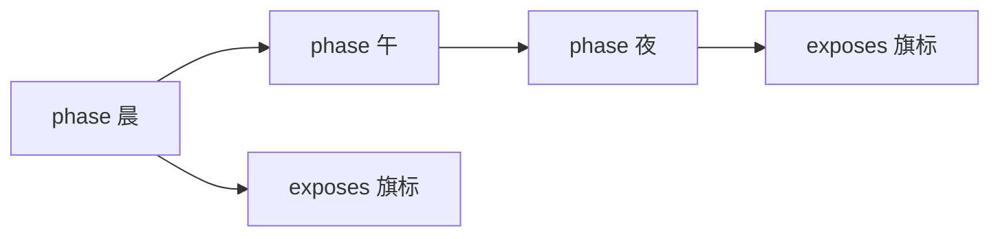
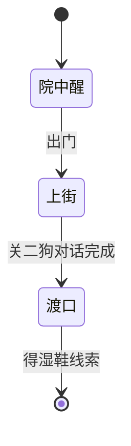

# 剧本面板

任务问「做完了吗」；剧本问「**这一章故事走到哪一拍**」。**剧本**（scenarios）定义一条剧情线的阶段（phase）、每阶段状态、解锁要什么、完成后 **暴露哪些旗标**、是否手动管某线的生命周期。和 [叙事状态机](./narrative) 互补：剧本偏「章节表」，叙事偏「实时电路」。

---

## 这块面板管什么

- **剧本 id**、描述、是否手动管线生命周期。
- **前置 requires**：与/或组合或结构化条件，整线能不能启动。
- **exposeAfterPhase**：到某 phase 后才暴露的东西。
- **exposes**：phase 完成后旗标→值映射表。
- **phases**：阶段名、状态、本阶段 requires；可 **拖拽排序**。
- **关联图对话 id 列表**：多为 **只读** 展示——改对话去 [图对话](./dialogue-graph) 面板。

---

## 怎么打开

1. `./dev.sh editor` → **叙事编排 → 剧本**。
2. 选剧本如「寻狗记·章一」。
3. 编辑 phases 与 exposes；Apply。

:::info[配图：剧本 phases 列表]
截 phases 拖排序、exposes 表、requires 条件编辑器。
:::

---

## 阶段怎么走

---

## 怎么新建剧本线

1. 新建 id `xungouji_ch1`。
2. description 写章概述；requires 设「接取主线任务后」。
3. phases 添加「到渡口」「见关二狗」「得线索」；每 phase 的 requires 细化。
4. exposeAfterPhase 控制地图/档案何时解锁（配合 [地图](./map)）。
5. exposes：phase「得线索」完成 → 旗标 `clue_shoe` true。
6. manualLineLifecycle 若 true，某些转换要你手推——读检视器说明。
7. Apply。

---

## 怎么改 / 删

- **拖 phase 顺序**：影响 exposeAfterPhase 语义——改后全局预览一章。
- **改 exposes**：下游 [条件](../concepts/conditions) 全受影响。
- **删剧本**：极少；确认叙事图与任务不硬编码此 id。

---

## 当心什么：危险区

| 风险 | 用户说法 |
|---|---|
| **phase 的 outcome 无界面** | 保存时 **outcome 被丢**——别指望手写 outcome 长期存活 |
| 关联图对话（只读） 只读 | 别在这里改对话，去图对话 |
| requires 写 JSON 模式 | 与/或/树模式混用要一致，否则阶段永远 inactive |
| 与叙事双源真相 | 剧本 phase 与叙事状态要约定谁领先 |

先读 [危险区](../concepts/danger-zone)。

---

## 雾津例子：章一「湿鞋」

1. 剧本 `xungouji_ch1` phases：「院中醒」→「上街」→「渡口」。
2. 「渡口」requires：任务步骤到打听码头；完成 exposes `dock_unlocked`。
3. [地图](./map) 渡口节点 unlock 条件读 `dock_unlocked`。
4. [水域小游戏](./water-minigame) 成功后叙事信号推 phase；勿与任务各写各的完成条件而不对齐。

:::info[配图：phase 与地图联动]
剧本「渡口」完成前后地图点亮对比。
:::

---

## 和相关面板怎么配合

| 面板 | 关系 |
|---|---|
| [任务](./quest) | 任务推进与剧本 requires |
| [旗标](./flags) | exposes 写入 |
| [叙事状态机](./narrative) | 信号对齐 phase |
| [档案](./archive) | expose 后解锁条目 |

---

---

## 实操检查清单

- [ ] phases 顺序与 exposeAfterPhase 语义一致，拖排序后全局预览
- [ ] exposes 写入的旗标已在旗标表注册
- [ ] requires 与任务、叙事状态对表，避免双源各写各的
- [ ] 关联图对话（只读） 只读，改对话去图对话面板
- [ ] 知悉 phase outcome 无界面，保存可能丢失 outcome
- [ ] manualLineLifecycle 为 true 时读检视器说明再改
- [ ] 删剧本前确认叙事图与任务不硬编码此 id
- [ ] 每 phase 的 requires 可达成，用 preview 逐段推
- [ ] 地图 unlock 与 exposes 旗标同名同义
- [ ] Apply 后整章 walkthrough 一遍

---

## 常见问题

| 现象 | 原因 | 怎么办 |
|---|---|---|
| phase 永远 inactive | requires 写错或模式不一致 | 查条件编辑器语法 |
| 地图点不亮 | exposes 未写或旗标未注册 | 补 exposes 与 static |
| 对话改了剧本没变 | 关联图对话（只读） 只读展示 | 去图对话改 |
| outcome 莫名消失 | 面板不持久化 outcome | 勿依赖手写 outcome |
| 与任务进度打架 | 剧本与任务双写完成 | 开会对齐单一真相 |

---

## 预览验证

1. 编辑 phases、requires、exposes，Apply。
2. 从新档或章初存档按 phase 顺序推剧情。
3. 每完成一 phase 查旗标与地图节点是否按设计亮。
4. 故意不满足 requires，确认阶段不会误推进。
5. 对照叙事状态机信号，看是否与 phase 同步。
6. 整章结束后 exposes 键与下游条件一致。

---

寻狗记章一「渡口」phase 完成应 exposes 解锁地图渡口——你在预览里对比完成前后地图灰亮。水域小游戏成功后若叙事发信号推 phase，要与任务 completion「持有湿鞋」对齐，防玩家捞到鞋剧本仍卡「上街」。exposeAfterPhase 控制档案条目时，别早于玩家该知道的信息点。

---

## 相关概念

- [怎么编排动作](../concepts/actions)
- [怎么设条件](../concepts/conditions)
- [怎么写带引用的文本](../concepts/rich-text)
- [危险区](../concepts/danger-zone)
