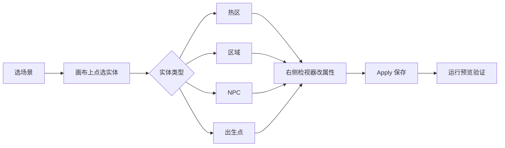
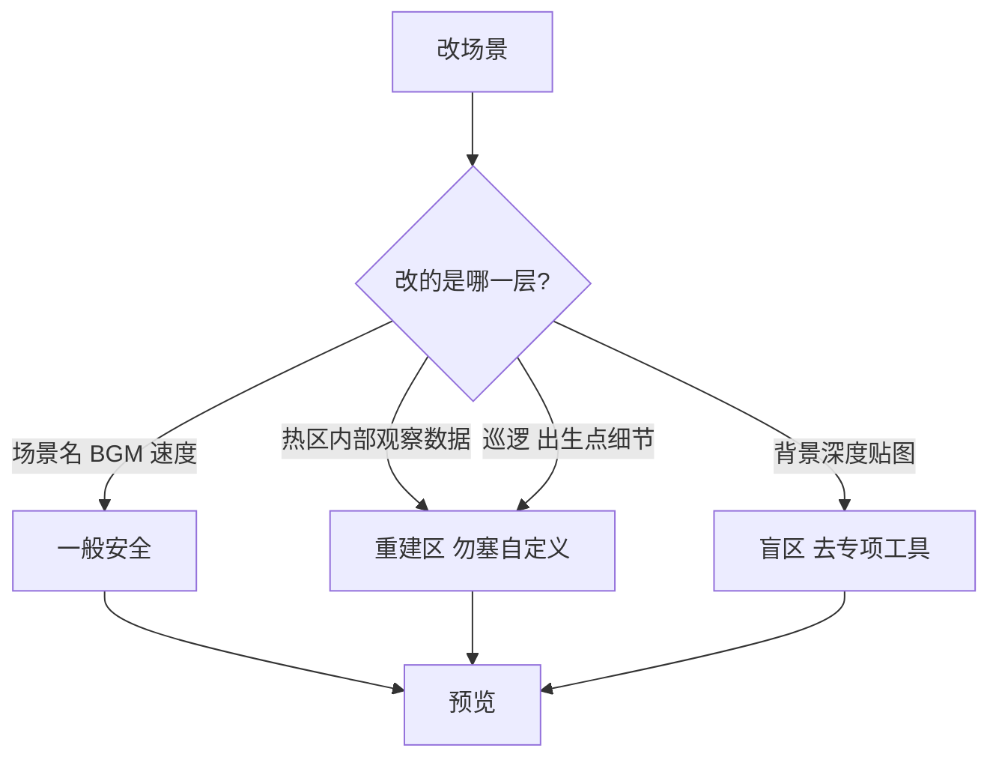

# 场景面板

你想让玩家在雾津的街巷里走动、在城隍庙门口驻足、从码头走进仓库——这些都得先在**场景面板**里把「这一张地图」摆好。场景是物理世界的地基：背景尺度、背景音乐、滤镜、出生点、能点的热区、能踩进去触发的区域、会巡逻的 NPC，全在这一页管。

---

## 这块面板管什么

| 你关心的 | 面板帮你做 |
|---|---|
| 整张地图的「底色」 | 场景名、世界宽高、行走/奔跑速度、背景音乐、画面滤镜、镜头缩放 |
| 玩家能点、能捡、能进门的东西 | **热区**（观察、拾取、转场、遭遇等） |
| 走进去就触发剧情或规矩的地面 | **区域**（标准区、深度地板区） |
| 会动、会说话的活人 | **NPC**（立绘动画、对话图、巡逻路线） |
| 玩家从哪冒出来 | **出生点**（默认出生点不可删） |
| 一进场景就先发生的事 | 场景级**动作**（见 [怎么编排动作](../concepts/actions)） |

场景面板带**画布**：你在图上拖位置、画碰撞多边形、拉巡逻折线，比在表格里填坐标直观得多。

---

## 怎么打开

1. 在游戏仓库根目录执行 `./dev.sh editor`，打开主编辑器。
2. 看左侧导航树，展开 **物理世界**，点 **场景**。
3. 画布上方或左侧有**场景列表**：选你要改的那张（例如雾津老街、城隍庙前庭、仓库内室）。
4. 改完记得点 **Apply / 应用**（或面板惯用的保存），再开运行预览走一遍。

:::info[配图：场景面板全貌]
请截一张：左侧选中「场景」、中间是雾津某张地图画布、右侧检视器露出场景名与 BGM 下拉。框出场景列表、画布、检视器三处。
:::

---

## 界面怎么走

- **场景列表**：切换不同地图；注意面板里**没有「新建场景」按钮**——新场景通常由工程流程或专项工具接入，不能指望在这里点一下就多出一张图。
- **画布**：世界坐标系；可拖热区/NPC、编辑碰撞多边形、画区域多边形、拉 NPC 巡逻线。
- **检视器**：选中什么改什么；富文本标签、条件、动作都走主编辑器通用控件（见文末链接）。

---

## 场景顶层：整张图的脾气

选中场景根（不点具体热区时），你能改：

- **名称**：给策划自己认的称呼，比如「雾津·城隍庙前庭」。
- **世界宽高与比例锁**：决定可走动范围；锁宽高比可避免拉变形。
- **行走/奔跑速度**：玩家在这张图里的脚程。
- **背景音乐、环境音**：进图就响什么；音频条目在 [音频面板](./audio) 里登记。
- **滤镜**：整张图的色调氛围，在 [滤镜面板](./filters) 里配好再下拉选择。
- **镜头**：缩放、像素与世界单位换算——影响「镜头跟多紧」。
- **进入场景时**：编排一串 [动作](../concepts/actions)，比如先播一段环境对白、改某个旗标。

:::tip[雾津例子：进老街的第一口气]
城隍庙前庭场景可以在「进入时」播一句旁白式的环境描写，或静默只开 BGM；若玩家带着某任务进来，用 [条件](../concepts/conditions) 配合区域或热区再分支，比全堆在 进入时 里清爽。
:::

---

## 热区：玩家手指下的东西

热区是地图上「可交互的一坨」——牌匾、可捡的铜钱、通往仓库的门、挂在墙上的遭遇入口等。每种类型管的事不一样：

| 类型 | 玩家体验到 | 你要配什么 |
|---|---|---|
| 观察型热区 | 点一下出说明或开对话/动作 | 动作列表，或挂接图对话 |
| 拾取型 | 捡到物品或钱 | 物品、数量、是否算钱币 |
| 转场 transition | 切到另一张场景 | 目标场景、目标出生点 |
| NPC 型 | 指向已登记的 NPC 实例 | 角色登记里的身份 |
| 遭遇 encounter | 进入选项式遭遇 | 遭遇面板里做好的遭遇 |

**通用字段**（多数类型都有）：显示标签（可走 [富文本](../concepts/rich-text)）、坐标、交互距离、是否自动触发、关联过场、显示条件、条件不满足时是否隐藏、展示用小图、碰撞多边形。

### 怎么加热区

1. 在画布工具栏选「添加热区」或等价按钮，在图上点一下落点。
2. 在检视器里选 **类型**，按类型填专属项（例如转场要选目标场景）。
3. 拖碰撞多边形包住「能点到的范围」——比只设交互距离更贴形。
4. Apply，预览里走过去点一遍。

### 怎么改 / 删

- **改**：画布拖位置；检视器改文案、条件、动作。
- **删**：选中热区，检视器或列表里删除——删前确认没有任务/对话还指着它。

:::info[配图：热区碰撞与转场]
截城隍庙牌匾热区：画布上多边形框住牌匾，检视器类型为转场，目标场景指向内室。
:::

---

## 区域：脚踩进去就发生

区域是一块**地面范围**（多边形），用来：

- 玩家走进某片瓦檐下才触发对话或规矩判定；
- 做深度地板（角色能走到物件后面时踩的「层」）。

**标准区域**可设：进入 / 停留 / 离开 时各跑一串动作，并挂 [条件](../concepts/conditions) 决定谁触发。

**深度地板区域**主要调地板抬升；若你把区域从标准改成深度地板，**进入/停留/离开的动作会被清掉**——切换类型前先想清楚。

### 画区域

1. 添加区域，在画布上点顶点围成多边形；可拖点、插点、删点。
2. 设区域种类与条件、动作。
3. 雾津例：老街雨巷里一片「湿冷」区，玩家踏入才播脚底水声环境音（动作里播音效或 cue）。

---

## NPC：会动会聊的人

NPC 不是「角色登记」本身，而是**这张场景里的一个实例**：站在哪、朝哪、用哪套动画、聊哪张图对话、要不要巡逻。

- 身份动画包在 [角色登记](./character) 统一定义，这里选引用。
- **对话图**、入口节点、对话镜头缩放在这里绑。
- **巡逻**：画布上拉折线路径；保存时编辑器只保留它认得的巡逻字段，别指望塞奇怪自定义项（见危险区）。
- **位面归属**：多选这张 NPC 在哪些位面可见（位面在 [位面面板](./plane) 配）；不选等于所有位面都在。

关二狗站在码头边、面朝河、初始 idle、点他开图对话——典型配置路径：角色登记有关二狗 → 场景里放 NPC 实例 → 热区或直接交互范围让玩家能点。

---

## 出生点

出生点决定**转场或读档后玩家落在哪里**。可以多个出生点，用不同 key 区分；**默认出生点不能删**，删别的点之前确认转场没再引用那个 key。

---

## 当心什么：危险区与够不着的地方

做场景最容易踩的坑，建议先读 [危险区总览](../concepts/danger-zone)。和本面板直接相关的：

### 会丢内容的「重建区」

- **热区内部数据**（尤其观察型里某些文案位）：编辑器保存时会按它认识的结构重写，多写的键会没。
- **NPC 巡逻**：只保留路线、速度、移动动画等编辑器表单项，别的会被抹掉。
- **出生点**：保存时通常只留坐标类信息。

### 主动删掉的字段

- 区域上旧的宽高坐标写法、规矩槽位等，面板保存时会清掉——用多边形和现行字段即可。
- NPC 上过时的「单文件对话」类挂接会被删，请统一用图对话。

### 编辑器够不着的盲区

- **多层背景、深度贴图、碰撞深度图**：主场景面板改不了，要用 **场景深度** 专项工具导出后再进游戏。
- **动画表**：这里只读，动画来自视频转图集等生产流程。

### 操作习惯

- **没有复制、没有列表拖拽排序**——要类似热区，得手动再加一份改。
- 改完一定 **Apply + 运行预览**；雾津地图大，漏一个碰撞多边形就是「点不到牌匾」。

---

## 雾津工作流示例：从码头走进仓库

1. 在 **地图面板** 确认码头与仓库已在世界地图上连线（可选）。
2. 打开码头场景，加热区类型 **转场**，目标场景选仓库内室，出生点选 `from_dock`。
3. 在仓库内室放默认出生点 + 一个 **inspect** 热区指向「堆放的货箱」说明。
4. 若仅夜间能进门，给转场热区加 [条件](../concepts/conditions)（旗标或任务状态）。
5. Apply，运行预览：从码头点码头绳梯 → 切场景落点正确 → 点货箱出描述。

:::info[配图：码头转场一条龙]
两张小图或一张标注图：码头热区转场设置 + 预览里成功进仓库的画面。
:::

---

## 和相关面板怎么配合

| 想做的事 | 还要开 |
|---|---|
| 新 NPC 脸型与动画包 | [角色登记](./character) |
| 点人聊的具体台词 | [图对话](./dialogue-graph) |
| 进门后自动演片 | [过场](./cutscene) |
| 踩进庙里某区守规矩 | [规矩](./rule) + 本面板区域 |
| 世界地图上的点 | [地图](./map) |

---

## 相关概念

- [怎么编排动作](../concepts/actions)
- [怎么设条件](../concepts/conditions)
- [怎么写带引用的文本](../concepts/rich-text)
- [危险区：哪里改了会丢](../concepts/danger-zone)
