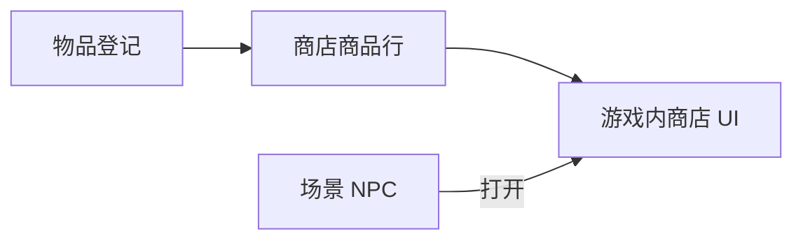

# 商店面板

关二狗不是唯一经济来源。**商店**定义一个摊位或柜台：**卖哪些物品、各自标价**。玩家走进商店 UI 时读这里的数据；物品本身的名字、描述、图标在 [物品面板](./item) 先做好，商店只引用物品 id + **price**。

---

## 这块面板管什么

- **商店 id**、**显示名**（如「渡口货郎」「纸扎铺」）。
- **商品表**：每行 itemId + price；可增删行。
- 保存时 **price 总会写出**——即使你以为留空可以「用物品默认价」，编辑器也会显式写数字，以你填的为准。

---

## 怎么打开

1. `./dev.sh editor` → **规则与经济 → 商店**。
2. 选商店或新建。
3. 商品表添加行，下拉选物品，填价。
4. Apply；场景 NPC 或动作「打开商店」绑此 id。

:::info[配图：商店商品表]
截三行：湿鞋相关道具、符纸、铜钱袋，price 列可见。
:::

---

## 流程

---

## 怎么新建商店

1. id `dock_vendor`；name「渡口货郎」。
2. 添加 item 行：引路符 paper_price 5、灯油 3……
3. 物品 [buyPrice](./item) 可作策划参考，但商店 **price 独立**——特价就写低一点。
4. Apply。
5. [图对话](./dialogue-graph) 货郎「看看货」→ 动作开 `dock_vendor`。

---

## 怎么改 / 删

- **改价**：直接改 price 列；已存档玩家不受影响（通常按当前价）。
- **下架**：删行，不删物品本身。
- **删商店**：确认对话/热区没还 openShop。

---

## 当心什么

| 当心 | 说明 |
|---|---|
| 卖了未登记物品 | 下拉没有或选错 id |
| price 填 0 | 白送——有时故意，有时手滑 |
| 只配商店没配物品 buyPrice | 别的系统若读 buyPrice 仍不一致 |
| 货币物品与普通物混 | isCurrency 在物品侧标 |

商店结构简单，少见危险区；经济平衡靠预览多买几次。

---

## 雾津例子：纸扎铺

1. `paper_shop` 卖黄裱纸、竹骨、染料。
2. 任务「帮庙祝扎马」前 pre 要求玩家能买得起黄裱纸——completion 不硬卡钱，但体验要够。
3. 夜位面同一 shop id 可对话换台词，不必 duplicate 商店除非真要不同货单。

:::info[配图：游戏内货郎界面]
预览打开 dock_vendor 购买流程。
:::

---

## 和相关面板怎么配合

| 面板 | 关系 |
|---|---|
| [物品](./item) | itemId 来源 |
| [任务](./quest) | 购物相关条件 |
| [场景](./scene) | 摊位 NPC |

---

---

## 实操检查清单

- [ ] 每个售卖物品已在物品面板登记，名称图标描述齐全
- [ ] 商品表每行 price 已显式填写，勿假设会自动读物品默认价
- [ ] 特价、白送、限购意图在 price 上写清楚，防手滑填零
- [ ] 商店显示名与雾津世界观一致（渡口货郎、纸扎铺等）
- [ ] 对话或热区「打开商店」动作已绑此商店 id
- [ ] 任务前置涉及购物时，核对玩家当时买得起关键道具
- [ ] 下架商品只删行，不删物品本身，免破坏拾取链
- [ ] 删商店前确认对话、热区、任务无 openShop 引用
- [ ] 货币类物品与普通物在物品侧 isCurrency 已区分
- [ ] Apply 后预览完整买一次、关界面、再开一次看持久化

---

## 常见问题

| 现象 | 原因 | 怎么办 |
|---|---|---|
| 打开商店是空的 | 商品表无行或 itemId 无效 | 补行并选已登记物品 |
| 价格与策划表不一致 | 商店 price 独立于物品 buyPrice | 以商店列为准，两边对表 |
| 买了没进背包 | 物品 id 与给予动作不一致 | 统一 id 并在预览实测 |
| 对话打不开商店 | 未绑商店 id 或 id 写错 | 查对话结果动作里的商店引用 |
| 删商店后某 NPC 无反应 | 仍引用已删商店 | 改对话或恢复商店条目 |

---

## 预览验证

1. 确认物品面板中待售条目已保存。
2. 在商店面板填好商品表与 price，Apply。
3. 从货郎对话或热区打开此商店。
4. 购买一件普通物、一件可能特价物，看扣款与入包。
5. 关商店再开，确认货单与价格未变。
6. 若任务要求「买得起黄裱纸」，用当前存档钱数测能否满足 pre。

---

纸扎铺应在帮庙祝扎马任务前就让玩家买得起黄裱纸——你在预览里用任务 pre 档的钱数实买一遍，比看表格可靠。渡口货郎卖引路符时，价可略低于物品参考价制造「熟人价」感；同一 shop id 在夜位面可只换对话不换货单，省得维护两套。白送 price 填零要有意为之，并在策划备注里写明，免被当 bug 修掉。

---

## 相关概念

- [怎么编排动作](../concepts/actions)
- [怎么设条件](../concepts/conditions)
- [怎么写带引用的文本](../concepts/rich-text)
- [危险区](../concepts/danger-zone)
