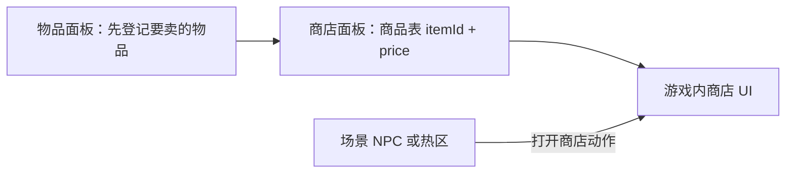

# 商店面板

关二狗不是雾津唯一的经济来源。**商店**定义一个摊位或柜台：**卖哪些物品、各自标多少价**。玩家走进商店 UI 时读的就是这里的数据；物品本身的名字、描述、图标要先在[物品面板](./item)登记好，商店只负责「引用物品 id + 标个价」。读完这页你能配出一个能买能卖的完整摊位，并搞清楚商店价和物品参考价之间那点容易搞混的关系。

---

## 这是什么（30 秒看懂）

把商店想成雾津街边一块**价目牌**：牌子上写着「引路符 五文、灯油 三文」，货是谁家做的、长什么样，牌子不管——那是物品自己的事。商店面板管的就是这块价目牌：这家摊子叫什么名、卖哪几样、各卖多少钱。一个摊位对应一个商店条目，玩家在场景里跟某个 NPC 对话或走进某个热区，触发「打开商店」的动作，游戏就会翻开这块价目牌。

商店结构很简单，是规则与经济这组面板里最不容易踩坑的一个，但它和物品面板之间「谁的价格说了算」这件事，是新手最常搞混的地方，下面会讲透。

---

## 入门：手把手做第一次

以「渡口货郎」这个摊位为例，从零做一遍。

1. 先确认要卖的东西已经在[物品面板](./item)登记过——比如引路符、灯油、符纸。没登记的话商品表下拉里选不到。
2. 打开 `./dev.sh editor` → **规则与经济 → 商店**。
3. 新建，id 填 `dock_vendor`，显示名填「渡口货郎」。
4. 在商品表里点添加行，下拉选「引路符」，price 填 5；再添加一行选「灯油」，price 填 3；再添加一行选「符纸」，price 填 8。
5. 点 Apply 保存。
6. 去[图对话](./dialogue-graph)编辑货郎的对白，加一个选项「看看货」，选中后的动作挂「打开商店」，商店 id 选 `dock_vendor`；或者在[场景](./scene)里让某个 NPC/热区的交互动作直接打开这个商店 id。
7. 进入运行预览，找到货郎、触发对话或交互，确认商店 UI 弹出、三件货品都在、价格和你填的一致，买一件试试扣款和入包是否正常。

---

## 进阶：每一项都讲透

### 商店本身的字段

- **商店 id**：全局唯一引用键，场景 NPC、图对话、热区的「打开商店」动作都靠它找到这家摊子。
- **显示名**：玩家看到的摊位名字，尽量贴合雾津调性，比如「渡口货郎」「纸扎铺」，而不是干巴巴的「商店1」。

### 商品表——每一行的意义

商品表每一行就是一件在卖的货，由两部分组成：

- **物品 id**：从下拉里选一个已经在[物品面板](./item)登记过的物品 id。这里只做引用，物品的名字、描述、图标、是否能堆叠都不归商店管。
- **price**：这件货在**这家商店**里的标价。**保存时 price 会被显式写出**——哪怕你以为留空就能「沿用物品的默认参考价」，编辑器也会写一个具体数字，实际生效的永远是你在商店里填的这个数，不是物品那边的参考价。

商品表可以自由增删行：想让某件货下架，直接删掉对应行即可，**不会影响物品本身**，物品数据照样存在，其他地方（比如遭遇奖励、拾取热区）引用它照样有效。想让某家店卖新货，加一行、选物品、填价即可。

### 商店价 vs 物品参考价——最容易搞混的一点

[物品面板](./item)里有个**参考买入价**字段，很多人第一次看会以为这就是「这件东西在商店里卖多少钱」。实际上：

- 物品的参考买入价更像是策划内部的**参考价**，给你自己对表用（比如「这东西大概值多少钱」）。
- 商店商品表里的 **price 是独立的一份数据**，同一件物品在不同商店可以标不同价——「渡口货郎」卖引路符可能比物品参考价略低，营造「熟人价」的感觉；「纸扎铺」卖同一件东西也可以标另一个价。
- 如果你的策划表格上写的是物品的参考买入价，一定要记得**再去对应商店的商品表里手动填一遍实际售价**，两边不会自动同步。日常检查「策划表价格和游戏里不一致」，十有八九就是漏了这一步。

### 货币类物品

商店卖的东西如果本身就是「钱」（比如铜钱袋），要在[物品面板](./item)那边把它标成货币类物品，不要和普通杂物混着标——这会影响背包/交易 UI 怎么处理它。商店这边不管这个区分，只管卖不卖、标多少价。

### 白送与特价

price 填 0 意味着「白送」，有时是故意设计（比如剧情送的开场道具挂在商店里象征性展示），有时纯粹是手滑。填 0 之前想清楚是不是有意为之，最好在策划备注里写明「此处故意免费」，免得被后续检查当 bug 改掉。特价同理：想做促销，直接把 price 填低即可，商店价格本来就独立于物品参考价，不需要额外机制。

### 改价与下架的影响范围

- **改价**：直接改商品表里的 price 列即可生效，通常按玩家当前看到商店时的价格结算，不会因为改价而影响玩家手里已经买到的东西。
- **下架**：只删商品表里的行，物品本身继续保留在物品面板里，其他系统（拾取、任务奖励、遭遇消耗）该怎么引用还怎么引用。
- **删除整家商店**：动手前先确认没有场景 NPC、热区、图对话动作还在引用这个商店 id，否则那些地方触发「打开商店」时会指向一个不存在的条目。

### 商店和内容其他部分的配合

- 一家商店可以被多处引用打开——比如渡口货郎既可以通过对话选项打开，也可以通过场景里的一个热区直接打开，两边指向同一个商店 id，不需要重复配置商品表。
- 同一个商店 id 在不同[位面](./plane)（比如夜雾津）下，通常只需要换一套对话措辞就够了，除非你真的想让夜里的货郎卖不一样的东西，才需要专门建一个新的商店条目。
- 涉及购物的[任务](./quest)前置条件（比如「买得起黄裱纸再去找庙祝」），商店这边不会帮你硬性卡死，但设计时要在预览里实际算一下玩家到那个任务节点时兜里大概有多少钱，确保买得起，体验上说得通。

---

## 危险区与边界

- 商店结构本身比较直白，编辑器 Apply 时会保留未知字段、不做丢弃处理，是规则与经济这组面板里危险区最少的一个。
- 主要风险不是数据结构层面的，而是**逻辑一致性**：商品表引用了没登记的物品 id、price 和策划表对不上、删商店前忘了查引用。这些都要靠你自己核对，编辑器不会主动提醒。
- 想系统了解哪些面板哪里改了会丢数据、哪里编辑器根本够不到，参见[危险区](../concepts/danger-zone)和[可编辑面·危险区参考](/docs/reference/danger-zone)。

---

## 常见问题

| 现象 | 原因 | 怎么办 |
|---|---|---|
| 打开商店是空的，什么都没有 | 商品表没有行，或者某行的物品 id 无效 | 补齐商品行，确认每行都选了已登记的物品 |
| 商店里的价格和策划表不一致 | 商店售价独立于物品的参考买入价，两边不会自动同步 | 以商店商品表里的 price 为准，发现不一致就回去对表改 |
| 买了东西但没进背包 | 商品表的物品 id 和给予道具的动作/逻辑用的不是同一个物品 id | 统一物品 id，进预览实测一次购买流程 |
| 对话里点「看看货」没反应，打不开商店 | 打开商店的动作没绑商店 id，或者 id 写错 | 回图对话检查该选项的动作，核对商店 id 拼写 |
| 删了某个商店后，对应 NPC 毫无反应 | 场景或对话仍然引用着已删除的商店 id | 改回原来的商店引用，或者把商店条目恢复出来 |

---

## 相关

- [物品面板](./item)——商店引用的物品来源，商店售价与物品参考买入价的关系在这两页各讲了一半
- [任务面板](./quest)——涉及购物的前置条件
- [场景面板](./scene)——摊位 NPC、打开商店的交互点
- [怎么编排动作](../concepts/actions)、[怎么设条件](../concepts/conditions)、[怎么写带引用的文本](../concepts/rich-text)
- [危险区](../concepts/danger-zone) / [可编辑面·危险区参考](/docs/reference/danger-zone)
