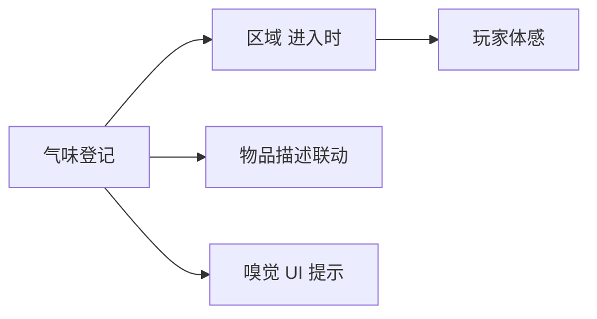

# 气味面板

雾津不只有画面和声音——**气味**是辅助叙事与玩法的登记层：某区域「闻到焚香」、某物品「血锈味」、某 [位面](./plane) 切换时嗅觉提示。主编辑器 **气味面板** 维护气味 **id** 与描述/强度等表单字段（以你打开的检视器为准），供动作、区域、UI 引用。

---

## 这块面板管什么

- **气味 id**：稳定代号。
- **标签/描述**：策划备注与可能显示给玩家的短句。
- **强度或分类**（若有）：用于叠加规则或滤镜式提示。

具体字段以面板为准；原则与 [物品](./item)、[叠图](./overlay) 同类——**先登记 id，别处引用**。

---

## 怎么打开

1. `./dev.sh editor` → **资源 → 气味**。
2. 列表新建或编辑。
3. Apply。

:::info[配图：气味列表]
截几条：incense_stale、river_rot、blood_rust。
:::

---

## 引用想象

（实际挂载点以工程支持的 [动作](../concepts/actions) 与场景字段为准——编排前查 [动作总表](./actions)。）

---

## 怎么新建

1. id `smell_incense_chenghuang`。
2. 描述「陈檀香与潮气」。
3. Apply。
4. [场景](./scene) 城隍庙内庭区域 进入时 动作若支持「呈现气味」则选此 id；或叙事 cue 旁白提气味。

---

## 怎么改 / 删

- 改描述不影响 id 引用。
- 删 id 前查区域/动作是否还指着。

---

## 当心什么

| 当心 | 说明 |
|---|---|
| 气味过多 | 玩家麻木；按章节节奏开 |
| 只有登记没有触发 | 玩家永远闻不到——绑区域或动作 |
| 与文本重复 | 气味 UI 宜短，长描写放 [档案](./archive) |
| 无障碍 | 重要信息勿只放气味要另有视觉/文本 |

---

## 雾津例子

1. 渡口 `smell_river_rot`：水域区域 进入时。
2. 纸人巷 `smell_paper_glue`：进巷区域。
3. 鬼打墙位面切换 cue 换 BGM 同时换气味 id（若动作支持）。
4. [档案](./archive) 见闻写「焚香」与 smell id 一致增强沉浸。

:::info[配图：游戏内嗅觉提示]
若 UI 有气味条/字幕，截「陈檀香……」提示。
:::

---

## 和相关面板怎么配合

| 面板 | 关系 |
|---|---|
| [场景](./scene) | 区域触发 |
| [物品](./item) | 物品关联气味（若支持） |
| [信号 Cue](./cue-signal) | 表现包装 |
| [动作总表](./actions) | 查气味类动作 |

---

---

## 实操检查清单

- [ ] 每条气味 id 对应一种可辨识的感官，勿一 id 多义
- [ ] 描述短于一行 UI，长描写放档案或对话
- [ ] 关键剧情信息勿只放气味——需有视觉或文本兜底
- [ ] 区域 进入时 或 Cue 已绑定气味呈现，非只登记不用
- [ ] 同场景气味不宜过多，按章节节奏开
- [ ] 与档案、物品描述用词一致（焚香、腐水、血锈）
- [ ] 位面切换时若换气味，与 BGM、滤镜同步测
- [ ] 删 id 前查区域、动作是否仍引用
- [ ] 强度或分类字段若存在，险境位面可略高
- [ ] Apply 后实际走进区域闻一遍（看 UI 提示）

---

## 常见问题

| 现象 | 原因 | 怎么办 |
|---|---|---|
| 玩家永远「闻不到」 | 只登记未绑触发 | 在区域 进入时 或 Cue 里呈现 |
| 提示与档案矛盾 | 文案各写各的 | 统一词条并回改 |
| 一进场景连弹多条 | 多区域重叠触发 | 收窄区域或加条件 |
| 删气味后无提示 | 动作仍引用旧 id | 改引用或恢复登记 |
| 重要线索仅气味 | 无障碍与可读性风险 | 补字幕或 inspect 文本 |

---

## 预览验证

1. 登记气味 id 与短描述，Apply。
2. 在目标场景区域或 Cue 绑定呈现动作。
3. 运行预览走进区域，看 UI 是否弹出预期短句。
4. 读档再进，确认不重复刷屏或该重复时仍重复。
5. 切换位面后若应换味，对比前后提示。
6. 对照档案相关条目，确认用词一致。

---

城隍庙内庭宜用「陈檀香与潮气」而非笼统「香火味」——玩家靠气味认地点。纸人巷进巷时 glue 味略甜腻，与鬼打墙腐水味形成对比，你在预览里连续走三个区域应能感到层次。河边叫魂前若只有视觉无嗅觉，可补一层「河腥」提示，增强长按蓄力时的压迫。

---

## 相关概念

- [怎么编排动作](../concepts/actions)
- [怎么设条件](../concepts/conditions)
- [怎么写带引用的文本](../concepts/rich-text)
- [危险区](../concepts/danger-zone)
