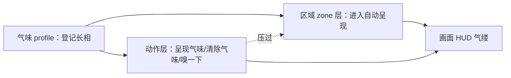

# 气味面板

雾津不只有画面和声音——渡口的河腥、义庄的腐气、城隍庙的陈檀香，这些"看不见但能感觉到"的氛围由一套独立的**气味系统**模拟：屏幕上会有一缕若隐若现、随风飘动的气缕指示，告诉玩家"你正闻到什么"。读完这页你能建好一种气味的"长相"，把它接到场景区域或剧情动作上，并弄清三层机制（登记 / 区域 / 剧情强制）谁压过谁。

---

## 这是什么（30 秒看懂）

气味这件事拆成两半来维护：

1. **气味"长相"怎么飘、什么颜色、有没有特殊效果**——登记在一张叫 **气味 profile** 的表里，本页面板管的就是这张表。
2. **具体在哪儿、什么时候真的冒出这股气味**——这不在本面板里设，而是分别在[场景](./scene)的区域（zone）属性里，或者剧情的动作编排里去指定。

打个雾津比方：气味 profile 就像香案上编好号的香型（"陈年焚香""河腥""血锈"……），而"城隍庙内庭要不要点这炷香、点多浓"是庙祝（场景/剧情）自己的决定，不是香号本身管的事。

---

## 入门：手把手做第一次

1. 打开主编辑器 → **资源 → 气味**。
2. 点新建一条 profile：起名字，比如"陈年焚香"；选一个 HUD 上显示的颜色；飘动参数先都用默认值就好，不用一开始就精调。
3. 右侧有实时预览，可以直接看这缕气味在 HUD 上怎么飘，边调边看。
4. 点 Apply 保存。
5. 去[场景](./scene)面板，选中城隍庙内庭那个区域（zone），展开"气味"折叠栏：**气味** 下拉选刚建好的这条 profile，**浓度** 先用默认 60，**方位偏向** 留 0（居中），**波动** 不勾（先不要明灭）。
6. Apply，运行预览走进这个区域，看 HUD 有没有冒出"陈年焚香"的气缕提示。

**雾津小例子**：城隍庙内庭配"陈年焚香与潮气"而不是笼统的"香火味"——玩家单靠气味就能认出"我这是进了内庭"；纸人巷则配偏甜腻的"糨糊味"，和鬼打墙里"腐水味"形成明显反差，你在预览里连续走三个区域应该能感到层次差异。

---

## 进阶：每一项都讲透

### 气味 Profile（本面板管的这张表）

- **名字（name）**：显示用的名字，如"陈年焚香"。
- **颜色（color）**：这缕气味在 HUD 上呈现的颜色。
- **飘动四项**（先用默认值即可，是让"手感"更贴切用的微调项）：
  - **上升 rise**：往上飘的速度。
  - **摆幅 sway**：左右摆动的幅度。
  - **摆频**：摆动的快慢。
  - **抖动 jitter**：不规则抖动的量，越大越"毛躁"。
- **沉·贴地（heavy）**：勾选后这缕气味贴地飘、不太往上走，适合腐水、尸臭这类"沉"味。
- **飘得不对劲（wrong）**：勾选后气缕呈现出诡异的飘法，适合鬼打墙一类超自然场景。
- **特殊渲染**（默认折叠、非必填的进阶效果组）：
  - **自体发亮（glow）**：用叠加混合让气缕自己发光，适合"香粉"这类会自体发光的气味。
  - **盘卷不散（coil）**：气缕打卷缠绕，不轻易散开。
  - **几缕逆着往下够（reach）**：有几缕反常地往下伸，制造不安感。
  - **基线被照亮发抖**：被光照到时，气缕基线会抖动。
  - 配套的时间包络：**攻击时长**（从无到有要多久）、**停留时长**（维持多久）、**衰减时长**（消散要多久）、**峰值 peak**（强度封顶值）。这一组是给"带点邪性"的特殊气味用的，日常香火、饭菜味不用勾这组。
- 编辑时右侧带**实时预览**（和游戏内 HUD 用同一套渲染逻辑），改参数立刻能看到飘动效果，不用来回进游戏试。

### 区域（zone）气味——气味真正"冒出来"的地方之一

在[场景](./scene)面板编辑某个区域（zone）时，能展开一个"气味"折叠栏，设置：

- **气味 scent**：下拉选一个 profile，或选"无"表示这个区域不配气味。
- **浓度 intensity**：0–100，默认 60，数值越大气味越浓。
- **方位偏向 dir**：-1 到 1，0 是居中，往哪个方向偏，气缕就往那一侧拖，用来模拟"气味来源在那一侧"。
- **波动 flicker**：勾选后气味在 HUD 上会明灭跳动，适合"不稳定的味道"。

玩家进入这个区域，气味自动呈现；离开自动收回，不用你手动清除。**注意**：深度地板（depth_floor）类型的区域没有进出触发逻辑，气味功能对它无效——把普通区域切成这个类型时，编辑器会先警告"会清空这个区域的气味"，确认后才会真的清掉。

### 动作层——呈现气味 / 清除气味 / 嗅一下

这三个动作可以挂在[过场](./cutscene)、[图对话](./dialogue-graph)等能编排动作的地方，属于"剧情强制指定"的一层，**会压过玩家当时所在区域本来该冒的气味**：

- **呈现气味**：参数气味 scent（下拉选 profile，必填）、浓度 intensity（默认 60）、方位偏向 dir、波动 flicker——字段跟区域气味一样，但这是剧情主动"按下"的一层，常用于过场/对话里想让玩家在特定台词或演出时刻强制闻到某种味道，不管玩家实际站在哪。
- **清除气味**：不用填参数，清掉"剧情强制指定"这一层。清掉之后：如果玩家人还站在配了气味的区域里，那个区域本来的气味会自动"浮回来"；如果人不在任何配气味区域，就恢复无味。
- **嗅一下（sniff）**：不用填参数，让当前正在生效的那缕气味有个短暂的"拔高变清"视觉脉冲，几秒后自己回落，用来强化"玩家主动去闻"这个动作的反馈。如果当前根本没有生效的气味，这个动作不会有任何效果。

**优先级规则**：剧情强制（动作层）不为空就听它的；动作层清空后，听玩家当前所在区域（zone 层）；都没有就是无味。如果玩家同时站在多个重叠的配味区域里，听"最后进入"的那一个。

### 和别的面板/动作怎么配合

| 面板/动作 | 关系 |
|---|---|
| [场景](./scene) | 区域气味在这里设置进出触发 |
| [过场](./cutscene) / [图对话](./dialogue-graph) | 呈现气味/清除气味/嗅一下三个动作常挂在这里 |
| [动作总表](./actions) | 查这三个动作的完整位置与用法 |
| [档案](./archive) | 见闻录文案用词与气味描述保持一致，增强沉浸 |

### 批量做法与效率窍门

- 先把常用的"味道原型"（香、腐、霉、血锈……）都登记成 profile，各区域/各动作直接下拉选，不用每次从零调参数。
- 改一条 profile 的飘动参数不影响谁在用它——各处只记了 profile 的名字（id），风格统一改一处，全场景一起变。
- **改 profile 的 id（改名）要格外小心**：改名不会自动帮你把区域、动作里已经填的旧 id 同步过去，编辑器改名前会给出提示；改完务必跑一次数据校验，检查有没有"某区域气味 xxx 不在气味登记表里"这类悬空警告。

---

## 危险区与边界

- **改 profile 的 id 会留下悬空引用**：区域气味、设置气味的动作里已经填的旧 id 字符串不会自动跟着改名同步，改名前有提示，改完必须跑一次校验确认没有悬空的旧引用。
- **depth_floor 类型的区域配了气味也不会触发**：属于"配了但没用"，切换到这个区域类型时编辑器会警告并清掉气味设置。
- **只登记 profile、没有任何区域或动作去"用"它**：玩家永远闻不到——这是最容易忘的一步，登记完记得立刻挂到区域或动作上试一次。
- **重要剧情线索不要只靠气味传达**：气味 UI 提示很短，重要信息务必配文本或画面兜底，避免无障碍/可读性风险。
- 更多编辑器整体可编辑边界见 [危险区](../concepts/danger-zone)。

---

## 常见问题

| 现象 | 原因 | 怎么办 |
|---|---|---|
| 玩家永远"闻不到" | 只登记了 profile，没在区域或动作里绑定呈现 | 去场景区域的"气味"栏选它，或加一条呈现气味动作 |
| 改了 profile 名字后，某区域报"气味不在登记表" | 改名不会同步旧引用 | 回到区域/动作重新选一次新名字，再跑校验确认无悬空引用 |
| depth_floor 区域气味设了没反应 | 该类型区域跳过进出触发，气味天然无效 | 换成普通区域类型，或不在此类区域配气味 |
| 剧情强制的气味结束后没有恢复 | 清除气味动作没有挂上，或玩家已离开原区域 | 补上清除气味动作；确认玩家是否仍在配味区域内 |
| 一进场景连弹好几种气味提示 | 多个区域重叠触发 | 收窄区域范围，或用条件限制同一时间只留一种 |
| 提示文案和档案描述对不上 | 两处文案各写各的没对齐 | 统一用词（如都用"陈檀香"而非一处"香火味"）并回改 |

---

## 相关

- [场景](./scene)——区域气味在这里设置进出触发
- [过场](./cutscene)——呈现气味/清除气味/嗅一下常挂载处
- [档案](./archive)——文案用词与气味描述互相呼应
- [怎么编排动作](../concepts/actions)
- [怎么设条件](../concepts/conditions)
- [危险区](../concepts/danger-zone)
