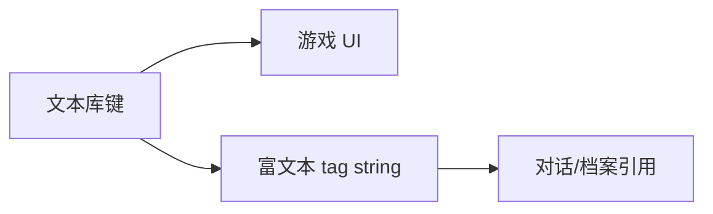

# 文本库面板

界面上的「确认」「背包已满」、系统菜单、部分可复用短句——放在 **文本库**（strings）比散落在各面板好找好译。树状 **分类** + **键**；值可以是纯文本、数字、布尔，字符串值可走 [富文本](../concepts/rich-text)。

---

## 这块面板管什么

- **分类树**：组织键名。
- **键值对**：key → value。
- **类型**：str 可富文本；number/bool 走对应编辑器。

---

## 怎么打开

1. `./dev.sh editor` → **资源 → 文本库**。
2. 左侧树选分类；右侧改键值。
3. Apply。

:::info[配图：文本库树]
截 UI/common 分类下几个键；一值用富文本。
:::

---

## 使用链

富文本 `[tag:string:某键]` 引用库内文案（语法见 [富文本概念](../concepts/rich-text)）。

---

## 怎么新建

1. 在合适分类 **添加键** `ui.quest.tracked`。
2. 值写「当前任务」或带 tag。
3. Apply；UI 读此键（由工程接线，策划只管填值）。

---

## 怎么改

- 改值即时影响所有引用处——改前搜谁用这键。
- 改键名等价于新建+迁移引用，面板不自动改引用。

---

## 怎么删 —— 当心

| 操作 | 能不能 |
|---|---|
| **删键** | **不能** —— 界面 不提供删键 |
| **删分类** | **不能** |
| 改值 | 可以 |
| 新建键 | 可以 |

过时键会一直留在树里——标注废弃或找程序清理。数组形叶子保存时可能被**压成字符串**，别当列表维护。

---

## 当心什么

| 当心 | 说明 |
|---|---|
| 键名 typo | 引用处显示空白或 fallback |
| 长文塞进 strings | 大段剧情应放 [档案](./archive) 或 [图对话](./dialogue-graph) |
| 与本地化流程 | 键稳定利于翻译导出 |
| 富文本过复杂 | UI 短句保持短 |

---

## 雾津例子

1. `ui.map.fogjin` → 「雾津」地图标题。
2. `hint.pressure.call_soul` → 叫魂长按共用提示半句。
3. 图对话 line 用 tag 引 `strings` 里玩家称谓模板。

:::info[配图：UI 显示文本库键]
预览某 UI 元素显示 strings 文案。
:::

---

## 和相关面板怎么配合

| 面板 | 关系 |
|---|---|
| [富文本](../concepts/rich-text) | string tag |
| [全局配置](./config) | 部分系统文案 |
| [档案](./archive) | 长文分工 |

---

---

## 实操检查清单

- [ ] 键名稳定、有分类，利于本地化导出
- [ ] UI 短句在此，长剧情在档案或图对话
- [ ] 改值前搜谁引用此键，防全 UI 突变
- [ ] 知悉 界面 不能删键、不能删分类，废弃键要标注
- [ ] 富文本值仅在有 tag 需求时用，短句保持短
- [ ] 数组形叶子勿当列表维护，防保存被压成字符串
- [ ] 与地图标题、长按提示等跨面板文案对表
- [ ] 键名 typo 会致空白 fallback，新建时复制旧键改后缀
- [ ] Apply 后切换分类前确认已保存
- [ ] 预览里点开对应 UI 看实际渲染

---

## 常见问题

| 现象 | 原因 | 怎么办 |
|---|---|---|
| UI 显示空白 | 键名 typo 或未 Apply | 核对键并保存 |
| 改一处多处变 | 多 UI 共用一个键 | 拆键或接受联动 |
| 过时键越积越多 | 面板不能删键 | 标注废弃或程序清理 |
| 富文本过复杂 | 短句面板不适合长 markup | 迁档案或对话 |
| 切换分类丢编辑 | 未 Apply 就切 Tab | 先保存再导航 |

---

## 预览验证

1. 在目标分类新建或修改键值，Apply。
2. 运行预览打开引用此键的 UI（地图标题、提示等）。
3. 若用富文本 tag 引用，在对话或档案测渲染。
4. 改值后再开 UI，确认即时生效。
5. 检查无 fallback 英文或空串。
6. 与策划表对照键名清单。

---

地图标题键「雾津」宜二字不加标点，与主菜单风格统一。叫魂长按共用 hint 半句可放文本库，图对话与临场面板同引，改一处两处同步。玩家称谓模板若用 tag 引库内键，预览时换男女名各测，防格错位。

---

## 相关概念

- [怎么编排动作](../concepts/actions)
- [怎么设条件](../concepts/conditions)
- [怎么写带引用的文本](../concepts/rich-text)
- [危险区](../concepts/danger-zone)
