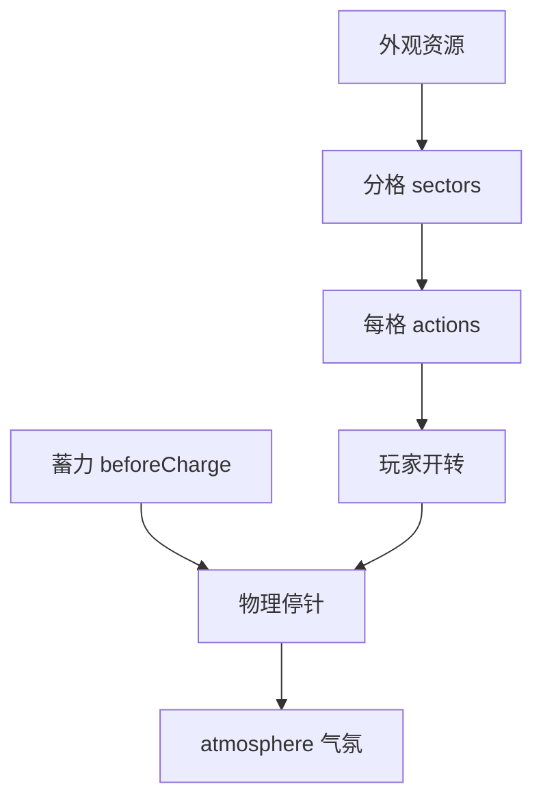

# 转盘小游戏面板

雾津街角糖画摊，玩家蓄力一甩，指针乱转停在一格——**转盘小游戏**（糖画转盘）就是编这个：外观图、分格、每格 [动作](../concepts/actions)、蓄力曲线、物理停针、气氛组、喊话锚点。面板有 **画布** 校指针与分格。

---

## 这块面板管什么

- **索引与实例**：同水域，id 必须一致。
- **外观**：底盘、指针、装饰图。
- **分格 sectors**：每格权重、停驻动作、文案锚点。
- **蓄力**：充电前条件与动作、曲线、最大可见喊话数（某些旧字段保存会被删——以表单为准）。
- **物理**：停针相关多项参数（摩擦、初速等——在检视器里逐项调）。
- **气氛组**：同屏多套氛围切换。

---

## 怎么打开

1. `./dev.sh editor` → **叙事编排 → 转盘小游戏**。
2. 选实例或新建。
3. 画布校准指针与扇区；表单填物理与 sectors。
4. Apply，用动作打开该关预览，反复甩盘调手感。

:::info[配图：转盘画布校准]
截分格扇区、指针角度、sectors 列表一行动作。
:::

---

## 编排流程

---

## 怎么新建

1. 索引 id `alley_sugar_luck`。
2. 实例绑背景、指针图；画布上 **校准** 指针零位与扇区边界。
3. sectors：「龙」给稀有物品动作；「空」给调侃 [富文本](../concepts/rich-text)；「凶」扣钱或进小遭遇。
4. beforeCharge：条件「持有铜钱」；动作扣钱。
5. 物理参数先默认，预览甩十把再微调停针分布。
6. speechAnchors 配摊主喊话位置。
7. atmosphereGroups 黄昏一套、夜一套。
8. Apply。

---

## 怎么改 / 删

- **改扇区**：动角度后所有 sector 边界要重校。
- **改物理**：分布变——策划要文档记录「龙格概率」。
- **删实例**：同水域，注意孤儿文件与引用。

---

## 当心什么

| 当心 | 说明 |
|---|---|
| 专家 JSON 不合法 | 保存失败——改前复制 |
| speechMaxVisible 等旧键 | 保存时被删，别依赖手写 |
| 扇区动作写错 id | 停在「龙」却没给东西 |
| 只有美术没 beforeCharge | 白嫖转盘的漏洞 |

转盘字段多，**重建**风险主要在子块 payload 须合法；乱贴附加键可能整段保存失败。

---

## 雾津例子：老街糖画摊

1. `old_street_sugar`：摊主 line 在 [图对话](./dialogue-graph) 里打开转盘动作。
2. 扇区「犬」：给任务道具相关；「糊」：仅 resultText 摊主吐槽。
3. beforeCharge 扣 5 铜钱；条件穷时禁用开转。
4. 夜 [位面](./plane) atmosphere 换冷色灯光组。

:::info[配图：停针结果]
预览指针停在「犬」格与 UI 反馈截图。
:::

---

## 和相关面板怎么配合

| 面板 | 关系 |
|---|---|
| [物品](./item) | 奖品 |
| [图对话](./dialogue-graph) | 摊主对白 |
| [遭遇](./encounter) | 凶格进遭遇 |
| [音频](./audio) | 转针音效 |

---

---

## 实操检查清单

- [ ] 索引 id 与实例 id 严格一致
- [ ] 画布上指针零位与扇区边界已校准
- [ ] 每扇区权重与结果动作对应，「凶」「空」也有反馈
- [ ] beforeCharge 扣费与条件已配，防白嫖
- [ ] 物理参数甩十把后再微调，文档记录概率体感
- [ ] 改扇区角度后全部边界重校
- [ ] 专家字段非法会导致整段保存失败，改前备份
- [ ] 气氛组昼夜各一套时在预览切换位面测
- [ ] 喊话锚点与摊主图对话位置对齐
- [ ] Apply 后从图对话开转实玩多轮

---

## 常见问题

| 现象 | 原因 | 怎么办 |
|---|---|---|
| 开不了转盘 | 索引与实例 id 不一致 | 对齐两处 id |
| 停在奖格没给物 | 扇区动作写错或未填 | 查该格 actions |
| 概率与策划不符 | 物理参数改后未文档化 | 重校并记录甩盘分布 |
| 保存失败 | 子块 payload 不合法 | 按表单填，勿乱贴键 |
| 无扣费也能转 | 缺 beforeCharge | 补条件与扣钱动作 |

---

## 预览验证

1. 画布校准指针与扇区，填 sectors 与物理，Apply。
2. 从摊主对话打开转盘，连甩十把看分布。
3. 测 beforeCharge 穷/富两种能否开转。
4. 每类结果格（奖、空、凶）至少命中一次看动作。
5. 切换夜位面 atmosphere，看视觉是否换组。
6. 改物理后再甩十把，对比与策划表。

---

老街糖画摊「犬」格给任务相关物时，resultText 与 give 动作应同屏反馈——玩家停针瞬间就要懂。beforeCharge 扣五铜钱应在穷档禁用开转，你在 preview 里故意留四文试一次。凶格进小遭遇前，先确认遭遇 id 存在且选项能闭环，免停针后黑屏。

---

## 相关概念

- [怎么编排动作](../concepts/actions)
- [怎么设条件](../concepts/conditions)
- [怎么写带引用的文本](../concepts/rich-text)
- [危险区](../concepts/danger-zone)
