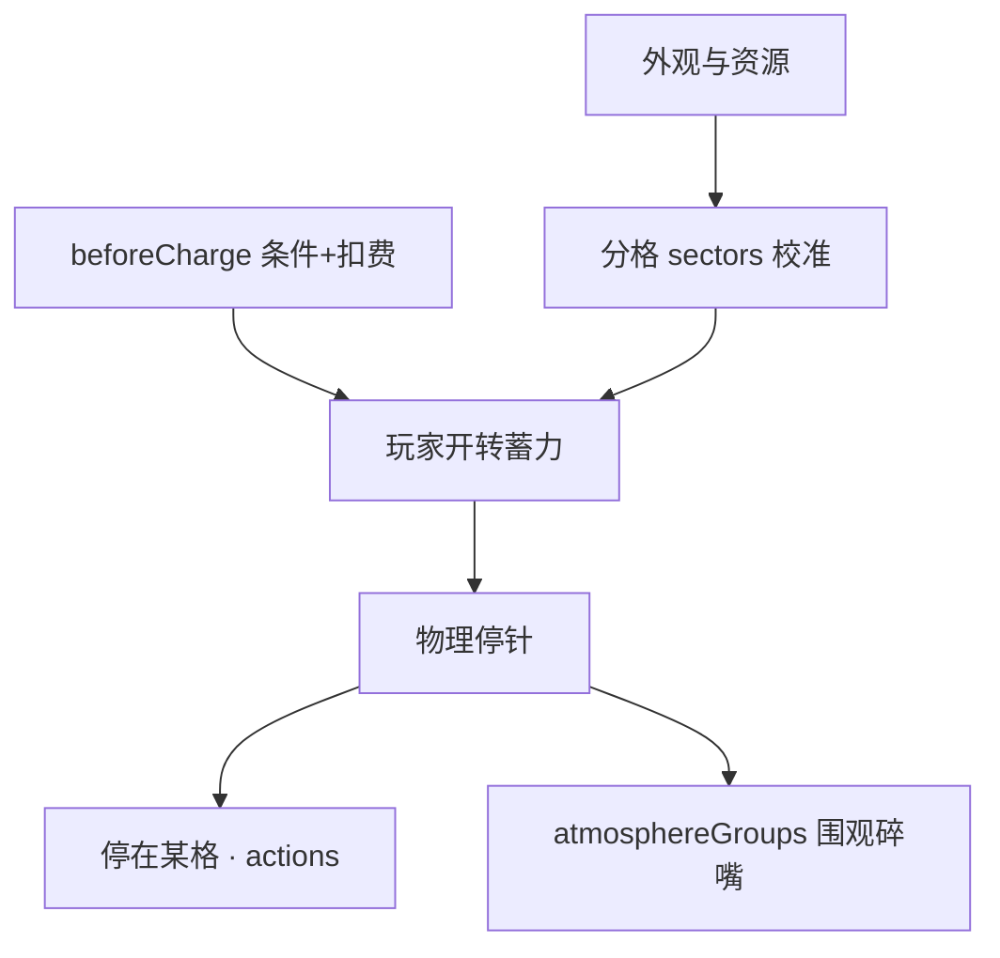

# 转盘小游戏面板

雾津街角糖画摊，玩家蓄力一甩，指针乱转停在一格——**转盘小游戏**（糖画转盘）编的就是这个：外观图、分格、每格停下来发生什么、蓄力手感、物理停针、围观人群的碎嘴气氛。读完这页你能搭出一台能转、有输赢、还带摊主吆喝的转盘。

---

## 这是什么（30 秒看懂）

想象雾津老街那个卖糖画的摊子：一个圆盘，画着龙、鱼、猴、兔各种图案，玩家投币按住蓄力，一撒手指针飞转，最后停在某一格，摊主就照着那格给一份对应的糖画（或者剧情道具、或者一顿数落）。

这块面板管的正是这台转盘的每一个零件：盘长什么样、有几格、每格转到会发生什么、转起来手感松紧、旁边围观的孩子和摊主什么时候插一句嘴。面板带**画布**，专门用来校准指针零位和分格边界对不对得上美术图。

面板结构：**索引**登记有哪些转盘（同水域小游戏，id 必须与实例一致）；**实例**才是一台转盘的完整配置。

---

## 入门：手把手做第一次

### 步骤

1. `./dev.sh editor` → **叙事编排 → 转盘小游戏**。
2. 索引新增一行，填 id（如 `alley_sugar_luck`）与显示名；打开对应实例。
3. 「外观与资源」分组：挂上背景图、转盘图、指针图（可选前景叠图，比如围观人群）。
4. 画布上**校准**：拖指针到零位，看分格边界是不是和美术图上的分隔线对齐——对不上就调整体角度偏移。
5. 「格子 sectors」列表：新增几格，每格填显示名，再给这一格配停下来时的[动作](../concepts/actions)。
6. 「蓄力曲线」分组：设蓄力时长、最低力度。
7. 「蓄力前：条件与动作」分组（蓄力前置检查）：配「玩家得先付钱」——条件判断能不能开转，通过则扣费再蓄力，不通过就播一句摊主的话。
8. Apply，从游戏里触发开转，反复甩几把看指针停的手感和格子对不对。

### 雾津小例子：老街糖画摊，照着抄

1. 索引新增 `alley_sugar_luck`，实例绑好背景与转盘图。
2. sectors 里加「龙」「鱼」「猴」「空」几格：「龙」格给稀有道具动作，「空」格只给摊主一句调侃的[富文本](../concepts/rich-text)台词，不给东西。
3. 蓄力前置条件设「持有铜钱 ≥ 5」，通过后扣 5 铜钱；不通过就让摊主说「莫闹，先拿钱来」。
4. 摊主的[图对话](./dialogue-graph)里用动作打开这台转盘；停针后按格子给反馈。
5. Apply，从对话里触发开转，穷玩家和富玩家各试一次，确认扣费卡点生效。

---

## 进阶：每一项都讲透

### 外观与资源

- **背景图 / 背景铺法**：摊位背景图；`cover` 铺满裁边，`contain` 完整显示不裁切。
- **前景图 / 前景铺法**：可选的前景叠图（比如围观人群剪影），画在转盘和指针之上、UI 按钮之下，同样有 cover/contain 两种铺法。
- **转盘图 / 指针图**：转盘盘面图与指针图，都可替换成不同风格的美术。
- **转盘缩放 / 指针缩放**：分别单独缩放轮盘或指针。
- **轮盘最大尺寸（百分比）/ 轮盘最大尺寸（像素）**：轮盘的最大显示尺寸（一个按屏幕宽度百分比、一个按像素封顶），两者取更小的生效。
- **指针旋转支点（纵向位置）**：指针旋转支点在指针贴图上的位置（0 顶部、1 底部），常用值 0.9（贴近箭头尾端旋转）。
- 指针的起始朝向不是配置项——玩家进入小游戏后可以直接用手拖指针，决定从哪个角度开始拨。

### 分格与指针校准

- **角度偏移**：整体角度偏移量，正数顺时针；美术图上的第一格如果和代码认的「正上方」对不齐，就调这个数值。
- **转动方向**：`clockwise`（顺时针）或 `counterclockwise`（逆时针），决定 sectors 列表顺序对应盘面上哪个转向。
- 画布上可以直接拖看分格边界，是不是压在美术图的分隔线上——这一步没校准好，游戏里会出现「明明停在龙格，画面却显示停在鱼格」的错位感。

### 蓄力曲线

- **蓄力时长**：按住蓄力钮多久能蓄满。
- **最低力度**：轻点一下（不长按）时的最低力度，取值 0 到 1。
- **蓄力映射曲线**：`1` 是线性，大于 1 时蓄力前段变化更细腻（方便玩家精确控制小力度）。

### 蓄力前置检查（条件与动作）

这是转盘「收费」「设门槛」的入口：玩家按住蓄力钮的瞬间，面板会先对**开转条件**（一条[条件](../concepts/conditions)）求值——

- 满足条件 → 先执行 **通过动作**（通常是扣钱），再正式进入蓄力。
- 不满足 → 执行 **不通过动作**（通常是摊主一句拒绝台词），直接中断，不会蓄力。

**没配这组蓄力前置检查，转盘就是纯白嫖**——想让摊主收费或设「只有关系好才让你转」之类的门槛，必须在这里配，别指望别处能拦。

### 物理停针（老手才需要精调的一段）

指针松手后不是简单转几圈停下，而是按真实物理减速：转速会被阻力、低速段额外阻力、蓄力映射出的初速/初加速度、指数衰减、干摩擦收尾、停止判定共同决定。可调的参数分四组：

- **阻力组**：整体阻力、低速阈值 + 低速额外阻力（转速降到某个阈值以下时额外加多少阻力，让盘不会无限慢转下去）、收尾干摩擦加速度（负责最后那一点点顿挫感）。
- **蓄力映射组**：蓄力最低/最高初始转速区间、蓄力最低/最高初始加速度区间、加速度衰减半衰期。
- **权重偏置组**：权重偏置强度（下面 sectors 里 weight 设的「跑道高低」整体影响强度）、低速削弱参考转速（转速很低、快停的时候削弱这个偏置，让盘能稳稳停在「坡上」而不是被顶着慢慢挪走）。
- **停止判定组**：停止判定转速（转速低于多少算准备停）、停止稳定时长（稳定多久才真正判定停止）。

调这些参数前**先甩十几把看分布**，别凭感觉一次改多个数——面板里通常配有「试转分布」一类的按钮，能做一次蒙特卡洛式模拟，比自己甩几十次靠谱。改完记得把「龙格大概多少概率能停到」这类体感写进策划文档，因为这不是精确概率，是物理模拟出来的近似分布。

> 旧字段（形如固定转动时长、固定圈数、停止抖动量一类的老参数）已经被这套物理模型取代，运行时会忽略、留着也不生效，别再指望靠它们控制手感。

### 格子 sectors

- **id / label**：格子的编号与显示名。
- **weight**：**不是精确中奖率**，是这一格在「转速—角度」曲线上的「跑道高度倾向」——数值越大，指针越容易在这附近变成低谷、越容易停下来；越小则像一个高坡，越难停住。默认 1（平地，无偏好）。实际每一格的命中占比，是这个 weight 和上面整段物理参数一起积分出来的结果，想知道准确数字要用「试转分布」类工具跑一遍，不能靠数值直接换算。
- **payload**：这一格附带的任意信息，原样透传给结果事件，给外部系统（比如奖励表、剧情判断）自己去解释，转盘本身不关心里面写了什么。
- **每格的 actions**：停在这一格时触发的[动作](../concepts/actions)——给道具、播提示、进小遭遇、写旗标都在这里配，用的是和其它面板一样的通用动作编辑器。

**转盘本身不会自动发奖励、不扣资源、不限制转的次数**——这些逻辑必须由蓄力前置检查和 sectors 的 actions 自己配出来，面板不会替你兜底。

### 对白气泡与围观气氛（让摊子活起来的部分）

- **对白气泡锚点**：一组对白气泡的锚点，每个角色（比如摊主、几个围观小孩）在画面上的相对位置（比例坐标）和气泡尾巴朝向，画布上可以直接拖圆点摆位，即使 JSON 里还没写这个字段，画布也会先显示默认锚点方便你拖。
- **气泡停留时长**：单句气泡停留多久。
- **旋转氛围脚本**：一组「围观剧本」，每套有 id、显示名、权重（决定被抽中概率）、台词池（按分类分组的候选台词），以及分「开场 / 转动中 / 减速中 / 停止」四个阶段各自安排谁说什么、等多久、按概率说不说、甚至能在指针快转到某一格附近时插一句针对性的台词。每次开转，系统会按权重抽一套剧本演一遍——这就是为什么同一台转盘每次围观小孩起哄的话都不完全一样。
- 「最多同时显示几句气泡」这个旧字段，围观氛围逻辑不读它，编辑器保存时会顺手清掉。

### 和相关面板怎么配合

| 面板 | 关系 |
|---|---|
| [物品](./item) | 停到某格给什么奖品 |
| [图对话](./dialogue-graph) | 摊主开场白、开转入口 |
| [遭遇](./encounter) | 「凶」格可以直接跳进一个小遭遇 |
| [音频](./audio) | 转针音效、停针音效 |
| [位面](./plane) | 昼夜/位面切换时氛围灯光跟着换 |

---

## 危险区与边界

- **索引 id 与实例 id 必须严格一致**，否则打不开或开错台。
- 「最多同时显示几句气泡」这个旧字段，保存时编辑器会顺手清掉——是清理废弃字段，围观氛围靠「旋转氛围脚本」配置。
- **payload 之外的子块必须是合法数据**：sectors、氛围脚本这类结构如果手写出格式错误，很可能导致整段保存失败，动手改专家字段前先复制一份备份。
- weight 只是物理偏置，**不是精确概率**，别把它当保底机制来承诺策划或玩家。
- 更多细节见[危险区](../concepts/danger-zone)与[参考·可编辑面](/docs/reference/authoring-surface)。

---

## 常见问题

| 现象 | 原因 | 怎么办 |
|---|---|---|
| 开不了转盘 | 索引与实例 id 不一致 | 对齐两处 id |
| 停在奖格却没给东西 | 该格 actions 没配或配错 | 打开该格检查动作列表 |
| 概率手感和策划表对不上 | 物理参数改动后没重新测 | 用「试转分布」类工具重新采样，更新体感记录 |
| 保存失败 | 专家字段（如 payload、氛围脚本）JSON 不合法 | 改前复制备份，按表单填，别乱贴多余键 |
| 没扣钱也能转 | 没配蓄力前置检查 | 补条件与扣费动作 |
| 气泡最大显示数设置保存后没了 | 旧字段，编辑器保存时顺手清掉 | 围观氛围靠「旋转氛围脚本」配置 |

---

## 相关

- [物品](./item)
- [图对话](./dialogue-graph)
- [遭遇](./encounter)
- [音频](./audio)
- [位面](./plane)
- [怎么编排动作](../concepts/actions)
- [怎么设条件](../concepts/conditions)
- [怎么写带引用的文本](../concepts/rich-text)
- [危险区](../concepts/danger-zone)
