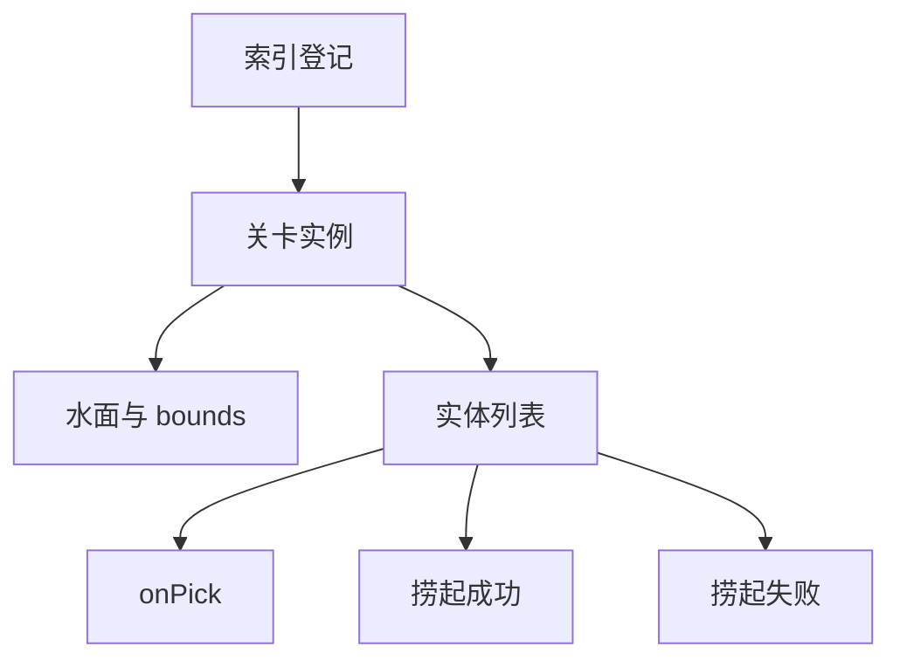
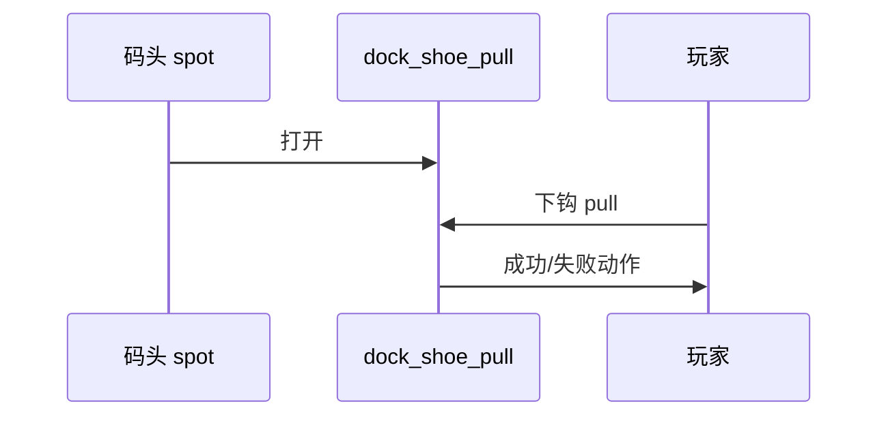

# 水域小游戏面板

雾津多水。**水域小游戏**是独立的「捞一捞」关卡：一片水面 bounds、水底高度、里面游什么实体（鱼、尸块、罐子）、玩家下钩 **pull** 的反馈、成功失败各跑什么 [动作](../concepts/actions)。渡口教学关、河湾隐藏道具，都可以在这里做实例，再在场景或任务里用动作 **打开某水域关**。

面板带 **画布**：像场景一样拖实体位置、看范围。

---

## 这块面板管什么

- **索引**：登记有哪些水域关（id、显示名、指向哪份实例数据）。
- **实例**：单关完整配置——关联场景 spot、水面环境（地点/时间/天气）、范围、实体列表。
- **实体**：品类、贴图、深度、显示大小、命中半径、运动、拉力档位、提示、捞起/失败回调。

显示大小与命中半径**留空**时走品类默认，不会写出多余键——别手填 0 除非你真要极小。

---

## 怎么打开

1. `./dev.sh editor` → **叙事编排 → 水域小游戏**。
2. 索引里选实例，或新建（id 必须与实例内 id 一致）。
3. 画布摆实体，表单填水面与回调。
4. Apply；预览里从关联场景 spot 进入小游戏。

:::info[配图：水域画布]
截河湾实例：bounds 框、两三个实体点、右侧 捞起成功 动作。
:::

---

## 结构怎么走

---

## 怎么新建一关

1. 索引 **添加** 行：id `dock_tutorial_pull`，label「渡口捞尸入门」。
2. 打开实例：label 同步；**spotId** 对应场景里水域交互点（与场景策划对齐）。
3. **surface** 填 location/time/weather，和雾津昼夜一致。
4. 画布拖 **bounds** 框住可捞区域；**waterBottom** 定钩沉深度感。
5. **添加实体**：category 选鱼/杂物；sprite 选图；pos 拖到位；depth/显示大小/命中范围 按需。
6. **motion** 让鱼缓缓游；**pull** 档位决定拉扯难度；**hint** 给玩家弱提示。
7. **钩住时** / **捞起成功** / **捞起失败** 各配动作与反馈。
8. Apply。

---

## 怎么改 / 删

- **改实体**：画布拖点比改坐标快；改 命中范围 后预览实际下钩。
- **删实体**：删行即可。
- **删实例**：索引删行后，磁盘上可能仍留旧实例文件——要清理找工程规范；删前查任务/场景是否还引用 id。

---

## 当心什么

| 当心 | 说明 |
|---|---|
| 索引 id 与实例 id 不一致 | 关卡打不开或开错档 |
| spotId 与场景对不上 | 游戏里点水面没反应 |
| 实体堆太多 | 性能与辨识度差 |
| 只写成功没写失败 | 玩家挫败时世界无反馈 |

删实例不自动清孤儿文件是**工作流坑**，不是面板按钮能一键搞定。

---

## 雾津例子：渡口捞鞋

1. `dock_shoe_pull`：spot 在码头栈桥末端；表面 location 雾津渡口、time 黄昏。
2. 实体「旧鞋」：低拉力档，捞起成功时给物品「湿鞋」+ 旗标「捞到鞋」推 [任务](./quest)。
3. 实体「空罐子」：失败仅 捞起失败 播水花 cue。
4. 任务步骤完成条件：持有湿鞋；对话关二狗引用此旗标。

:::info[配图：游戏内下钩]
预览下钩命中旧鞋与失败水花各一图。
:::

---

## 和相关面板怎么配合

| 面板 | 关系 |
|---|---|
| [场景](./scene) | spot 位置 |
| [物品](./item) | 捞起给什么 |
| [任务](./quest) | 进度 |
| [信号 Cue](./cue-signal) | 水花表现 |

---

---

## 实操检查清单

- [ ] 索引 id 与实例 id 一致
- [ ] spotId 与场景水域交互点对齐
- [ ] 画布 bounds 框住可捞区域，实体点在 bounds 内
- [ ] 每实体 捞起成功/捞起失败 至少一侧有反馈
- [ ] 显示大小、命中范围 留空走默认，勿手填 0 除非故意
- [ ] 关键实体 pull 档与教学/剧情意图一致
- [ ] surface 昼夜与雾津场景设定一致
- [ ] 删实例查任务、场景引用，知悉可能留孤儿文件
- [ ] 实体不宜过多，保辨识度
- [ ] Apply 后从 spot 进关实钩十几次

---

## 常见问题

| 现象 | 原因 | 怎么办 |
|---|---|---|
| 点水面没反应 | spotId 与场景不对 | 与场景策划对齐 |
| 开错关 | 索引与实例 id 不一致 | 统一 id |
| 钩空无反馈 | 缺 捞起失败 | 补失败动作或 cue |
| 实体钩不到 | 命中范围 太小或不在 bounds | 画布调点半径 |
| 删关仍被引用 | 任务或热区仍 open | 先解引用 |

---

## 预览验证

1. 索引与实例配好 bounds、实体、回调，Apply。
2. 到场景 spot 打开水域关。
3. 下钩命中教学实体，看 success 链（给物、旗标）。
4. 故意 miss 或拉空罐，听/看 fail 反馈。
5. 确认任务 completion 在拿到关键物后可完成。
6. 黄昏 surface 与场景氛围一致。

---

渡口捞鞋 spot 在栈桥末端，旧鞋 pull 档宜低，成功给湿鞋并推任务——你在 preview 里第一钩就应能 teaching。空罐只 fail 播水花 cue 即可，勿 silent。spot 与 bounds 对不齐时，玩家会觉得「点到了却进不去」，必在画布目测框住栈桥水面。

---

## 相关概念

- [怎么编排动作](../concepts/actions)
- [怎么设条件](../concepts/conditions)
- [怎么写带引用的文本](../concepts/rich-text)
- [危险区](../concepts/danger-zone)
