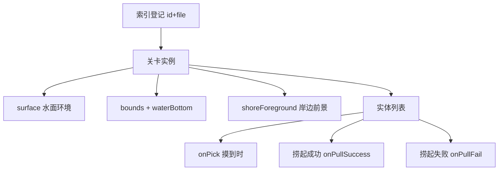

# 水域小游戏面板

雾津多水，渡口、河湾、义冢浅滩都能捞出东西。**水域小游戏**面板编的就是这一片「捞一捞」关卡：水面范围有多大、水底什么样、水里游着/沉着什么、玩家下钩拉扯的手感、钩住成功或失败各自发生什么。读完这页你能从零搭出一关能捞、能给奖励、能失败有反馈的水域小游戏。

---

## 这是什么（30 秒看懂）

把水域小游戏想成雾津码头边一个可以反复开的「小摊位」：你在场景里放一个交互点（spot），玩家一走近、一触发，就跳进这一小片独立的水面场景——里面漂着水草、游着鱼、沉着箱子。玩家对着实体下钩，钩住会有一段「拔河」，拔赢了捞起东西，拔输了空手而归甚至倒霉（比如被水猴子咬一口）。

关二狗爱在渡口边捞东西找乐子——策划要做的，就是在这个面板里摆好这一片水域「养」了什么、捞起来给什么。

面板结构分两层：
- **索引（index）**：一张登记表，列出游戏里有哪些水域关（id、显示名、对应哪份实例文件）。
- **实例（instance）**：单独一关的完整配置——水面在哪、长什么样、里面有什么。

面板带**画布**：像编辑场景一样，能直接在水面范围里拖实体的位置、看范围框，比纯填表直观得多。

---

## 入门：手把手做第一次

### 步骤

1. `./dev.sh editor` 打开主编辑器 → 左侧「叙事编排」分组 → **水域小游戏**。
2. 索引列表里点「新增实例」，填 id（比如 `dock_shoe_pull`）和显示名；或直接选一个已有实例练手。
3. 打开实例后，先填**surface**（水面环境）：location（地点，如 dock/wild/grave，也可以自己写自由文本）、time（morning/day/night）、weather（clear/rain/fog）。
4. 在画布上拖出 **bounds**（可捞区域的宽高框），再定**水底**的贴图、色调、深度感。
5. 点「新增实体」，画布上会多一个点：拖到你想要的位置，右侧表单填 category（水草/漂浮物/游动生物/沉底物）、贴图、深度。
6. 展开「位移 motion」，给它一点缓慢漂移或巡游；展开「拉力 pull」，选一个拉扯节奏和失败方式。
7. 填**摸到时 / 捞起成功 / 捞起失败**三处的[动作](../concepts/actions)——至少给「捞起成功」一个像样的奖励。
8. 点 Apply 保存，回到场景，从关联的交互点进入这一关，实际下钩试一次。

### 雾津小例子：渡口捞鞋，照着抄

1. 索引新增一行：id `dock_shoe_pull`，label「渡口捞鞋」。
2. 实例的交互点 id 对准渡口栈桥末端那个交互点；surface 填 location `dock`、time `day`、weather `clear`。
3. 画布拖一个 bounds 框住栈桥下方的水面。
4. 添加实体「旧鞋」：category 选 `sunken`（沉底），pull 节奏选 `stable`（稳），失败方式选 `escape`（滑脱不罚）。
5. 「捞起成功」给物品「湿鞋」+ 设旗标「捞到鞋」（这个旗标后面会被[任务](./quest)的完成条件用到）。
6. 再添加实体「空罐子」：只给「捞起失败」挂一句水花提示，不给东西。
7. Apply，从渡口 spot 进关，第一钩就应该能顺利捞到鞋——这就是给玩家的「教学关」。

---

## 进阶：每一项都讲透

### 索引与实例

- **索引**只登记 `id / label / file` 三样，是给关卡开关用的「门牌号」。**实例内部自己写的 id 必须和索引这一行的 id 完全一致**，否则要么打不开这一关，要么开错档。
- 面板有「预览」按钮：保存后会用开发模式直接把游戏跳进这个实例，不用先在场景里跑一遍——调手感时比每次从场景交互点进去快得多。

### surface（水面环境）

- **location**：地点标签，编辑器预置了 `dock`（码头）、`wild`（野外河湾）、`grave`（义冢）、`dev`（占位测试）几个常用值，也能自己写自由文本登记新地点。
- **time**：`morning` / `day` / `night`，决定这片水面的光照基调。
- **weather**：`clear` / `rain` / `fog`，配合雾津的天气系统调氛围。
这三项共同决定这片水关给玩家的第一印象——建议和关联场景的昼夜天气对齐，否则玩家会觉得「明明是傍晚，一进水关变成大白天」。

### bounds 与水底

- **bounds**：可捞区域的宽高，画布上直接拖框；所有实体都应该落在这个框内，框外的实体点不到。
- **水底**：贴图、色调（tint）、深度感（depth）三项，决定钩子沉下去时的视觉基调——浑浊码头水和清澈河湾水用不同贴图色调，一眼能分辨。

### 岸边前景（容易被忽略的一项）

- 最多两条「岸边」记录，每条填：**sprite**（岸边贴图）、**edge**（贴在水域的 `top`/`bottom`/`left`/`right` 哪一条边）、**thickness**（这条岸边的厚度）、**inset**（往里收缩多少）、**overhang**（往水面里探出多少）、**alpha**（透明度）。
- 用途：让水面看起来有真实的岸/桥/草丛遮挡感，而不是一块光秃秃的方形水域。渡口关配一条码头栈桥的岸边前景，义冢关配一条杂草丛生的岸边，观感立刻不同。

### entities（实体列表，重头戏）

每个实体是画布上的一个点，逐项如下：

- **id**：这个实体在本关内的唯一编号。
- **category**：`grass`（水草/杂物，纯装饰或弱交互）、`floating`（漂浮物）、`swimming`（游动生物）、`sunken`（沉底物）。品类还决定了下面两项的默认值。
- **sprite**：贴图。
- **pos**：画布上拖，或手填 x/y。
- **depth**：水下深浅感（数值越大越靠近水底），影响钩子下沉的层次表现。
- **显示大小 / 命中半径**：**留空即用品类默认**（水草 70/42、沉底物 62/38、漂浮物 46/30、游动生物 52/34，单位是画布像素），留空时不会写出多余的键。除非你确实要一个特别大或特别小的实体，否则别手填 0——那不是「用默认」，而是「显示成一个点」。
- **motion**（位移）：`path` 选 `stationary`（不动）、`drift`（漂）、`patrol`（巡游）、`approach`（靠近）、`flee`（逃开）之一，配一个速度；水草通常不动，鱼可以巡游或见人就逃。
- **价值等级**：`normal`（普通）或 `premium`（精品）。标记这个实体是不是「压箱底」的稀罕货；在设备性能吃紧、进入降级模式时，`premium` 实体会被跳过不生成，普通实体照常出现——所以真正重要的教学/剧情道具建议用 `normal`，纯彩蛋惊喜可以标 `premium`。
- **捞起后是否消失**：捞起成功后，这个实体是不是就此从关卡里消失（不勾选就可能反复捞起）。
- **pull**（拉力/拔河手感）：
  - **判定区间大小**：越小越难精准命中。
  - **拉扯速度**。
  - `rhythm`：节奏类型——`stable`（稳）、`burst`（突然发力）、`spasm`（抽搐乱动）、`heavy_sink`（沉重下坠）。
  - **失败处理方式**：失败时的表现——`escape`（滑脱溜走，无惩罚）、`snap`（线绷断）、`bite`（反咬一口，通常配倒霉动作）。
  - **时间限制（秒）**：本次拉扯的时限；留空按节奏类型/失败处理方式给出的动态默认时限，不强求每个实体都手填。
- **cue**：钩子靠近但还没实际命中前的一句氛围提示文字（比如「像是水猴子拖过的涟漪」），也可以改成引用 [Strings 词条](./strings)。
- **hint**：给玩家的弱提示文案，通常在悬停/靠近该实体时出现。
- **摸到时**：摸到/点到实体时（不一定钩住）触发的[动作](../concepts/actions)。
- **捞起成功 / 捞起失败**：拔河分出胜负后各自触发的动作——给物品、设旗标、播提示、发[叙事信号](./narrative)都在这里配。

### 和相关面板怎么配合

| 面板 | 关系 |
|---|---|
| [场景](./scene) | 场景里的交互点（spot）决定从哪进入这一关 |
| [物品](./item) | 捞起成功给什么物品 |
| [任务](./quest) | 捞到东西后设的旗标常作任务完成条件 |
| [信号 Cue](./cue-signal) | 水花、惊吓等表现层反馈 |
| [叙事状态机](./narrative) | 用「发送叙事信号」类动作把捞鱼结果推进剧情 |

### 效率窍门

- 画布拖点比手填 x/y 快得多，尤其实体多的时候。
- 先把「教学向」的实体（低难度、必然给关键道具）摆好并跑通，再往里加彩蛋/惊喜实体，避免调手感时被干扰项打断节奏。
- 一关别塞太多实体：既拖累性能，也让玩家分不清哪个是关键目标。

---

## 危险区与边界

- **索引与实例 id 必须一致**是这块面板最常见的坑，不一致轻则打不开，重则开错档。
- **删实例不清盘上文件**：索引里删掉一行后，磁盘上原来的实例文件不会被自动清理，也不会自动检查还有没有场景/任务在引用这个 id——删前务必先确认没人还在用。
- **显示大小 / 命中半径 留空是有意义的默认**，不是「未填」，别为了保险手填 0，那会让实体变得几乎点不到。
- 面板本身没有复制功能，想做「差不多的一关」得新建后手动照抄。
- 更多面板级别的能改/不能改边界，见[危险区](../concepts/danger-zone)与[参考·可编辑面](/docs/reference/authoring-surface)。

---

## 常见问题

| 现象 | 原因 | 怎么办 |
|---|---|---|
| 点水面交互点没反应 | 交互点 id 与场景对不上 | 和场景策划核对交互点 id |
| 打开的关不对/打不开 | 索引 id 与实例内 id 不一致 | 统一两处 id |
| 下钩总扑空 | 命中范围太小，或实体不在 bounds 内 | 画布里调点位与半径 |
| 捞空没有任何反馈 | 缺「捞起失败」动作 | 补一个失败提示或 cue，别让玩家觉得游戏没反应 |
| 删了一关，磁盘还占着老文件 | 面板不自动清孤儿文件 | 按工程约定手动清理 |
| 关卡卡顿或很乱 | 实体堆太多 | 精简实体数量，保留关键 + 少量点缀 |

---

## 相关

- [场景](./scene)
- [物品](./item)
- [任务](./quest)
- [信号 Cue](./cue-signal)
- [叙事状态机](./narrative)
- [怎么编排动作](../concepts/actions)
- [怎么设条件](../concepts/conditions)
- [怎么写带引用的文本](../concepts/rich-text)
- [危险区](../concepts/danger-zone)
