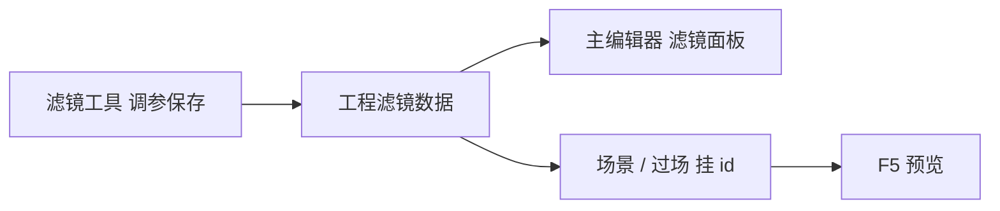

# 滤镜工具

同一座码头，日头下和雨夜里该是两种气色。**滤镜工具**用滑条可视化调 **色彩矩阵** 滤镜，实时看前后对比，**保存预制**后游戏直接加载——与主编辑器 **滤镜** 面板看的是 **同一批** 数据，两边改一处、另一边刷新即见。

---

## 干什么

- 调 **色相、饱和度、亮度、对比** 等 ColorMatrix 参数。
- 从空白或 **已有预制** 起步微调。
- **实时预览**某张场景截图或示例图。
- **保存**为新预制，自动进工程滤镜目录。
- 导出格式与游戏运行时 **完全一致**，无需手改 JSON。

---

## 怎么开

**方式一：命令**

```bash
./dev.sh filter-tool
```

**方式二：Web 控制台**

点 **滤镜工具**。

**方式三：主编辑器**

**工具 → 外部工具** → **滤镜工具**。

---

## 一步步怎么用

1. 打开滤镜工具，选空白或相近预制（如雨夜偏冷底子）。
2. 拖滑条，中间预览区边看边调。
3. 心里钉住目标场景——城隍庙夜祭偏暖黄，义庄阴风偏青灰。
4. 满意后 **保存为新预制**，起名如 `wujin_rain_night`（id 即文件名，保存后只读）。
5. 主编辑器 **滤镜** 面板或 **场景** 里挂此预制 id。
6. F5 进场景确认氛围；与 [光照体积](./lightvolume-lab) 叠加时注意别过曝。

---

## 何时用

| 情况 | 建议 |
|---|---|
| 新场景要独特色调 | 新建预制再挂场景 |
| 全工程统一晨雾色 | 一个预制多场景复用 |
| 只改场景挂哪个滤镜 | 主编辑器滤镜/场景面板即可，不必开工具 |
| 调色矩阵调疯了 | 从相近预制重置再微调 |

---

## 当心什么

| 当心 | 说明 |
|---|---|
| 与体积光、后期叠太狠 | 画面死黑或死白 |
| 预制 id 改名 | 引用处要同步改场景/过场 |
| 自定义预制备份 | 工具内可存个人预制列表，换机器前确认已导出到工程 |
| 滤镜≠深度 | 不改遮挡，穿模仍要回 [场景深度](./scene-depth-editor) |

---

## 工作流



---

## 雾津例子

1. 新建 `wujin_rain_night`：压暗、偏青、略降饱和，雨夜码头用。
2. 城隍庙夜祭另存 `chenghuang_candle_warm`，提暖、压高光。
3. 场景 `dock_rain` 挂雨夜预制；过场夜祭步挂暖黄预制。
4. F5 两段对比，确认玩家不会觉得「同一个 LUT 硬套」。
5. 详细步骤见 [教程：调一个画面滤镜](../../tutorials/filter)。

---

## 和相关工具怎么配合

| 面板 / 工具 | 关系 |
|---|---|
| [滤镜面板](../panels/filters) | 同一数据目录，轻量选用 |
| [场景面板](../panels/scene) | 场景级挂滤镜 |
| [光照体积烘焙](./lightvolume-lab) | 局部光 + 全屏色调 |

---

## 相关

- [滤镜面板](../panels/filters)
- [教程：调一个画面滤镜](../../tutorials/filter)
- [工具打开方式](../launch-architecture)
