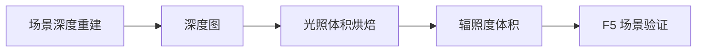

# 光照体积烘焙

雾津夜里码头一盏灯、庙里烛火映脸——除了静态背景，游戏还能用 **光照体积** 让角色走近光源时局部变亮。**光照体积烘焙**读取 [场景深度](./scene-depth-editor) 产出的深度图，在浏览器里 **烘焙辐照度体积** 并 **quad 预览**，调满意再写回工程。

---

## 干什么

- 加载指定场景的 **深度图**（通常来自场景深度工具）。
- 在 Web 界面里设光源、烘焙参数，生成 **辐照度体积**。
- **预览**角色区域受光变化是否合理。
- **导出**供游戏运行时采样。

不负责画背景、不负责碰撞——深度不对请先回场景深度重建。

---

## 怎么开

**方式一：命令**

```bash
./dev.sh lightvol
```

浏览器自动打开本地页（常见端口 **8099**）。

**方式二：指定场景**

```bash
./dev.sh lightvol -- --scene mountain_pass
```

把 `mountain_pass` 换成你要烘的场景 id。

**方式三：Web 控制台**

点 **光照体积实验室**（或控制台里对应按钮）。

---

## 一步步怎么用

1. 确认目标场景 **深度图已导出**（[场景深度重建](./scene-depth-editor)）。
2. `./dev.sh lightvol`，必要时带 `--scene <场景id>`。
3. 页面加载深度与场景预览，调 **光源位置、颜色、强度、范围**（以界面为准）。
4. 点 **烘焙**，看 quad 预览里明暗是否自然——忌整张图糊成一片亮。
5. 不满意回步骤 3 微调，或回场景深度修前景深度。
6. **保存/导出**体积数据到工程约定位置。
7. F5 进场景，关二狗走过灯柱旁应局部提亮。

---

## 何时用

| 情况 | 建议 |
|---|---|
| 室内烛火、室外路灯氛围 | 深度已有，要局部动态光 |
| 场景深度刚重做 | 深度更新后应重新烘焙光照体积 |
| 只有全屏 [滤镜](./filter-tool) | 滤镜改色调，不能替代近光源体积光 |
| 深度图缺失 | 先场景深度，再开本工具 |

---

## 当心什么

| 当心 | 说明 |
|---|---|
| 深度与背景不对齐 | 光斑飘在半空 |
| 烘焙过亮 | 雾津偏阴湿，别烘成正午大晴天 |
| 改深度未重烘 | 游戏里光位仍错 |
| 端口占用 | 以终端打印的实际地址为准 |

---

## 工作流



---

## 雾津例子

1. 城隍庙夜祭场景深度导出后，`./dev.sh lightvol -- --scene chenghuang_night`。
2. 在庙门前柱灯处放点光源，偏暖黄，范围只盖台阶区。
3. 烘焙预览：玩家站位时脸微亮、远处廊柱仍暗。
4. 导出后进游戏，与 [滤镜](./filter-tool) `wujin_lamp_warm` 叠加，夜祭氛围统一。

---

## 和相关工具怎么配合

| 工具 | 关系 |
|---|---|
| [场景深度重建](./scene-depth-editor) | 深度图输入 |
| [滤镜工具](./filter-tool) | 全屏色调；与体积光叠加 |
| [场景面板](../panels/scene) | 场景 id 与背景引用 |

---

## 相关

- [场景深度重建](./scene-depth-editor)
- [工具打开方式](../launch-architecture)
