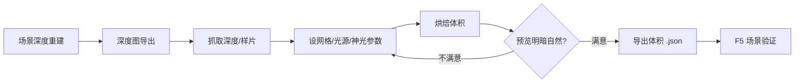

# 光照体积烘焙

雾津夜里码头一盏灯、庙里烛火映脸——除了静态背景色调，游戏还能让角色**走近光源时局部变亮**。这靠的不是滤镜，而是**光照体积**：一份记录空间里"哪里该亮多少"的体数据。**光照体积烘焙**读取[场景深度](./scene-depth-editor)产出的深度图，在浏览器里设光源、跑烘焙、边调边看积水积雪反光效果，满意再导出给游戏采样。

---

## 这是什么（30 秒看懂）

把一个场景想象成一格一格的透明格子箱子摞起来（长×宽×高），每个格子都记一个"这里应该是什么颜色的光"。**烘焙**就是根据深度图算出这些格子该多亮、什么颜色；游戏运行时按角色所在格子实时取值，就能做出"走近灯笼脸变暖、走远变暗"的效果，而不是整个屏幕死板地统一提亮。

这份格子数据叫**辐照度体积**（irradiance volume）。烘焙前还会顺带模拟一些场景专属的视觉效果——积水反光、落雪、丁达尔效应般的"神光"（god ray）——这些都是本工具独有的能力，滤镜工具做不到，因为滤镜只管全屏统一的色彩矩阵，不知道空间里哪里近哪里远。

本工具**不画背景、不管碰撞**——那是[场景深度重建](./scene-depth-editor)的活；深度不对，光斑就会飘在半空，遇到这种情况先回场景深度修，不要在这里硬调参数将就。

---

## 入门：手把手做第一次

1. 确认目标场景的**深度图已经导出**（见[场景深度重建](./scene-depth-editor)）——没有深度图，本工具没有依据来烘焙体积。
2. 命令行跑 `./dev.sh lightvol`，浏览器会自动打开本地页面（常见端口 8099）；也可以带上场景 id 直接指定要烘的场景，或者从 Web 控制台点"LightVolume 实验室"进入后再选场景。
3. 页面顶部可以**导入 .json** 载入已有体积继续调，也可以**抓取**——直接按场景 id 从工程里拉取对应的**深度 PNG（raw_depth_rg）**和可选的**样片 PNG**，没有样片就用灰片占位；也支持手动补**背景 PNG**（找不到素材、直接双击打开 file:// 页面时常用）。
4. 设**格 X / 格 Y（地面）/ 层 K（高度）**三个方向的网格分辨率——数值越大，体积数据越细腻，但烘焙越慢，先用较粗的网格试位置，定下来再加密。
5. 调光照参数：**天光强度**控制整体环境光基调，**神光强度 / 神光步数 / 神光距离**控制丁达尔光柱效果（步数越多光柱越连续，但更耗时），**每体素光线数**决定每个格子采样精度，数值越高结果越干净但烘焙越慢。
6. 点**烘焙体积**，等待计算完成（未烘焙时页面会提示"未烘焙"）。用**着色模式**或**直接显示体积环境色(raw)**切换查看方式，检查明暗过渡是否自然——忌讳整张图糊成一片死白或死黑。
7. 觉得不满意就回到第 4、5 步微调参数重新烘焙，或者回[场景深度重建](./scene-depth-editor)修前景深度。
8. 满意后**导出体积 .json**到工程约定位置，回主编辑器或运行预览进场景，验证角色走过灯柱旁时脸部应该局部提亮，而不是整个人一起变亮。

---

## 进阶：把每一项都讲透

**网格与烘焙精度**
- **格 X / 格 Y（地面）/ 层 K（高度）**：三个方向各自独立的体素网格分辨率，决定光照数据有多"细"。室内小场景（茶馆内景）可以用较密的网格换取更准的局部光；室外大场景先用粗网格定基调，避免烘焙时间过长。
- **每体素光线数**：每个格子采样多少条光线来估算亮度，数值越高结果越平滑、噪点越少，但烘焙耗时也越久，是"质量 vs 速度"的直接旋钮。

**光照与氛围**
- **天光强度**：场景整体的环境光基调，相当于"这个场景本身有多亮"的底色，雾津偏阴湿的调性下不宜调得太高。
- **神光强度 / 神光步数 / 神光距离**：模拟光柱穿过雾气或缝隙的丁达尔效应，常用于庙门、窗棂漏光的场景；步数越多光柱边缘越连续不闪烁，距离控制光柱能延伸多远。
- **色调强度（tone）**：整体色调的压制/强化程度，用来让烘焙结果和场景既有的美术基调贴合，不是替代滤镜，而是让体积光和滤镜的色调不打架。

**雾效**
- **雾浓度 / 雾高度衰减 / 雾流速 / 雾色**：给场景加一层体积雾——浓度控制多"糊"，高度衰减控制雾是不是贴地（越高越淡），流速让雾缓慢流动而不是死板静止，雾色决定偏冷偏暖。夜祭、义庄这类阴气场景常会调高雾浓度、压低雾色明度。
- **被照亮的雾**：让雾本身也能被光源照亮，形成"光柱穿雾"的层次感，和神光参数搭配使用效果更明显。

**积雪**
- **积雪量 / 积雪朝上阈值 / 雪色**：在场景朝上的表面（屋顶、台阶顶面）模拟积雪厚度和颜色，阈值决定多"朝上"的面才会积雪，避免墙面、栏杆侧面也莫名其妙盖雪。

**积水与反光（可交互）**
- **画积水（湿度）/ 擦积水 / 清除积水**：直接在预览画布上用笔刷"画"出积水区域，模拟雨后地面湿滑反光；擦积水局部去掉，清除积水一键清空重来。
- **积水笔刷大小 / 积水量**：控制画积水时一笔的范围和这块区域的湿润程度。
- **积水反射强度 / 最小反射高度（滤地面/越大只反射高物）**：反射强度决定水面倒影有多明显；最小反射高度是个过滤器，调大后水面只反射比较高的物体（比如灯笼、人物），不反射细碎的地面纹理，避免倒影"脏"。
- **倒影扫描行数（越多越深）/ 倒影步长（px，越小越无缝）**：控制倒影计算的精细度，行数越多倒影层次越丰富，步长越小倒影拼接越不容易看出接缝。
- **同列竖直镜像**：倒影的基本呈现方式——同一列像素上下镜像模拟水面反射。

**角色互动效果**
- **移动角色**：在预览里手动拖动一个模拟角色，实时看它走到不同位置时光照、积水涟漪的反应，不用真的进游戏也能预判效果。
- **角色扰动半径**：角色走过积水时激起涟漪/脚印的影响范围。
- **涟漪强度 / 涡度（打圈强度）**：控制角色搅动积水时波纹的强弱和打旋的程度。
- **清除脚印 / 拖动作用**：清掉已经留下的脚印痕迹；"拖动作用"控制鼠标拖拽在画布上产生的具体效果（配合画积水等笔刷工具）。
- **暂停/继续动画**：水面涟漪、雾气流动这些是持续动画效果，需要长时间盯着看细节时可以暂停。

**查看与导入导出**
- **着色模式 / 直接显示体积环境色（raw）**：两种查看视角切换——着色模式接近游戏最终观感，raw 模式直接看体积数据本身的颜色，调试用。
- **导入 .json / 导出体积 .json**：随时把当前调好的体积数据保存下来继续下次编辑，或者导出为游戏运行时读取的最终格式。
- **深度 PNG / 样片 PNG / 背景 PNG**：三类输入图各自的用途——深度 PNG 是烘焙的核心依据，样片 PNG 让预览贴近真实画面观感（没有就用灰片占位），背景 PNG 是找不到自动素材时的手动兜底。

**和别的工具/面板配合**
- 深度图更新后必须重新烘焙——旧的体积数据是按旧深度算的，场景深度一改，光位就全错了。
- 和[滤镜工具](./filter-tool)是两套互补的东西：滤镜管全屏统一色调（比如整体压暗、偏青），光照体积管局部动态光源；两者会叠加显示，调的时候留意别互相"打架"到过曝或死黑。
- 场景 id、背景引用仍归[场景面板](../panels/scene)管，本工具只认场景 id 去抓取对应素材，不负责场景的其它设置。

---

## 什么时候用它 / 和别的工具配合

| 情况 | 建议 |
|---|---|
| 室内烛火、室外路灯这类局部光氛围 | 深度已经做好，需要角色靠近时局部提亮 |
| 场景深度刚重做过 | 深度更新后必须重新烘焙，光位才会跟着对 |
| 场景需要雨后湿滑地面、水面倒影 | 用画积水笔刷现场调，配合反射强度和倒影行数 |
| 只需要全屏色调（偏暖/偏冷） | 用[滤镜工具](./filter-tool)就够，不必上体积光 |
| 深度图还没导出 | 先做[场景深度重建](./scene-depth-editor)，再开本工具 |

**边界与当心**
- 深度与背景没对齐：光斑会飘在半空，看起来很假。
- 烘焙过亮：雾津整体偏阴湿，别把场景烘成正午大晴天的观感。
- 改了深度却忘记重烘：游戏里光位依旧是旧的，白改一场。
- 端口偶尔被占用：以终端实际打印出的地址为准，不要死记 8099。

---

## 常见问题

**Q：烘焙完发现光斑飘在半空，是哪里出问题了？**
A：几乎都是深度图和背景没对齐——回[场景深度重建](./scene-depth-editor)检查前景深度是不是准确，改完导出后再重新抓取、重新烘焙。

**Q：网格调多细合适？**
A：先用较粗的格 X/格 Y/层 K 定光源大致位置和强度，效果满意后再逐步加密，避免一开始就用高精度反复试错，浪费烘焙时间。

**Q：积水和雾效会不会影响游戏性能？**
A：这些是烘焙阶段和预览阶段的效果调节，最终导出的是体积数据，具体性能由游戏运行时决定，工具本身只负责让你把参数调到满意。

**Q：光照体积和滤镜工具能不能同时用？**
A：能，而且经常一起用——滤镜管全屏色调，体积光管局部动态光，叠加时留意别互相压过头导致过曝或死黑。

**Q：抓取不到深度图/样片怎么办？**
A：检查场景深度是否已经导出到工程约定位置；实在找不到，可以用页面提供的手动补背景 PNG 功能兜底，但深度 PNG 缺失时烘焙没有意义。

---

## 相关

- [场景深度重建](./scene-depth-editor)
- [滤镜工具](./filter-tool)
- [场景面板](../panels/scene)
- [工具打开方式](../launch-architecture)
