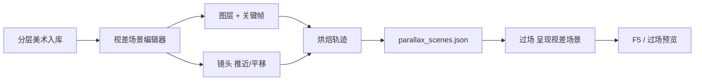

# 视差场景编辑器

过场里图层缓缓拉开、镜头似在雾中穿行——**视差场景编辑器**在浏览器里编**图层堆叠、关键帧、镜头运动**，渲染方式与游戏过场完全一致，所见即所得。结果写入工程的视差场景数据，供过场步骤"呈现视差场景"直接调用。

---

## 这是什么（30 秒看懂）

把一张过场插画想象成拆成好几层的纸偶戏：天空/远雾在最后面，山影/建筑在中间，人物/近景道具在最前面。**视差**指的是这几层随镜头移动时速度不一样——远的层动得慢，近的层动得快，这样即使是静态插画也能做出"镜头穿行"的纵深感。

本工具就是编排这几层怎么动、镜头怎么推的地方：给每层设起点终点位置、缩放、透明度，再单独给一个"镜头"轨道设运镜（推近、平移），最后把两者叠加烘焙成一份可以直接播放的分层动画数据。它不管这些层图从哪来（那是分层美术+入库的活），也不负责游戏是否会播这段过场（那要在**过场**面板的"呈现视差场景"步骤里指向这份数据）。

---

## 入门：手把手做第一次

1. 命令行跑 `./dev.sh parallax-editor`，浏览器会打开编辑器页面（常见端口 5205）；如果同端口已有实例在跑，会直接复用，不会重复起服务。也可以从 Web 控制台点"Parallax 编辑器"，或者在主编辑器**过场**面板的"呈现视差场景"步骤上找快捷入口。
2. 顶部**场景 Scene** 下拉选择已有场景，或新建一个场景 id（比如 `fog_dock_intro`）。设置**画布宽 / 高**，这个尺寸要和过场实际呈现的画幅匹配。
3. 在**图层 Layers** 面板**添加图层**，每层绑定一张已经[入库](../asset-domain/asset-ingest)的分层图片，勾选**启用**让它参与渲染，可以用**显示**开关临时隐藏某层方便对照。
4. 选中某层，在**关键帧 Keyframes** 面板打关键帧：设起点、终点的**平移 X**、**缩放**、**透明度**，越靠后的层（远景）位移应该更小，越靠前的层位移更大，这样视差感才自然。
5. 打开**推摄像机 Camera** 面板，单独给镜头设**推近**幅度和时间——镜头运动是叠加在各层自己的运动之上的，不是替代它们。
6. 用**总时长**设定整条时间轴的长度，勾选**循环**可以让关键帧时间轴循环播放，方便反复对照效果。
7. 用**缓动**设置关键帧之间的过渡曲线，让运动更顺滑。拖动播放头，或者用时间轴 scrub（直接拖动定位而不是点播放）逐帧检查有没有跳变、穿帮——**页面在后台/非激活状态时播放会被浏览器节流变卡**，所以验证轨迹准不准，优先靠拖动时间轴看效果，不要只信播放按钮的实际速度。
8. 满意后点**导出 / 保存**，写入 `parallax_scenes.json`（也可以**复制 JSON** 单独取一份内容备用）。
9. 回主编辑器**过场**面板，在某一步选择"呈现视差场景"并指向这个场景 id，用过场预览或 F5 验证效果。

---

## 进阶：把每一项都讲透

**图层管理**
- **图层 Layers**：每层是一张独立的分层图片，可以增删、上下调整层序（层序决定谁在前谁在后）。
- **启用 / 显示**：启用决定这层是否参与最终导出和运行；显示只是编辑时临时隐藏，方便你单独看某一层或对照几层的位置关系，不影响导出结果。
- **选中图层**：选中后关键帧面板才会显示该层专属的关键帧列表，不同层的关键帧互不干扰。

**关键帧与运动**
- **平移 X**：层沿水平方向的位移量，是做视差感的核心参数——远景层数值小、近景层数值大，镜头移动时才会呈现"近处飞快掠过、远处缓慢跟随"的效果。
- **缩放**：层的放大缩小，常用来模拟"镜头拉近时这层显得更大"的透视感。
- **透明度**：控制层的显隐渐变，可以用来做云雾飘过、光影渐变淡出这类效果。
- **删除选中帧**：去掉某一个不需要的关键帧节点，不影响该层其它关键帧。
- **缓动**：关键帧之间过渡的速度曲线，决定运动是匀速还是有加速减速的观感。
- **循环 / 循环关键帧时间轴**：让整条关键帧时间轴首尾衔接循环播放，适合做没有明确终点、可以一直"漂"下去的背景运动（比如持续飘的雾）。

**镜头（推摄像机 Camera）**
- **推摄像机 Camera 面板**：单独于图层运动之外，再叠加一层"镜头"运动——推近、平移。这个运动作用在所有层的坐标系之上，相当于给整个画面加一层额外的运镜，而不是覆盖掉各层自己已经设好的位移。
- **推近**：镜头向画面纵深方向推进的幅度，常用来做过场开场"缓缓拉近"的效果。
- **景深**：给画面叠加景深观感，让远近层的清晰度产生差异，强化纵深层次。
- **删除选中镜头帧**：单独删除镜头轨道上的某个关键帧，不影响图层自己的关键帧。

**时间轴与整体设置**
- **总时长**：整条视差场景播放的总时间，需要和过场脚本里这一步预期的时长对上，否则过场切下一步时视差可能还没播完就被打断，或者播完了还空等。
- **画布宽 / 高**：编辑器预览画布的尺寸，要和实际呈现的画幅一致，否则预览观感和游戏里对不上。
- **电影黑边预览 Movie Bar**：叠加显示电影感的上下黑边，用来预览这段视差配合宽银幕黑边呈现时的实际取景范围，避免关键内容被黑边遮住。

**导出与数据**
- **保存到 parallax_scenes.json / 导出 / 保存**：把当前编排结果写入工程的视差场景数据文件，游戏运行时直接读取这份文件对应的场景 id。
- **复制 JSON**：把当前场景的数据复制一份到剪贴板，方便临时对比、分享或者手工核对内容，不等同于正式保存。

**和别的工具/面板配合**
- 图层图片要先在[分类导入](../asset-domain/asset-ingest)里入库，本工具只负责挑选和编排已入库的图，不负责抠图、裁切这类前期处理。
- 过场脚本要在**过场**面板里安排"呈现视差场景"这一步，并把场景 id 填对——id 对不上会导致过场里黑屏或播错场景。
- 这段过场如果同时需要独特色调（比如晨雾、夜祭），可以再挂上[滤镜工具](./filter-tool)做的预制，两者互不冲突，一个管分层运动，一个管全屏色调。
- 场景深度、光照体积和本工具无关——那些管的是玩家实际走位的场景，本工具管的是过场里的静态插画演出。

---

## 什么时候用它 / 和别的工具配合

| 情况 | 建议 |
|---|---|
| 新做过场的卷轴/穿行镜头 | 在本工具编图层关键帧和镜头轨迹 |
| 过场里图层错位、节奏不对 | 回时间轴改关键帧位置或调缓动 |
| 静态对话过场，没有镜头运动需求 | 不必用视差，过场面板里选别的呈现步类型即可 |
| 只是换一张层图，运动轨迹不变 | 直接改图层绑定的图片路径，关键帧可以保留复用 |

**边界与当心**
- 图层分辨率差太大：放大糊、缩小锯齿，尽量让各层素材按同一套归一尺寸处理。
- 总时长和过场脚本对不上：过场切下一步时视差还没播完，或播完后画面空等。
- 场景 id 和过场步骤里填的不一致：游戏里表现为黑屏或播放了错误的场景。
- 保存后没刷新：同端口复用有时仍会看到旧缓存内容，保存后刷新页面确认。
- 验证轨迹别只信播放按钮：页面被浏览器节流时播放速度不准，用时间轴拖动（scrub）看效果更可靠。

---

## 常见问题

**Q：为什么播放的时候感觉运动比预期慢/卡？**
A：浏览器对非激活标签页的动画帧率会节流，播放速度不代表最终效果。想准确核对轨迹，直接拖动时间轴逐帧看，而不是点播放按钮计时。

**Q：远景和近景应该差多大的平移幅度？**
A：没有固定公式，但原则是"越远的层动得越少"，可以参考已有场景的层序惯例：背景板/天空幅度最小，中景次之，近景/特效层幅度最大。

**Q：镜头运动和图层自己的运动是什么关系？**
A：镜头运动是叠加在图层自身运动之上的，相当于额外加一层运镜，不会覆盖或替换掉你已经给某层设好的关键帧位移。

**Q：改了图层图片，之前调好的关键帧还能用吗？**
A：能，只要新图的尺寸和构图差别不大，关键帧的位移/缩放/透明度都可以直接复用，不需要重新打点。

**Q：保存之后过场里还是老样子？**
A：检查过场面板"呈现视差场景"这一步填的场景 id 是否和你刚保存的一致；也确认编辑器页面已经真正点了导出/保存，不是只复制了 JSON。

---

## 相关

- [过场面板](../panels/cutscene)
- [分类导入](../asset-domain/asset-ingest)
- [滤镜工具](./filter-tool)
- [教程：视差过场](../../tutorials/parallax)
- [工具打开方式](../launch-architecture)
