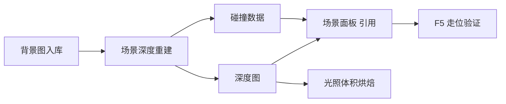

# 场景深度重建

等距场景若所有人像贴在一张平板上，街就假了。**场景深度重建**从背景图估算**远近深度**，并编辑**碰撞区**，让角色走过去该被桌腿挡住、不能穿桌而过。主编辑器 **场景** 面板只能调少量深度相关参数；**背景层主体、深度图、碰撞数据**要靠本工具导出。详见 [危险区](../concepts/danger-zone)。

---

## 干什么

- 加载场景背景，**自动生成**深度图（远近灰度）。
- **人工修整**桌沿、栏杆、柱子边缘。
- **编辑碰撞**——角色走不过去的区域，与画面前景对齐。
- **导出**深度与碰撞，供游戏遮挡与走位使用。

---

## 怎么开

**没有** `./dev.sh` 短命令：

```bash
./dev.sh editor
```

菜单 **工具 → 外部工具** → **场景深度**。

工具打开后加载当前工程场景列表，选中要处理的场景。

---

## 一步步怎么用

1. 确认背景已 [入库](../asset-domain/asset-ingest)，主编辑器 **场景** 已指向该背景。
2. 打开场景深度工具，列表选场景——如 **满堂茶客** 茶馆内景。
3. 左侧调 **图像 / 深度 / 相机 / 映射** 等参数（以界面为准），点 **估算深度**。
4. 对比原图与深度预览，**笔刷或工具修**桌沿、栏杆——前景要更「近」。
5. 进入 **碰撞编辑**，在走不过去的地方勾区域，与深度前景对齐。
6. **导出**到工程约定位置。
7. 回主编辑器 **场景** 刷新，F5 走进去验遮挡与穿模。

---

## 何时用

| 情况 | 建议 |
|---|---|
| 新场景背景画完 | 深度 + 碰撞一次做完再摆 NPC |
| 角色穿桌、穿柱 | 回工具修深度与碰撞 |
| 只改容差、地面偏移 | 主编辑器场景面板可能够用 |
| 换了一张新背景图 | 必须重跑深度，旧深度不能复用 |

---

## 当心什么

| 当心 | 说明 |
|---|---|
| 深度估错边缘 | 挡人错位，像飘在桌上 |
| 碰撞过大 | 角色离桌很远就被挡住 |
| 碰撞过小 | 仍能穿模 |
| 未导出就预览 | 主编辑器 F5 仍用旧数据 |
| 与视差/滤镜无关 | 本工具只管深度与碰撞 |

---

## 工作流



---

## 雾津例子

1. 茶馆内景 `mantang_chake_interior` 背景入库，场景已绑定。
2. 场景深度工具估算深度，修茶桌前沿与栏杆立柱。
3. 碰撞勾住桌腿、柜台，留过道可走。
4. 导出后 F5，关二狗从过道过，被桌挡时应半身藏在桌后。
5. 深度图可交给 [光照体积烘焙](./lightvolume-lab) 做氛围光。

---

## 和相关工具怎么配合

| 工具 / 面板 | 关系 |
|---|---|
| [场景面板](../panels/scene) | 引用深度配置；少量参数在此改 |
| [光照体积烘焙](./lightvolume-lab) | 消费深度图烘焙光照 |
| [教程：给场景加遮挡/深度](../../tutorials/scene-depth) | 端到端练习 |

---

## 相关

- [危险区](../concepts/danger-zone)
- [光照体积烘焙](./lightvolume-lab)
- [工具打开方式](../launch-architecture)
